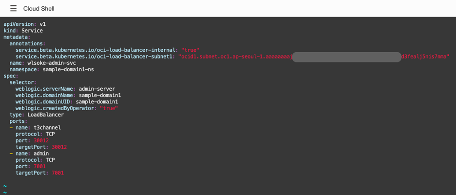
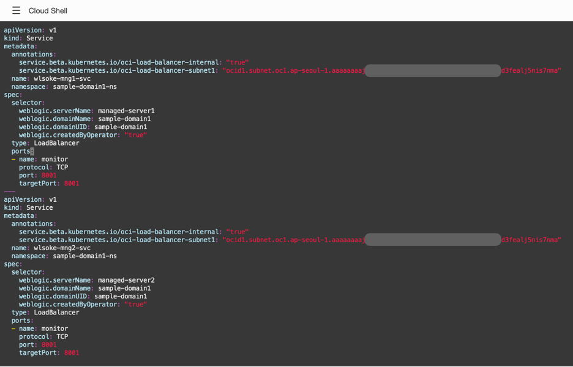

# Create Kubernetes load balancer services

## Introduction


Once you have a private subnet in the Kubernetes cluster VCN, you can create load balancer services in Kubernetes. In this tutorial, you will collect domain information from the WebLogic services, create YAML files, enter the domain and private subnet information into the files, and finally apply the YAML to create load balancer services in Kubernetes.

Estimated time: 15 minutes

* Completion of the **[Migrating WebLogic Server to Kubernetes on OCI](https://apexapps.oracle.com/pls/apex/dbpm/r/livelabs/view-workshop?wid=567)** workshop, labs 1, 2, 3 and 4.
* Completion of the preceding tutorials in this workshop

## Task 1: Collect WebLogic information

1. In the Oracle Cloud console, select the Cloud Shell icon (>_ ) from the menu bar to launch a Cloud Shell session window if one is not. Copy and paste the ***kubectl get svc*** command to list out all the namespaces.

    ``` bash
    <copy>
    kubectl get svc --all-namespaces
    </copy>
    ```
     Write down the service names for the WebLogic admin server and WebLogic managed servers so you can reference them later. They are **sample-domain1-admin-server**, **sample-domain1-managed-server1**, **sample-domain1-managed-server2** in the image below, for example.  

   

2. Execute ***kubectl describe svc*** command to obtain label names of the WebLogic admin server service.

    ``` bash
    <copy>
    kubectl describe svc sample-domain1-admin-server -n sample-domain1-ns
    </copy>
    ```
3. From the command output, locate the three parameters shown below, under the **Labels** section.  

      *	weblogic.domainName
      *	weblogic.domainUID
      *	weblogic.serverName

   

   Open a text file in your computer, write down the values of the parameters. You will need these values in the subsequent steps to create a YAML file.

4. Similarly, run the below command to collect the **domainName**, **domainUID** and **serverName** information for the **managed-server-1**. Note down the values to the text file.

    ``` bash
    <copy>
    kubectl describe svc sample-domain1-managed-server1 -n sample-domain1-ns
    </copy>
    ```
   

5.  Repeat the steps described in the \#3 above to collect the information from the **managed-server-2**.

    ``` bash
    <copy>
    kubectl describe svc sample-domain1-managed-server2 -n sample-domain1-ns
    </copy>
    ```
   


## Task 2:  Create YAML files to set up load balancer services

1. Using the Oracle Cloud Shell, from the home directory, create YAML files.

    ``` bash
    <copy>
    cd ~; touch admin-lb.yaml; touch managed-lb.yaml
    </copy>
    ```

2. Open the ***admin-lb.yaml*** file just created with an editor on your choice (E.g., vi editor). This will be the YAML file that configures the load balancer service for the WebLogic Admin Server, **admin-server**.


    ``` bash
    <copy>
    vi ~/admin-lb.yaml
    </copy>
    ```

3. Hit “i” key to turn on the edit mode, then copy the below contents and paste into the file. Replace the **OCID of the private subnet** collected in the Tutorial 2, Task 1, step 6.


        apiVersion: v1
        kind: Service
        metadata:
          annotations:
            service.beta.kubernetes.io/oci-load-balancer-internal: "true"
            service.beta.kubernetes.io/oci-load-balancer-subnet1: "<OCID of the Private Subnet>"
          name: wlsoke-admin-svc
          namespace: sample-domain1-ns
        spec:
          selector:
            weblogic.serverName: admin-server
            weblogic.domainName: sample-domain1
            weblogic.domainUID: sample-domain1
            weblogic.createdByOperator: "true"
          type: LoadBalancer
          ports:
          - name: t3channel
            protocol: TCP
            port: 30012
            targetPort: 30012
          - name: admin
            protocol: TCP
            port: 7001
            targetPort: 7001

    *	**wlsoke-admin-svc** is the name of the load balancer service, for the WebLogic Administration server.
    *	Default values are preconfigured for the **namespace**, **weblogic.ServerName** , **weblogic.domainName**, and **weblogic.domainUID**. If you used a different namespace or server names at the domain creation, replace with the values collected from the Kubernetes service in the previous steps.

    Save the file with ***esc + :wg***.

    >***Suggested Editing Tips***:
     * Use your mouse to select the text above, and manually copy and paste it into a text file.
     * Auto copy is not provided as it may break the indentation.
     * Replace the ***OCID of the Private Subnet***, then copy the modified text into the YAML file.
     * Make sure to keep the syntax of 2 space indentation.
     * Refer to the screenshot image below to see how it should look like after the file is modified.
         


4. Next, Open the ***managed-lb.yaml*** with an editor. This will be the YAML file that configures the load balancer services for the WebLogic managed servers, **managed-server1** and **managed-server2**.

    ``` bash
    <copy>
    vi ~/managed-lb.yaml
    </copy>
    ```

5.  Hit “i” key to turn on the edit mode, then copy the below contents and paste into the file. Replace the **OCID of the private subnet** collected in the Tutorial 2, Task 1, step 6. Note  that there are two locations in the file where you need to replace the OCID.


        apiVersion: v1
        kind: Service
        metadata:
          annotations:
            service.beta.kubernetes.io/oci-load-balancer-internal: "true"
            service.beta.kubernetes.io/oci-load-balancer-subnet1: "<OCID of the Private Subnet>"
          name: wlsoke-mng1-svc
          namespace: sample-domain1-ns
        spec:
          selector:
            weblogic.serverName: managed-server1
            weblogic.domainName: sample-domain1
            weblogic.domainUID: sample-domain1
            weblogic.createdByOperator: "true"
          type: LoadBalancer
          ports:
          - name: monitor
            protocol: TCP
            port: 8001
            targetPort: 8001
        ---
        apiVersion: v1
        kind: Service
        metadata:
          annotations:
            service.beta.kubernetes.io/oci-load-balancer-internal: "true"
            service.beta.kubernetes.io/oci-load-balancer-subnet1: "<OCID of the Private Subnet>"
          name: wlsoke-mng2-svc
          namespace: sample-domain1-ns
        spec:
          selector:
            weblogic.serverName: managed-server2
            weblogic.domainName: sample-domain1
            weblogic.domainUID: sample-domain1
            weblogic.createdByOperator: "true"
          type: LoadBalancer
          ports:
          - name: monitor
            protocol: TCP
            port: 8001
            targetPort: 8001


    **wlsoke-mng1-svc** and **wlsoke-mng2-svc** are the names of the load balancer services, for the managed WebLogic servers.  Ensure the expected values are entered and the indentation is set correctly. Save the file with ***esc + :wg***.

    > **NOTE:**  Refer to the screenshot image below to see how it should look like after the file is modified.
       


    >  This YAML configures two managed WebLogic Servers in a single file, and three hyphens “---” are used as separators. If you have more than two managed servers, you can add sections in the file, collect server names from the ***kubectl describe pod*** command, and populate them in the YAML file.

## Task 3:  Apply the configuration


1. From the home directory in the Oracle Cloud Shell, execute the following commands to apply the configuration to the Kubernetes pods.

    ``` bash
    <copy>
    kubectl apply -f admin-lb.yaml -n sample-domain1-ns
    kubectl apply -f managed-lb.yaml -n sample-domain1-ns
    </copy>
    ```
    


2.  Wait for few minutes, then run the following command to verify the load balancer services are created. Make sure they have EXTERNAL-IPs assigned.

    ``` bash
    <copy>
    kubectl get svc -n sample-domain1-ns
    </copy>
    ```
3.  Open a text file on your computer and write down the **names of the WebLogic Server services**, and the matching **External IPs of the load balancer services**. You will need these values later when configuring the hosts file in the EM agent compute instance.

    

        Format: <External IP of the matching LB> <WLS Server service name>
        E.g.,
        10.0.x.248 sample-domain1-admin-server
        10.0.x.252 sample-domain1-managed-server1
        10.0.x.156 sample-domain1-managed-server2


You may now [proceed to the next tutorial](#next).

## Acknowledgements

* **Author** - Yutaka Takatsu, Product Manager, Enterprise and Cloud Manageability
- **Contributors** -
Renjit Clement, Principal Member Technical Staff,  
Rupesh Kumar, Consulting Member of Technical Staff,  
Ravi Mohan, Senior Software Development Manager,  
Steven Lemme, Senior Principal Product Manager,  
Avi Huber, Senior Director, Product Management
* **Last Updated By/Date** - Yutaka Takatsu, March 2022
