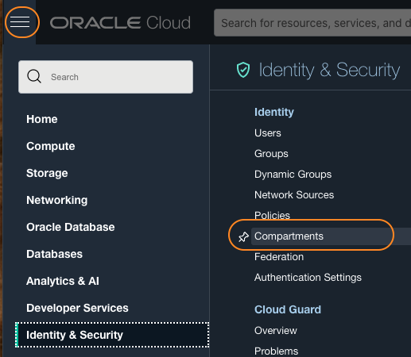
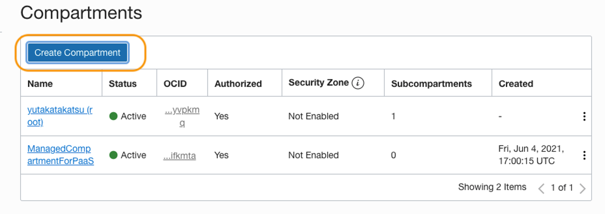
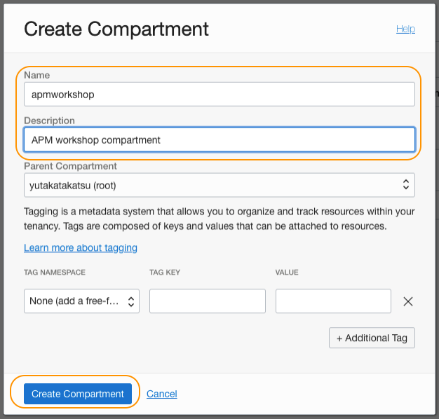
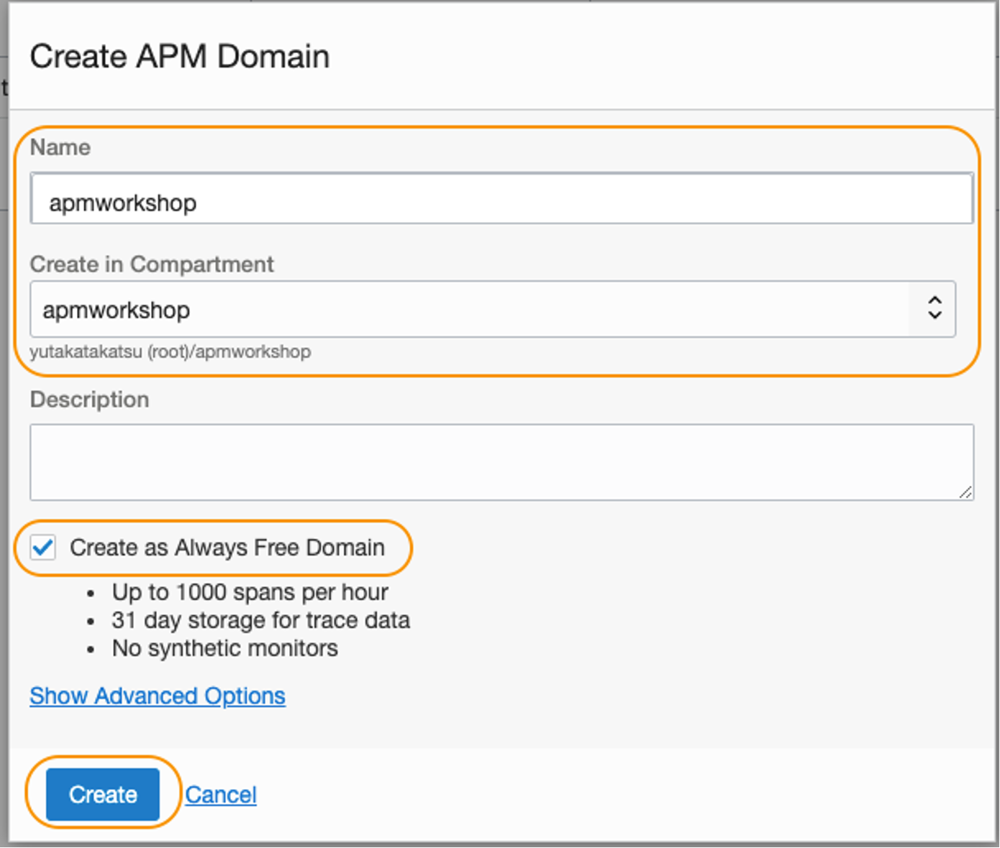
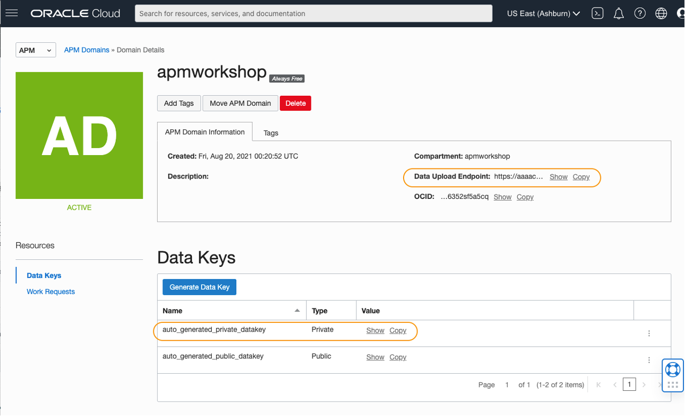

# Create an APM Domain and obtain Data Upload Endpoint and Private Data Key

## Introduction

In this lab, you will use OCI console to set up an OCI compartment and create an APM Domain. You will acquire a Data Upload Endpoint and a Private Data Key, which are needed to configure the APM Tracer on the application.

Estimated time: 10 minutes

### Objectives

* Create an OCI Compartment
*	Create an APM Domain
*	Obtain a Data Upload Endpoint and a Private Data Key

### Prerequisites

* This lab requires an [Oracle Cloud account](https://www.oracle.com/cloud/free/). You may use your own cloud account, a cloud account that you obtained through a trial, a Free Tier account, or a LiveLabs account.
* To create APM domain, you will need an Oracle Cloud Account Administrator role or manage apm-domains permission in the target compartment. For more details, refer to the OCI Documentation, [Create an APM Domain](https://docs.oracle.com/en-us/iaas/application-performance-monitoring/doc/create-apm-domain.html).

## Task 1: Create an OCI compartment

1. Open the menu from the top-left corner of the OCI Console and select **Identity & Security** > **Compartments**.
	
2. Click **Create Compartments**
	
3. Enter the following parameters:
*	Compartment name: **apmworkshop**
*	Description: **APM workshop compartment**
	

## Task 2: Create an APM domain

1.	From the OCI menu, select **Observability & Management**, then **Administration**.
	
2.	Click **Create APM Domain**.
  
3.	Name your APM domain and select the compartment you created. Add a check to the **“Create as Always Free Domain”**, then click **Create**.
  

4.	This may take few minutes. Press the refresh button periodically to check the status.
  
5.	Once the job is completed, the status turns to Active with a green icon.
  
  For more details how to create an APM Domain, refer to the OCI documentation, [Create an APM Domain](https://docs.oracle.com/en-us/iaas/application-performance-monitoring/doc/create-apm-domain.html).

## Task 3: Obtain Data Upload Endpoint and Private Data Key

To upload tracing data to an APM domain, Data Upload Endpoint and Private Data Key must be configured in the application’s configuration files. You can obtain the values of them at the OCI Console.

1.	Click the link to the APM domain.
  

  2.	In the **APM Domain Information** tab, find **Data Upload Endpoint**, then click **Copy**. Paste the copied value to a text file and save. You will need this value in the later steps in the workshop.

  3.	Under **Data Keys**, find **auto\_generated\_private_data\_key**. Click **Copy** and save the value to the text file.
  

For more details on Data Upload Endpoint and Data keys, refer to the OCI documentation, [Obtaining Data Upload Endpoint and Data keys](https://docs.oracle.com/en-us/iaas/application-performance-monitoring/doc/obtain-data-upload-endpoint-and-data-keys.html).

You may now [proceed to the next lab](#next).

## Acknowledgements

* **Author** - Yutaka Takatsu, Product Manager, Enterprise and Cloud Manageability
* **Contributors** -
* **Last Updated By/Date** - Yutaka Takatsu, September 2021
