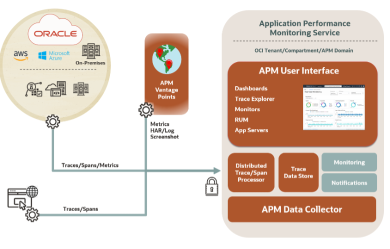

# Introduction

## About this Workshop

This workshop walks you through how to:

* Enable OpenTracing for a Java microservice based Helidon SE application using  Oracle Application Performance Monitoring (APM)
* Trace the workflow within a service and across multiple services
* Use the Helidon SE application and its build instructions, described in the **[Helidon SE Tracing Guide](https://helidon.io/docs/latest/#/se/guides/06_tracing)**.

Estimated Workshop Time: 60 minutes

### About Oracle Cloud Infrastructure Application Performance Management (OCI APM)

The diagram below provides an overview of the OCI APM Service, its features, components, and some of the other OCI services it integrates with.

  

Among other capabilities, OCI APM includes an implementation of a Distributed Tracing system. It collects and processes transaction trace data (spans) from the monitored application and make it available for viewing, dashboarding, exploration, alerts, etc. For more information on APM and Trace Explorer please refer to Application Performance Monitoring > **[Use Trace Explorer](https://docs.oracle.com/en-us/iaas/application-performance-monitoring/doc/use-trace-explorer.html)** section in the OCI Documentation.

In the workshop, you will learn how to add APM tracer to a Maven project, and the specific required configuration for Helidon. You will also learn how to create an APM domain and use Trace Explorer to search and view traces/spans in the APM User Interface.

### Objectives

In this workshop, you will:
* Create OCI compartment and APM domain
*	Build and deploy a Java microservice based application using Maven project and Helidon framework
*	Configure APM tracer on the application
*	Use APM Trace Explorer to view traces, spans, and verify span dimensions

### Prerequisites

* An Oracle Cloud Account

### Reference
*  Helidon SE Tracing Guide, Helidon Documentation Version:(2.3.3), URL: https://helidon.io/docs/latest/#/se/guides/06_tracing

### Learn More
-	**[Create an APM Domain](https://docs.oracle.com/en-us/iaas/application-performance-monitoring/doc/create-apm-domain.html)**
- **[Obtain Data Upload Endpoint and Data Keys](https://docs.oracle.com/en-us/iaas/application-performance-monitoring/doc/obtain-data-upload-endpoint-and-data-keys.html)**
- **[Configure Application Performance Monitoring Data Sources](https://docs.oracle.com/en-us/iaas/application-performance-monitoring/doc/configure-application-performance-monitoring-data-sources.html)**
- **[Use Trace Explorer](https://docs.oracle.com/en-us/iaas/application-performance-monitoring/doc/use-trace-explorer.html)**

You may now [proceed to the next lab](#next).

## Acknowledgements

- **Author** - Yutaka Takatsu, Product Manager, Enterprise and Cloud Manageability
- **Contributors** -
- **Last Updated By/Date** - Yutaka Takatsu, September 2021
