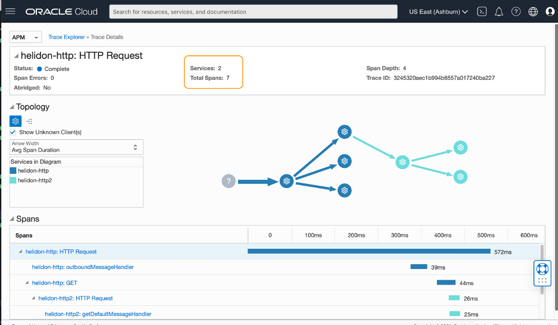

# View the trace having multiple services

## Introduction

In this lab, you will modify the original service to call the second service, which you created in the Lab 4. Then verify the trace that is distributed among the services, in the APM Trace Explorer.

Estimated time: 15 minutes

### Objectives

* Implement Jersey client in the Maven project
*	Create and start a span that invokes the second service
*	Rebuild the application
*	Use APM Trace Explorer to verify the trace having multiple services


### Prerequisites

* This tutorial requires the completion of the Lab 1,2,3 and 4.

## Task 1: Task 1: Modify pom.xml

1.	Change to ***helidon-quickstart-se*** directory, open ***pom.xml*** in an editor.

	``` bash
	<copy>
	vi ~/helidon-quickstart-se/pom.xml
	</copy>
	```

2.	Add the following dependency:

		<dependency>
		    <groupId>io.helidon.security.integration</groupId>
		    <artifactId>helidon-security-integration-jersey</artifactId>
		</dependency>
		<dependency>
		    <groupId>io.helidon.tracing</groupId>
		    <artifactId>helidon-tracing-jersey-client</artifactId>
		</dependency>
		<dependency>
		    <groupId>org.glassfish.jersey.core</groupId>
		    <artifactId>jersey-client</artifactId>
		</dependency>
		<dependency>
		    <groupId>org.glassfish.jersey.inject</groupId>
		    <artifactId>jersey-hk2</artifactId>
		</dependency>
	

## Task 2: Replace GreetService Class

1.	Change to ***quickstart/se*** directory where the ***GreetService.java*** file resides.

	``` bash
	<copy>
	cd ~/helidon-quickstart-se/src/main/java/io/helidon/examples/quickstart/se
	</copy>
	```


2.	Replace the GreetService class with the code below.

	``` bash
	<copy>

	package io.helidon.examples.quickstart.se;

	import io.helidon.common.http.Http;
	import io.helidon.config.Config;
	import io.helidon.tracing.jersey.client.ClientTracingFilter;
	import io.helidon.webserver.Routing;
	import io.helidon.webserver.ServerRequest;
	import io.helidon.webserver.ServerResponse;
	import io.helidon.webserver.Service;
	import io.opentracing.Span;
	import java.util.Collections;
	import java.util.concurrent.atomic.AtomicReference;
	import javax.json.Json;
	import javax.json.JsonBuilderFactory;
	import javax.json.JsonObject;
	import javax.ws.rs.client.Client;
	import javax.ws.rs.client.ClientBuilder;
	import javax.ws.rs.client.Invocation;
	import javax.ws.rs.client.WebTarget;

	public class GreetService implements Service {

		private final AtomicReference<String> greeting = new AtomicReference<>();
		private WebTarget webTarget;
		private static final JsonBuilderFactory JSON = Json.createBuilderFactory(Collections.emptyMap());

		GreetService(Config config) {
		  greeting.set(config.get("app.greeting").asString().orElse("Ciao"));
		  Client jaxRsClient = ClientBuilder.newBuilder().build();
		  webTarget = jaxRsClient.target("http://localhost:8081/greet");
		}

		@Override
		public void update(Routing.Rules rules) {
		  rules
		      .get("/", this::getDefaultMessageHandler)
		      .get("/outbound", this::outboundMessageHandler)
		      .put("/greeting", this::updateGreetingHandler);
		}

		private void getDefaultMessageHandler(ServerRequest request, ServerResponse response) {
		  var spanBuilder = request.tracer()
		              .buildSpan("getDefaultMessageHandler");
		  request.spanContext().ifPresent(spanBuilder::asChildOf);
		  Span span = spanBuilder.start();
		  try {
		    sendResponse(response, "World");
		  } finally {
		    span.finish();
		  }
		}

		private void sendResponse(ServerResponse response, String name) {
		  String msg = String.format("%s %s!", greeting.get(), name);

		  JsonObject returnObject = JSON.createObjectBuilder().add("message", msg).build();
		    response.send(returnObject);
		  }

		  private void updateGreetingFromJson(JsonObject jo, ServerResponse response) {

		   if (!jo.containsKey("greeting")) {
		      JsonObject jsonErrorObject =
		          JSON.createObjectBuilder().add("error", "No greeting provided").build();
		      response.status(Http.Status.BAD_REQUEST_400).send(jsonErrorObject);
		      return;
		    }
		    greeting.set(jo.getString("greeting"));
		    response.status(Http.Status.NO_CONTENT_204).send();
		  }

		  private void outboundMessageHandler(ServerRequest request, ServerResponse response) {
		    Invocation.Builder requestBuilder = webTarget.request();

		    var spanBuilder = request.tracer()
		                .buildSpan("outboundMessageHandler");
		    request.spanContext().ifPresent(spanBuilder::asChildOf);
		    Span span = spanBuilder.start();

		    try {
		      requestBuilder.property(
		          ClientTracingFilter.CURRENT_SPAN_CONTEXT_PROPERTY_NAME, request.spanContext());  
          requestBuilder   
		          .rx()
		          .get(String.class)
		          .thenAccept(response::send)
		          .exceptionally(
		              throwable -> {
		                response.status(Http.Status.INTERNAL_SERVER_ERROR_500);
		                response.send("Failed with: " + throwable);
		                return null;
		              });
		    } finally {
		      span.finish();   
		    }
		  }

		  private void updateGreetingHandler(ServerRequest request, ServerResponse response) {
		    request.content().as(JsonObject.class).thenAccept(jo -> updateGreetingFromJson(jo, response));
		  }
		}
		</copy>
		```


## Task 3: Build and start the application

1. Ensure the JAVA_HOME environment variable is set.

	``` bash
	<copy>
	export JAVA_HOME=~/graalvm-ce-java11-20.1.0
	export PATH="$JAVA_HOME/bin:$PATH"
	</copy>
	```
2.	Kill the existing session using the port 8080.

	``` bash
	<copy>
	fuser -k 8080/tcp
	</copy>
	```

2.	From the ***helidon-quickstart-se*** directory, run mvn package, skipping unit tests.

	``` bash
	<copy>
	cd ~/helidon-quickstart-se/; mvn package -DskipTests=true
	</copy>
	```
3.	Start the application by running the application jar file.

	``` bash
	<copy>
	nohup java -jar target/helidon-quickstart-se.jar&
	</copy>
```
4.	Test the application by running the following command

	``` bash
	<copy>
	curl -i http://localhost:8080/greet/outbound
	</copy>
	```
	

## Task 4: View the trace in the APM Trace Explorer

1.	From the OCI menu, select **Observability & Management**, then **Trace Explorer**.  Click a link of helidon-http service.


	

2. In the **Trace Details** page, verify that the trace includes 7 spans from two services. Examine the topology to understand how the two services are connected. Review the flow in the **Spans** view and observe how the spans are distributed.

	

You may now [proceed to the next lab](#next).

## Acknowledgements

- **Author** - Yutaka Takatsu, Product Manager, Enterprise and Cloud Manageability
- **Contributors** -
- **Last Updated By/Date** - Yutaka Takatsu, September 2021
