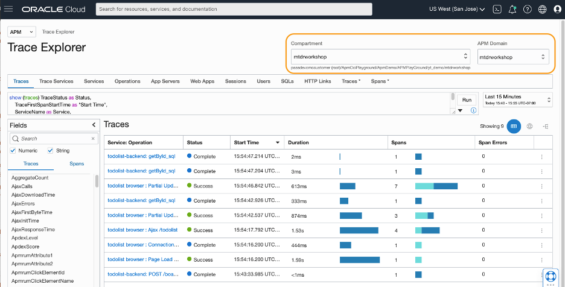
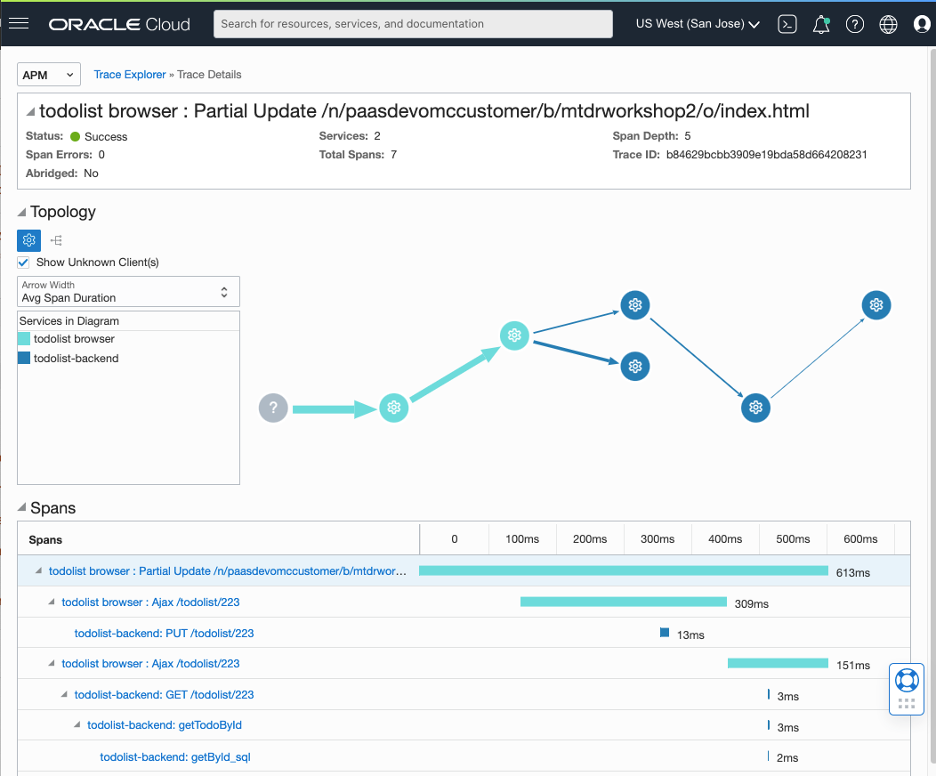
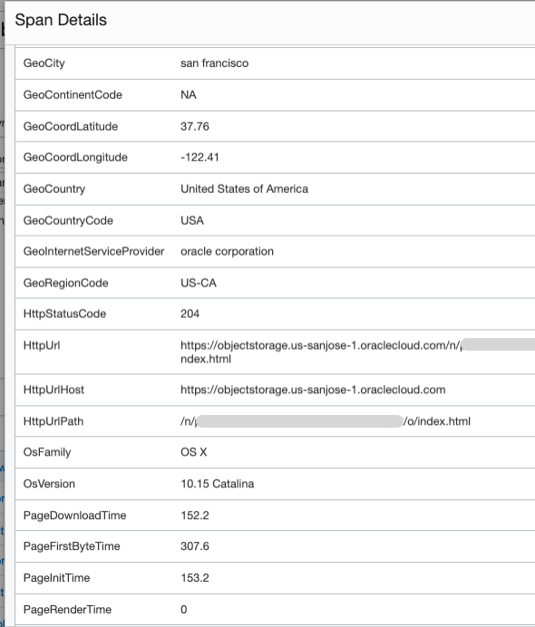
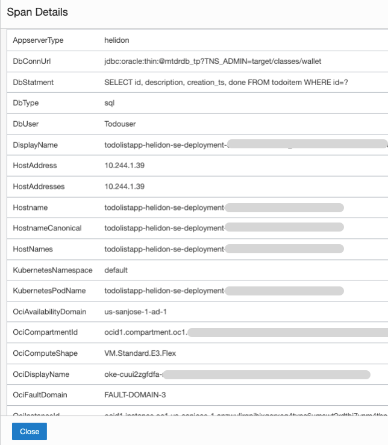

# View traces and spans in APM Trace Explorer

## Introduction

In this lab, you will learn how to use APM Trace Explorer to trace the workload you generated in the My TodoList application, in the previous lab.

Estimated time: 15 minutes

### Objectives

* Open APM Trace Explorer from the Oracle Cloud console
*	Verify traces and spans generated by the APM tracers configured in the Lab 3.
*	Examine values in the span dimensions for the frontend, backend server, and the database.

### Prerequisites

* This tutorial requires the completion of the Lab 1, 2, 3 and 4 in this workshop.

## Task 1: Open APM Trace Explorer in the Oracle Cloud console

1.	From the OCI menu, select **Observability & Management**, select **Trace Explorer**.

	

2.	Select the Compartment and the APM domain. Review the traces captured under **Traces** .

	

## Task 2: Verify traces in the Traces page

1.	In the **Traces** pane, you will see two types of services. They are the browser-based services and the backend-based services. The image below shows ***“todolist-browser”*** as a browser-based service and ***“todolist-backend”*** as a backend-based service. You may see the service names differently depends on how you named them.

2.	Click ***todolist browser : Partial Update***, a browser-based service having 7 spans.

	

## Task 3: Examine spans and their dimensions in the Trace Details page

1.	In the **Trace Details** page, you can observe how the spans are distributed in the trace. Examine the **Topology** view and the **Spans** view to understand how the two services are connected. You will see multiple spans, which are issued from two different services, are nested in a single trace.

	

2.	Click a span with the browser-based service.

	

3.	Examine the values of the client-side dimensions including user’s location, browser type, OS type, and Page load time information.

	

4.	Close the window. Select a span labeled as ***getByID_sql***. This is a custom span to track SQL executions, which you added in the Lab3, Task 5.

	

5.	Verify the values of the backend dimensions, including the App server type, DB connection, SQL statement, Kubernetes and OCI information.

	

This is the end of the workshop. You have learnt how to add the APM tracers to Helidon based microservices by editing the configuring files, how to add custom spans to Java classes to capture database transactions, how to add the APM Browser Agent to trace client information, and how to Use APM Trace Explorer to view traces and spans generated by the microservices. For more information on APM, refer to the OCI documentation, **[Application Performance Monitoring](https://docs.oracle.com/en-us/iaas/application-performance-monitoring/index.html)**.

 
You have completed the tutorials in this Workshop. You may now [proceed to the Need Help section ](#next) to review the common problems users face in the LiveLab, or exit the Workshop.

## Acknowledgements

- **Author** - Yutaka Takatsu, Product Manager, Enterprise and Cloud Manageability
- **Contributors** -
- **Last Updated By/Date** - Yutaka Takatsu, September 2021
