# Create and configure a file system

## Introduction

In this lab, you will create a file system in the Oracle Cloud Infrastructure. You will also create security rules to allow network traffic and mount the file system to the Kubernetes pods.  


Estimated time: 20 minutes

### Objectives
* Create a file system in the Oracle Cloud
*	Create security rules in the network
*	Create a YAML file, which defines Storage Class, Persistent Volume and Persistent Volume Claim
*	Mount the volume to the Kubernetes cluster by applying the YAML, which recreates the Kubernetes pods with the new storage configuration


### Prerequisites

* Requires OCI quota to create a file system and associated resources
* Completion of the Lab 1 and Lab 2


## Task 1: Create a file system in the Oracle Cloud

1.	From the OCI menu, select **Storage** > **File Systems**.

   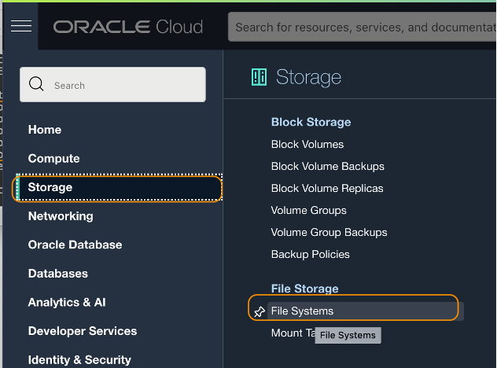

2.	Click **Create File System**

   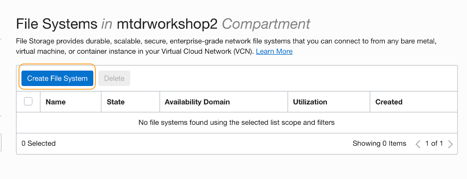


3. On the Create File System page, in the **File System Information** section, click **Edit Details**.

   

4.	On the Create File System page, enter ***apmlab-fss*** into the **Name** field.
<br><br>
Then drop down and select the **Availability Domain** and the **Compartment** where the cluster is running. You can find this information in the Cluster page (**Developer Services** > **Kubernetes Clusters (OKE)**).

   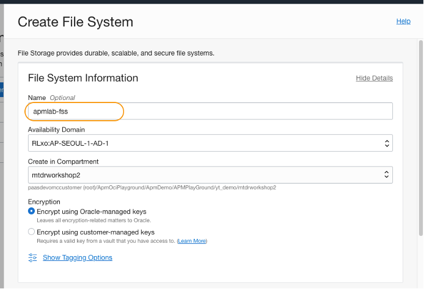


5. Scrolling down the Create File System page, in the **Export Information** section, verify that the **Export Path** is set to /apmlab-fss. This is where the file system will be mounted. You will provision APM Java agent at this location.

6. In the **Mount Target Information** section, click **Edit Details** (upper right side) to expand the section. Then click the link **Click here to enable compartment selections**.


   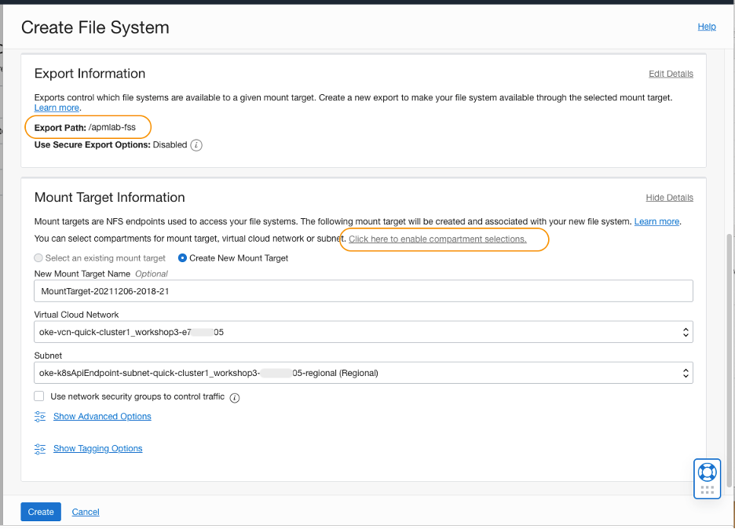

7. In the Mount Target Information section, locate the **Create in Compartment** field, ensure the same compartment that the cluster uses, is selected.

8. Next, then check that the **Create New Mount Target** is selected. Select the same **Virtual Cloud Network** that the cluster is using. Select ***oke-k8sApiEndpoint-subnet..*** for **Subnet**. Leave the other fields by default and click **Create**.

   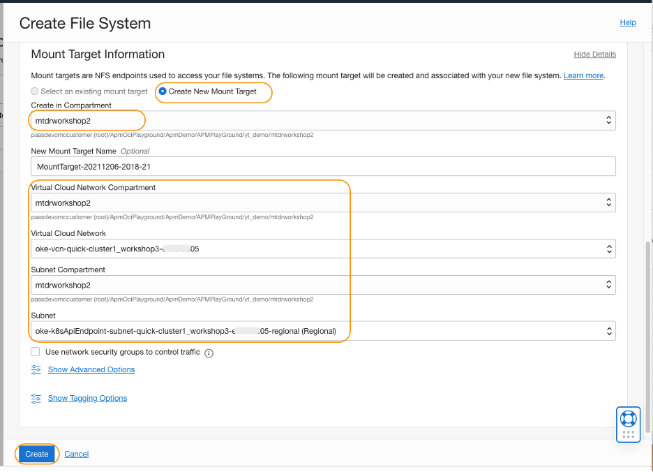


    > ***NOTE***: Ensure that oke-k8sApiEndpoint-subnet.. is selected for the Subnet.
    

9.	A new File System is created.  Scroll down to find **Exports** section. Click the link to the **Mount Target** just created.

   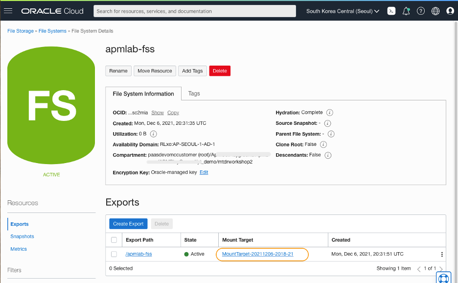

10.	Click **Copy** next to the **OCID**. Save the value in a text file on your computer. Also, take a note of the **IP Address** as you will need these values in the next steps.

   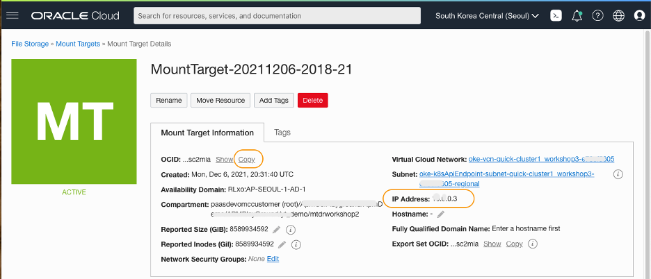

## Task 2: Create security rules in the network


1. In the Mount Target Information section point your mouse cursor over the **“i”**  icon next to **Subnet** and review the message. As the message indicates, security rules must be configured before mounting the file system, and that is what you will be doing next.

   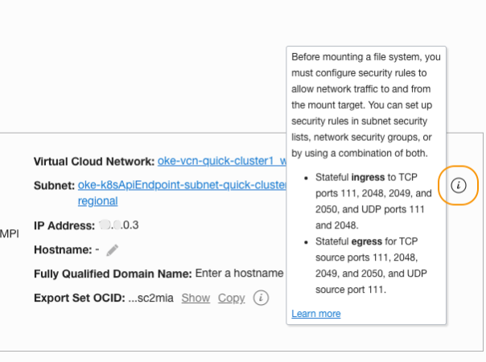

2.	Click the **Subnet** link to open the Subnet page.

   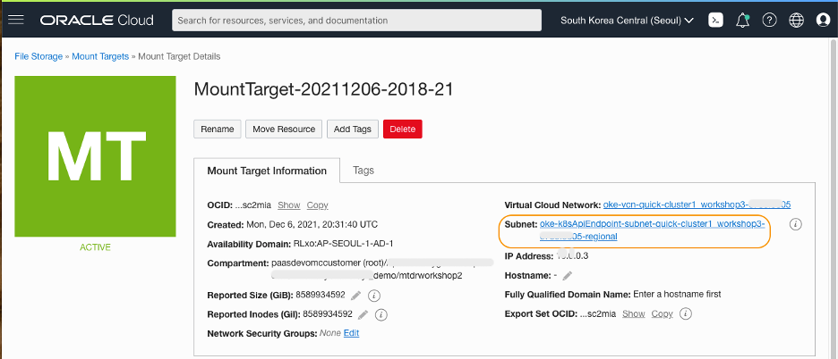


    >***NOTE***: If the click does not land at the subnet page properly, copy the subnet name and paste into the search box at the top of the Oracle Cloud console.  Find the correct link shows up under **Resources** and click.
   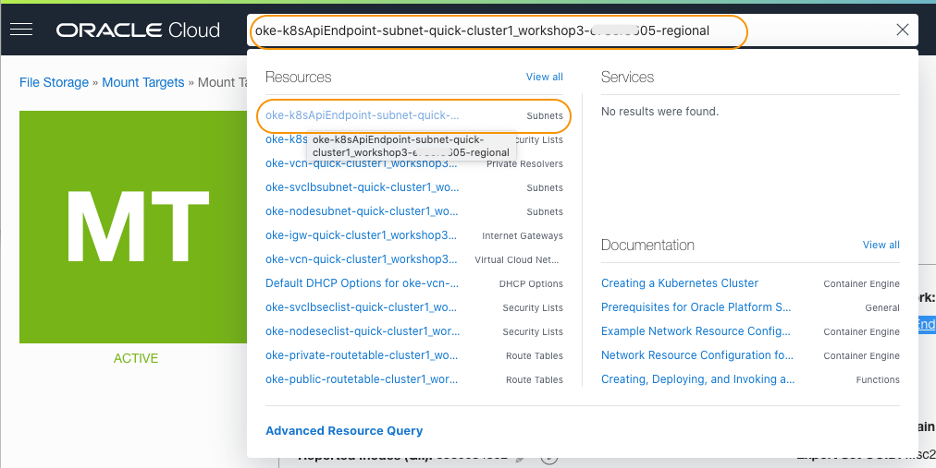

3.	In the **Subnet Details page**, scroll down and find **Security Lists** section, then click the link to the security list.

   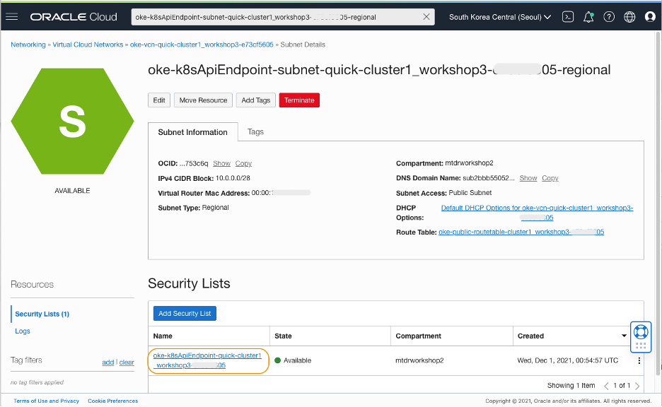

4.	Click **Add Ingress Rules** button

   


5.	In the **Add Ingress Rules** dialog, enter the following information:

     *	Stateless: **No**
     *	Source Type: **CIDR**
     *	Source CIDR: **0.0.0.0/0**
     *	IP Protocol: **TCP**
     *	Source Port Range:  leave as default (All)
     *	Destination Port Range: **111** 	
     *	Description: **Security rule for apmlab-fss**


   

6.	Create additional rules for **TCP** destination port **2048**, **2049** and **2050**. Use the same values with the rule created above except for the **Destination Port Range**.

7.	Create security rules for **UDP** destination port **111** and **2048**.  

   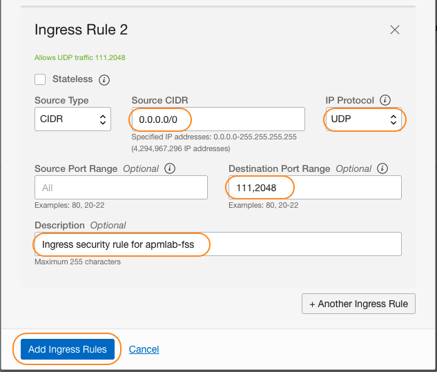

8.	After the configuration, your security rules for the **Ingress Rules** should look like the image below, .

   

9.	Click **Egress Rules**, which located at the left side of the screen.

   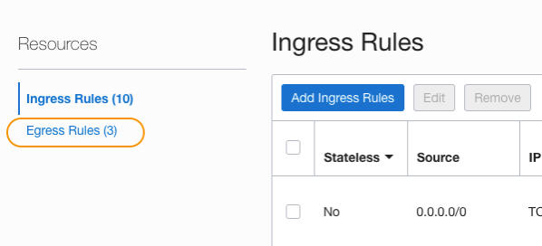

10.	Click **Add Egress Rules** button.

   

11.	In the Add Egress Rules dialog, enter the following information:

    *	Stressless: **No**
    *	Source Type: **CIDR**
    *	Source CIDR: **0.0.0.0/0**
    *	IP Protocol: **TCP**
    *	Source Port Range:  leave as default (All)
    *	Destination Port Range: **111** 	
    *	Description: **Security rule for apmlab-fss**

   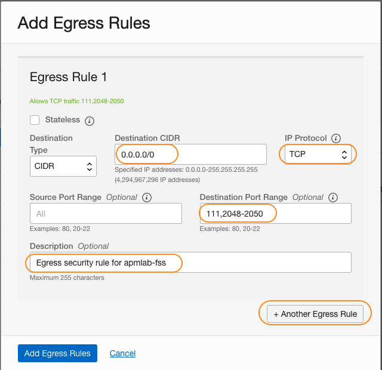

12.	Create additional rules for **TCP** destination port **2048**, **2049** and **2050**. Use the same values with the rule created above except for the **Destination Port Range**.
13.	Create security rules for **UDP** destination port **111**.
14.	After the configuration, your security rules for the **Egress Rules** should look like the image below.

   

## Task 3: Mount the file system to Kubernetes pods

1. Click the **>..**  icon from the top right corner in the Oracle Cloud console menu bar, to start a Cloud Shell environment which will appear at the bottom of your page.
   

    >	***NOTE***: If the Cloud Shell is already running but the window is minimized, you can restore the window by clicking the bar icon or the arrow icon at the toolbar.
      

2.  Run the oci cd (Container Engine) command that you saved in the Lab 1, Task1, step6.

   

3.	Create a YAML file in your home directory, by running the command below.


    ``` bash
    <copy>
    touch ~/apmlab-fss.yaml
    </copy>
    ```

4.	Use any text editor (such as vi editor tool) to open the file for editing.

    ``` bash
    <copy>
    vi ~/apmlab-fss.yaml
    </copy>
    ```

    >***NOTE***: If you are using the vi editor, type ***i*** to enter Insert mode, and make the text editable. Use allow keys to navigate the text and make changes to where you set the cursor. To save a file, press Esc key, then type ***:wq*** to write and quit the file. If you do not wish a change, press Esc then type ***:q!*** to discard your changes. Please refer to the editor references for more usages.

5. Manually copy the contents below and paste it to the file just created. Ensure to replace the **mntTargetID** and **server IP** with the values copied in the Lab 3, Task 1, step 10 in this Workshop.


        kind: StorageClass
        apiVersion: storage.k8s.io/v1
        metadata:
          name: apmlab-fss
        provisioner: oracle.com/apmlab-fss
        parameters:
          mntTargetId: <OCID of your Mount Target >
        ---
        apiVersion: v1
        kind: PersistentVolume
        metadata:
          name: apmlab-fsspv
        spec:
          storageClassName: apmlab-fss
          capacity:
            storage: 10Gi
          accessModes:
            - ReadWriteMany
          mountOptions:
            - nosuid
          nfs:
            server:<Server IP of your Mount Target>
            path: "/apmlab-fss"
            readOnly: false
        ---
        apiVersion: v1
        kind: PersistentVolumeClaim
        metadata:
          name: apmlab-fsspv
        spec:
          storageClassName: apmlab-fss
          accessModes:
          - ReadWriteMany
          resources:
            requests:
              storage: 10Gi
          volumeName: apmlab-fsspv


     >***Suggested Editing Tips***:
   	* Use your mouse to select the text above, and manually copy and paste it into a text file.
    * Auto copy is not provided as it may break the indentation.
    * Replace the ***mntTargetId*** and the ***Server IP***, then copy the modified text into the YAML file.
   	* Make sure to keep the syntax of 2 space indentation.
   	* Refer to the screenshot image below to see how it should look like after the file is modified. Verify that the Kubernetes objects, such as StorageClass, PersistentVolume and PersistentVolumeClass are configured in the YAML file.
       	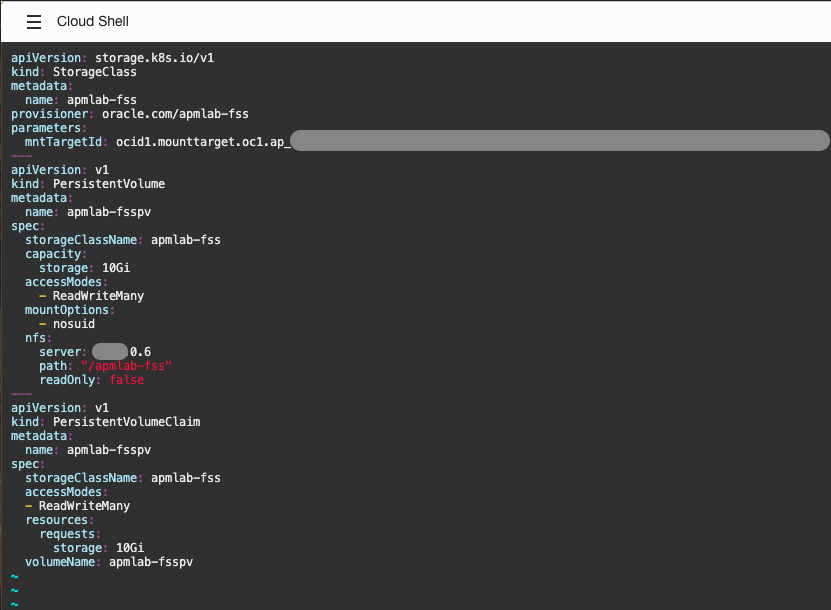

## Task 4: Recreate Kubernetes pods


1.	From the home directory, execute the following command to add the storage objects to the Kubernetes cluster.


    ``` bash
    <copy>
    cd ~; kubectl apply -f apmlab-fss.yaml -n sample-domain1-ns
    </copy>
    ```

   

     >***NOTE***: If you need to modify the YAML file after once applied, first run the command below to remove the objects, modify the file, then rerun the above command to re-apply the YAML. <br>kubectl delete -f apmlab-fss.yaml -n sample-domain1-ns

2.	Open ***domain.yaml*** file that locates in the home directory, with any editor, such as vi tool.

    ``` bash
    <copy>
    vi ~/domain.yaml
    </copy>
    ```
3.	Find the **volumes:** section. At this point, the section is commented out.

   

4.	Uncomment the **volume** section, then replace the values as below, then save the file.


        volumes:
        - name: apmlab-nfs
          persistentVolumeClaim:
            claimName: apmlab-fsspv
        volumeMounts:
        - mountPath: "/apmlab-fss"
          name: apmlab-nfs

   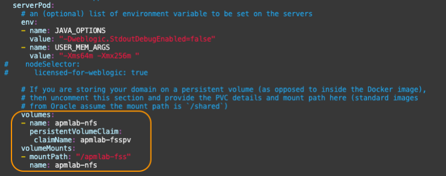


    >***NOTE***: ensure that the line “volumes:” is set with the same indentation level with the line “env:”.

5.	Run the following command. This will recreate the pods, with the new object configurations.

    ``` bash
    <copy>
    kubectl apply -f domain.yaml -n sample-domain1-ns
    </copy>
    ```
   

6.	Run the following command to ensure the pods are in the running state. You may need to wait for few minutes to see the status updated.

    ``` bash
    <copy>
    kubectl get pods -n sample-domain1-ns
    </copy>
    ```
    

7.	Execute the following command to access the Kubernetes pods.

    ``` bash
    <copy>
     kubectl exec -it sample-domain1-admin-server -n sample-domain1-ns -- /bin/bash
    </copy>
    ```

8.	Go to the root directory and hit ls. Make sure that you see ***apmlab-fss*** directory that is the file system mounted to this location.

    ``` bash
    <copy>
    cd /; ls
    </copy>
    ```
    

9.	Move to the ***apmlab-fss*** and create a directory ***apmagent***

    ``` bash
    <copy>
    cd apmlab-fss; mkdir apmagent
    </copy>
    ```
10.	Ensure the ***apmagent*** directory is created

    ``` bash
    <copy>
    ls
    </copy>
    ```
    

11.	Go back to the Cloud Shell.


    ``` bash
    <copy>
    exit
    </copy>
    ```
    

    >***Debugging TIPS***: If you cannot find the apmlab-fss directory, or the pods do not start running, execute the following command from the Cloud Shell to troubleshoot. <br> kubectl get events --sort-by=.metadata.creationTimestamp -n sample-domain1-ns


You may now [proceed to the next lab](#next).

## Acknowledgements

* **Author** - Yutaka Takatsu, Product Manager, Enterprise and Cloud Manageability
- **Contributors** - Steven Lemme, Senior Principal Product Manager,<br>
David Le Roy, Director, Product Management,<br>
Avi Huber, Senior Director, Product Management
* **Last Updated By/Date** - Yutaka Takatsu, January 2022
