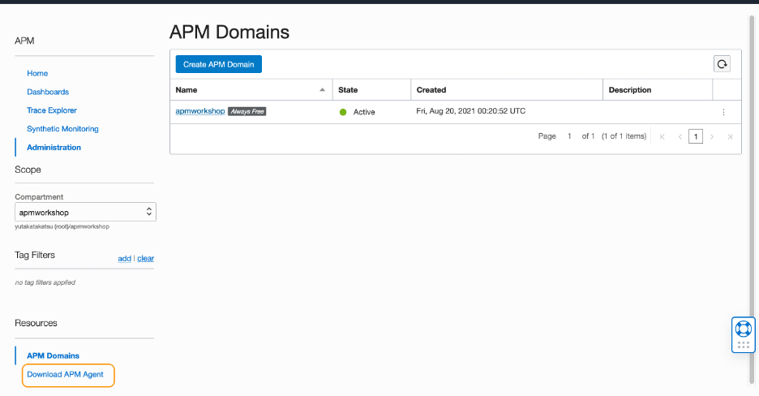
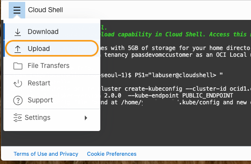
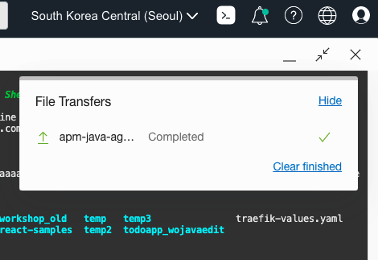

# Configure APM Java Agent

## Introduction

In this lab, you will download the APM Java Agent installer file from the Oracle Cloud console, upload it to the Oracle Cloud shell, transfer to the Kubernetes container, provision the Java Agent to the file system, and finally deploy the Agent to the WebLogic Server.

Estimated time: 20 minutes

### Objectives
* Download the APM Java Agent from the Oracle Cloud console
*	Upload the APM Java Agent to the Cloud shell
*	Copy the Java Agent installer from the Cloud shell to the file system
*	Provision the APM Java Agent in the shared file system directory
*	Deploy the Java Agent to the WebLogic Server


### Prerequisites
* Completion of the Lab 1, 2 and 3


## Task 1: Download APM Java Agent

1.	Open navigation menu from the Oracle Cloud console, select **Observability & Management** > **Administration**.


   

2.	Under **Resources** at the lower left side of the screen, click **Download APM Agent**

   

3.	Click **Java Agent** link. Save the file to your laptop. Your browser may ask you to save the file to local. Click OK, if asked.  

   

## Task 2: Upload the APM Java Agent to the Cloud shell

1.	Open the Cloud Shell by clicking the **>..** icon from the top right corner in the Oracle Cloud console.


   

2.	Click the navigation menu (three-bar icon) in the Cloud Shell title bar to open the menu. Then select **Upload**.

   

3.	Click **select from your computer** link and select the Java agent installer file from your computer. This is the file that you downloaded in the earlier steps.

   

4.	Click **Upload**.

   

5.	Wait for the File Transfer to complete.

   

6. Then type "ls" command in the Cloud shell to confirm the file exists in the home directory.  

    ``` bash
    <copy>
    cd ~/; ls
    </copy>
    ```
   

## Task 3: Copy the Java Agent installer to the file system

1.	Run the command below to copy the Java Agent installer file to the file system. Ensure to replace the **apm-agent-version** with that of the APM Java Agent you have, before the command execution.

    ``` bash
    <copy>
    kubectl cp apm-java-agent-installer-<apm-agent-version>.jar sample-domain1-ns/sample-domain1-admin-server:/apmlab-fss/apmagent/
    </copy>
    ```
    > e.g., kubectl cp apm-java-agent-installer-1.2.1725.jar sample-domain1-ns/sample-domain1-admin-server:/apmlab-fss/apmagent/

   >***NOTE***: file system path must match the one you created in the earlier steps. In this example, mounted path is ***apmlab-fss***.


2.	Use the kubectl command below to remotely access the container in the Kubernetes pod.

    ``` bash
    <copy>
    kubectl exec -it sample-domain1-admin-server -n sample-domain1-ns -- /bin/bash
    </copy>
    ```

3.	Change to the ***apmagent*** directory to verify the successful file transfer.

    ``` bash
    <copy>
    cd /apmlab-fss/apmagent; ls
    </copy>
    ```

    If you see the java agent installer file in the location, the file transfer was successful.


   

    >***NOTE***: The APM version may be different from what is showing in the example.


## Task 4: Provision the APM Java Agent


>***NOTE***: Make sure you are still in the Kubernetes container. If your command prompt does not show ***bash-4.2#***, you are back in the Cloud Shell due to the timeout. Execute the following command to log back in to the container. <br> kubectl exec -it sample-domain1-admin-server -n sample-domain1-ns -- /bin/bash


1.	Move to the apmagent directory

    ``` bash
    <copy>
    cd /apmlab-fss/apmagent; ls
    </copy>
    ```
    You should see the apm-java-agent-installer file in the directory.

2.	Run java -version command. Verify that Java is installed and the version returns in the output.

   

3.	From the ***apmagent*** directory, execute the command below to provision the APM Java agent. Replace the **APM Domain Private key** and **APM Domain Endpoint**, with the values saved in the Lab2, Task2. Please also change the **apm-agent-version** in the file name to the version of the agent you have.

    ``` bash
    <copy>
    java -jar ./apm-java-agent-installer-<apm-agent-version>.jar provision-agent -service-name=lab-WLS-svc -destination=.  -private-data-key=<APM Domain Private Key> -data-upload-endpoint=<APM Domain Endpoint>
    </copy>
    ```


    With a successful installation, you should see the output similar to below.

   

4.	Type "ls" command to verify ***oracle-apm-agent*** directory is created. Then exit the container and go back to the Cloud shell.
    ```bash
    <copy>
    cd /apmlab-fss/apmagent; ls
    </copy>
    ```
    ```bash
    <copy>
    exit
    </copy>
    ```

    

## Task 5: Disable the maintenance spans

In this task, you will add exclusions to the data capture in the APM Agent, for the JAXRS server probe that generates a lot of static spans. This is an optional task if you are monitoring the real-life environment, but for the lab purpose, we would like to suppress the spans generated from the server maintenance, so that you can focus on the spans related to the browser navigations.

Because there is no editing tool inside the container, you will copy an APM agent configuration file from the container to the Cloud Shell, edit the file, then copy back to the container. We plan to add the exclusion by default, to the product in the future.

1.	Copy ***ProveConfig.acml*** from the container.

    ``` bash
    <copy>
    kubectl cp sample-domain1-ns/sample-domain1-admin-server:/apmlab-fss/apmagent/oracle-apm-agent/config/<apm-agent-version>/ProbeConfig.acml ~/ProbeConfig.acml
    </copy>
    ```   

    >***NOTE***: The file path includes the APM Java Agent version. Change the directory name to the Agent version you have. <br>E.g., kubectl cp sample-domain1-ns/sample-domain1-admin-server:/apmlab-fss/apmagent/oracle-apm-agent/config/**1.2.1725**/ProbeConfig.acml ~/ProbeConfig.acml

    run "ls" command from the Home directory and confirm the file was transferred.  
    ```bash
    <copy>
    cd ~;ls
    </copy>
    ```
   

2.	Open ***ProbeConfig.acml*** with an editor

    ```bash
    <copy>
    vi ProbeConfig.acml
    </copy>
    ```

3.	Make the following changes and save the file.

    - Find **JAXRS\_SERVER** under the **enabled\_probes** section,
    - change<br>
    JAXRS\_SERVER : **true**  to <br>
    JAXRS\_SERVER : **false**   

   

   4.	Copy ***ProbeConfig.acml*** back to the container. Change the directory name to the Agent apm-agent-version you have.

    ```bash
    <copy>
    kubectl cp  ~/ProbeConfig.acml sample-domain1-ns/sample-domain1-admin-server:/apmlab-fss/apmagent/oracle-apm-agent/config/<apm-agent-version>/ProbeConfig.acml
    </copy>
    ```

    > ***NOTE***: E.g., kubectl cp  ~/ProbeConfig.acml sample-domain1-ns/sample-domain1-admin-server:/apmlab-fss/apmagent/oracle-apm-agent/config/**1.2.1725**/ProbeConfig.acml

## Task 6: Deploy the Java Agent

Next you will deploy the Java Agent by modifying the domain.yaml file to point the APM Agent jar file bootstrap location.

1.	Open the Cloud shell, if not opened. Open the ***domain.yaml*** from the home directory with any editor.

    ```bash
    <copy>
    cd ~; vi domain.yaml
    </copy>
    ```

2.	Find the **JAVA_OPTIONS** section. You will see a java runtime parameter **"-Dweblogic.StdoutDebugEnabled=false"** is set.

        

3.	Add the Java Agent jar location by replacing the value to:

    ```bash
    <copy>
    "-javaagent:/apmlab-fss/apmagent/oracle-apm-agent/bootstrap/ApmAgent.jar -Dweblogic.StdoutDebugEnabled=false"
    </copy>
    ```

        

    Save and close the file.

4.	Recreate the Kubernetes pod by applying the yaml.

    ```bash
    <copy>
    kubectl apply -f domain.yaml -n sample-domain1-ns
    </copy>
    ```
        

5.	Wait for a few minutes, then run the following command to check the status of the pods. Make sure they are in the Running state and Ready.

    ```bash
    <copy>
    kubectl get pods -n sample-domain1-ns
    </copy>
    ```
    Once the pods are in the Running state, the APM Java Agent is active and listening to the WebLogic Server. It captures backend traces and spans which you can view in the APM Trace Explorer.


You may now [proceed to the next lab](#next).

## Acknowledgements

* **Author** - Yutaka Takatsu, Product Manager, Enterprise and Cloud Manageability
- **Contributors** - Steven Lemme, Senior Principal Product Manager,<br>
David Le Roy, Director, Product Management,<br>
Mahesh Sharma, Consulting Member of Technical Staff,<br>
Avi Huber, Senior Director, Product Management
* **Last Updated By/Date** - Yutaka Takatsu, January 2022
