# Use DLS to Bulk Label Dataset

## Introduction
In this lab, we will provide a .zip file containing biomedical images separated into 3 subfolders based on how each image has been medically classified. In this lab, participants will download this .zip file, bulk upload the images to object storage, and will create a labeled dataset using the Data Labeling Service and custom bulk-labeling code.

*Estimated Time*: 60 minutes

### Objectives

In this lab, you will:
- Create an Object Storage Bucket and load images from your local machine into the Bucket
- Create a Data Labeling Service dataset and bulk label the images that were loaded into Object Storage

### Prerequisites and Additional Requirements

- An Oracle Free Tier, or Paid Cloud Account
- Ensure that you have OCI-CLI installed. If unsure, run the following in your local command line and make sure your namespace is returned.
    ```
    <copy>oci os ns get</copy>
    ```
    Else, refer to the [OCI-CLI setup instructions](https://docs.oracle.com/en-us/iaas/Content/API/SDKDocs/cliinstall.htm)
- Ensure that you have Python SDK installed on your machine by following the steps [here](https://docs.oracle.com/en-us/iaas/tools/python/2.57.0/installation.html#install)
  * Note that if you have a Python version of less than 3, it is necessary to replace all instances of 'python3' in the CLI operations mentioned in this lab with 'python'. In these lab instructions, we will assume that the user has Python3.

**Required Download:** Use [this](https://objectstorage.us-ashburn-1.oraclecloud.com/p/j8C5pBw0Nco_tjY_ggsCEHlJUk9IDWms8hGHtGkRIt-EqCGPWZWicJLwxBJE-brX/n/orasenatdpltintegration03/b/all-images-live-lab/o/Biomedical_Demo.zip) link to download the files needed throughout the lab. Unzip the file to a location of your choice on your local machine.

## **Policy Setup**

Before you start using OCI Data Labeling Service, you or your tenancy administrator should set up the following policies by following below steps:

1. Either identify or create a compartment where you will provision resources for this lab.

  a. From the OCI services menu, click 'Compartments' under 'Identity'
  

  b. Click 'Create Compartment'

  c. Provide an appropriate name

  d. Provide a description

  e. Select the parent compartment

  f. Click 'Create Compartment'
  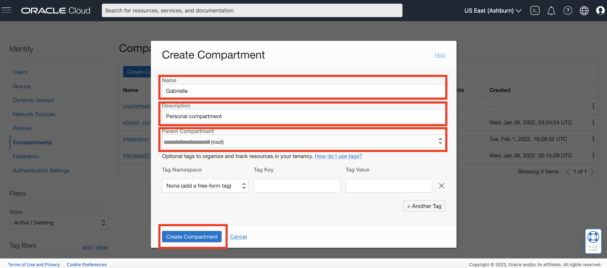

2. Retrieve the compartment OCID

3. Make a group and add your user to it.

  a. From the OCI services menu, click 'Groups' under 'Identity'
  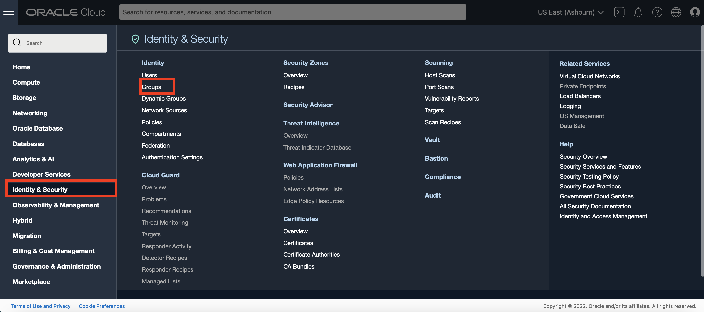

  b. Click 'Create Group'

  c. Provide an adequate group name (e.g. named ImageClassification_Group) and description

  d. Click 'Add User to Group'
  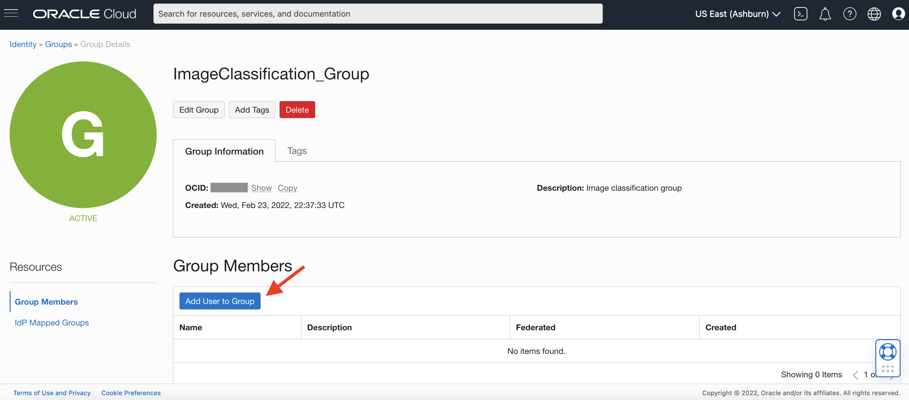

  e. Select user you want to add to the group.


4.  Create a Dynamic Group

    a. From the OCI services menu, click 'Dynamic Groups' under 'Identity'
    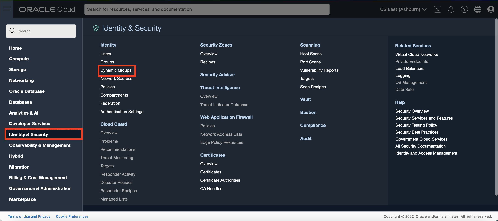

    b. Select 'Create Dynamic Group'

    c. Add an appropriate name (e.g. named DataLabeling_DynamicGroup)

    d. Add a description

    e. Include the following rule. Replace the information in '<>' with your own value.

      ```
      <copy>ALL {datalabelingdataset.compartment.id='<compartment OCID>'}</copy>
      ```
      

5. Create policies for Dynamic Group and Group.

    a. From the OCI services menu, click 'Policies' under 'Identity'
    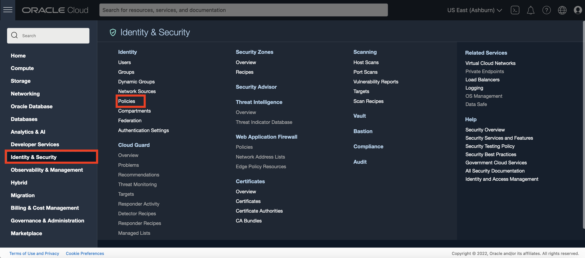

    b. Click on 'Create Policy'

    c. Give the policy an appropriate name (e.g. named DataLabelingPolicy)

    d. Provide a description

    e. Click the toggle to show the manual editor

    d. Copy and paste the following statements into the Policy Builder editor. Replace the information in '<>' with your own values.

      ```
      <copy>Allow dynamic-group DataLabeling_DynamicGroup to read buckets in compartment id <compartment OCID></copy>
      ```
      ```
      <copy>Allow dynamic-group DataLabeling_DynamicGroup to read objects in compartment id <compartment OCID></copy>
      ```
      ```
      <copy>Allow dynamic-group DataLabeling_DynamicGroup to manage objects in compartment id <compartment OCID> where any {request.permission='OBJECT_CREATE'}</copy>
      ```
      ```
      <copy>Allow group ImageClassification_Group to read buckets in compartment id <compartment OCID></copy>
      ```
      ```
      <copy>Allow group ImageClassification_Group to manage objects in compartment id <compartment OCID></copy>
      ```
      ```
      <copy>Allow group ImageClassification_Group to read objectstorage-namespaces in compartment id <compartment OCID></copy>
      ```
      ```
      <copy>Allow group ImageClassification_Group to manage data-labeling-family in compartment id <compartment OCID></copy>
      ```
## **Task 1:** Create an Object Storage Bucket

1. From the OCI services menu, click 'Buckets' under 'Object Storage & Archive Storage'
  

2. Set your Compartment to the desired Compartment using the drop down under List Scope
  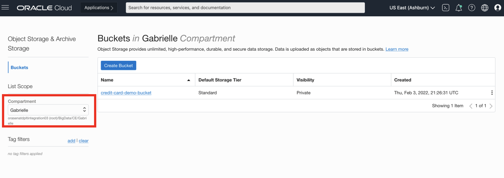

3. Click 'Create Bucket' and enter details for your Bucket:

  a. Bucket Name: enter a name for your Bucket that you can recognize, e.g. image-classification-demo

  b. Default Storage Tier: Standard

  c. Encryption: Encrypt using Oracle managed keys

  d. Click 'Create'
  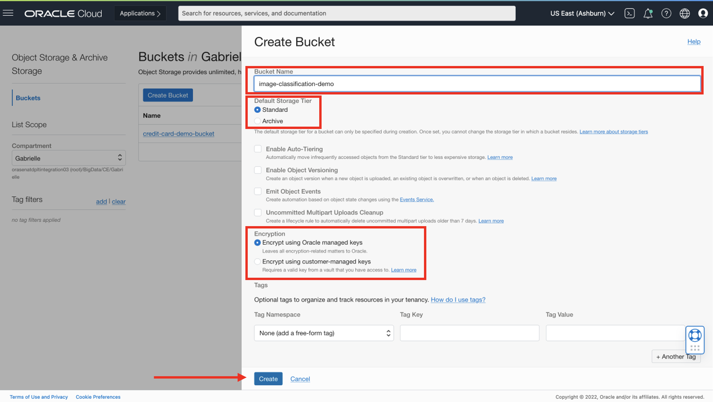

## **Task 2:** Upload the Images From Your Local Machine Into Your Bucket
Note: These instructions are Mac OS compatible
1. On your local machine, execute the following commands to set environment variables for the name of your bucket and the OCID of the compartment where your bucket exists. Be sure to replace the information in "<>" with your own values.
    ```
    <copy>export DL_BucketName="<your bucket name>"</copy>
    ```
    ```
    <copy>export DL_Compartment=<OCID of your Compartment></copy>
    ```

2. On your local machine, execute the following commands to set environment variables for the directory named "Cell" that contains your .jpg/.jpeg image files to be labeled accordingly. Be sure to replace the information in "<>" with your own values.
    ```
    <copy>export DL_LabelDirectory="<path to Cell folder>"</copy>
    ```

3. Execute the following command to bulk-upload the .jpg/.jpeg image files to your bucket from the "Cell" folder, appending the prefix "c" to the objects that will be created from this bulk-upload command, which will be used to bulk-label the records in our Dataset later in this lab.
    ```
    <copy>oci os object bulk-upload --bucket-name "${DL_BucketName}" --src-dir $DL_LabelDirectory --content-type 'image/jpeg' --object-prefix c</copy>
    ```
4. Repeat Steps 2 and 3, replacing "Cell" and "c" with "Stripe" and "s", which represent another category into which our images will be classified.

5. Repeat Steps 2 and 3, replacing "Stripe" and "s" with "Debris" and "d", which represent another category into which our images will be classified.

6. Confirm that the images have been uploaded to object storage and have been prepended with the appropriate letter.
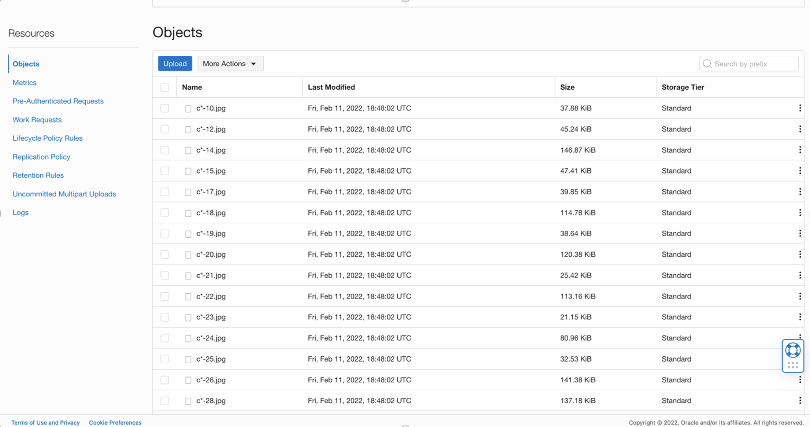

## **Task 3:** Create a Data Labeling Service Dataset
1. From the OCI services menu, click 'Data Labeling' under 'Machine Learning'


2. Click on 'Datasets'
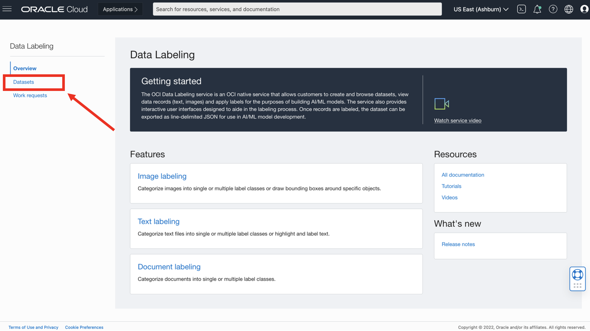

3. Set your Compartment to the same Compartment where you created your Bucket using the drop down under List Scope
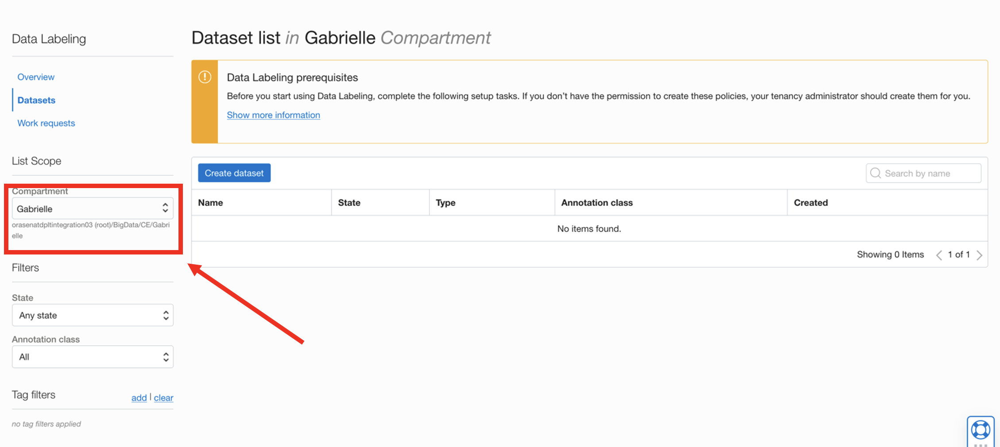

4. Create your dataset by clicking 'Create dataset'

  a. Name: enter a name for your DLS Dataset that you can recognize, e.g. image-classification-demo

  b. Dataset format: Images

  c. Annotation Class: Single Label

  d. Click 'Next'
  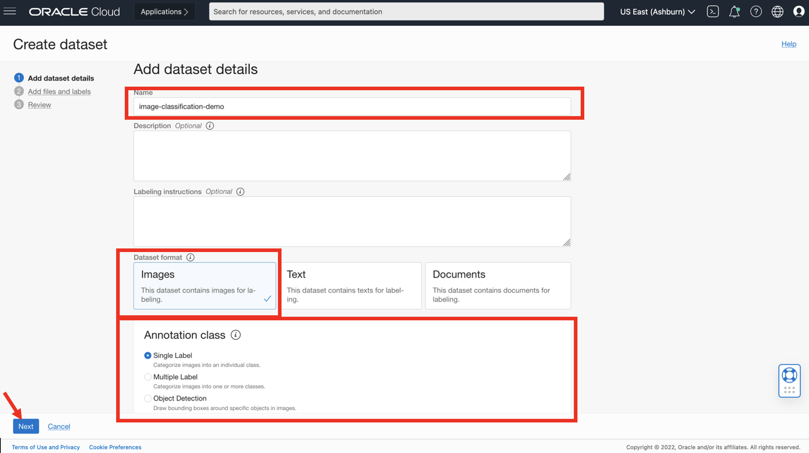

  e. Retrieve files from Object Storage by choosing 'Select from Object Storage'
  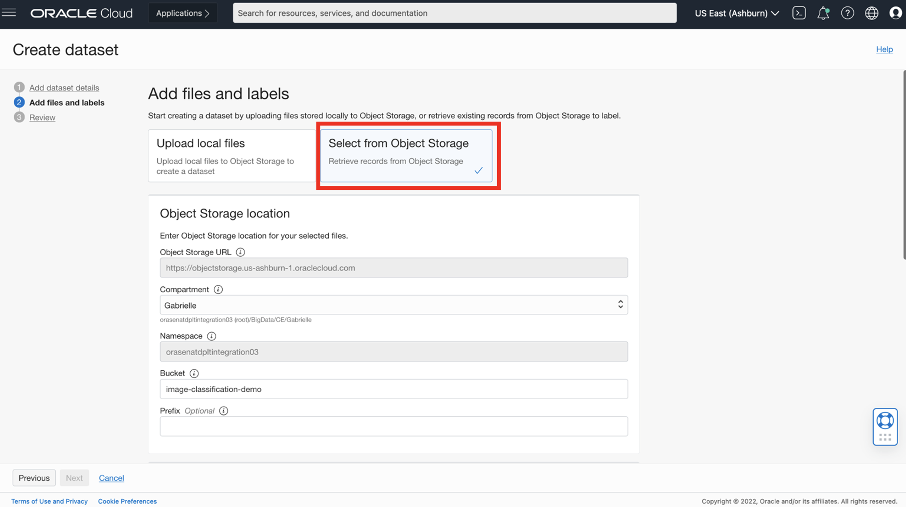

  f. Choose the name of compartment where your Bucket exists
  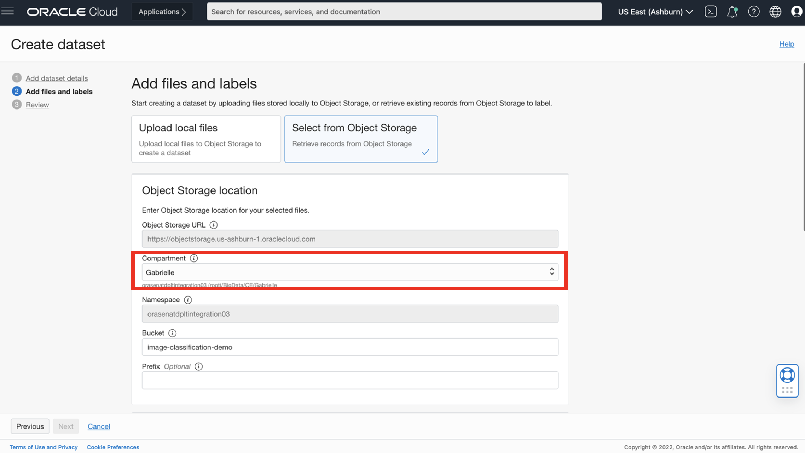

  g. Choose your Bucket by name
  

  h. Add Labels: enter all possible labels that you will want to use to label any of your data, pressing enter between each label. In our case, our labels will be:
    * cell
    * stripe
    * debris
  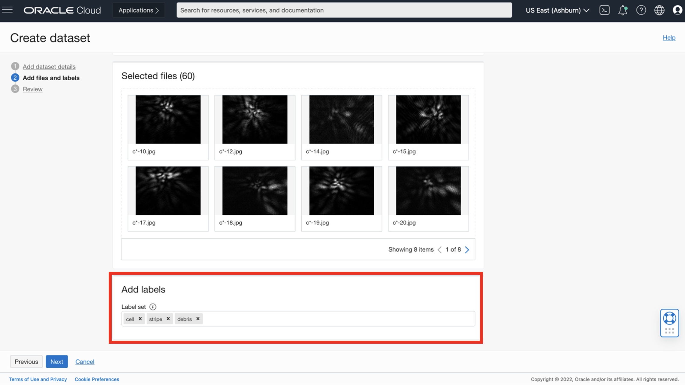

  i. Click 'Next'
  

  j. Review the information and deploy your Dataset by clicking 'Create'
  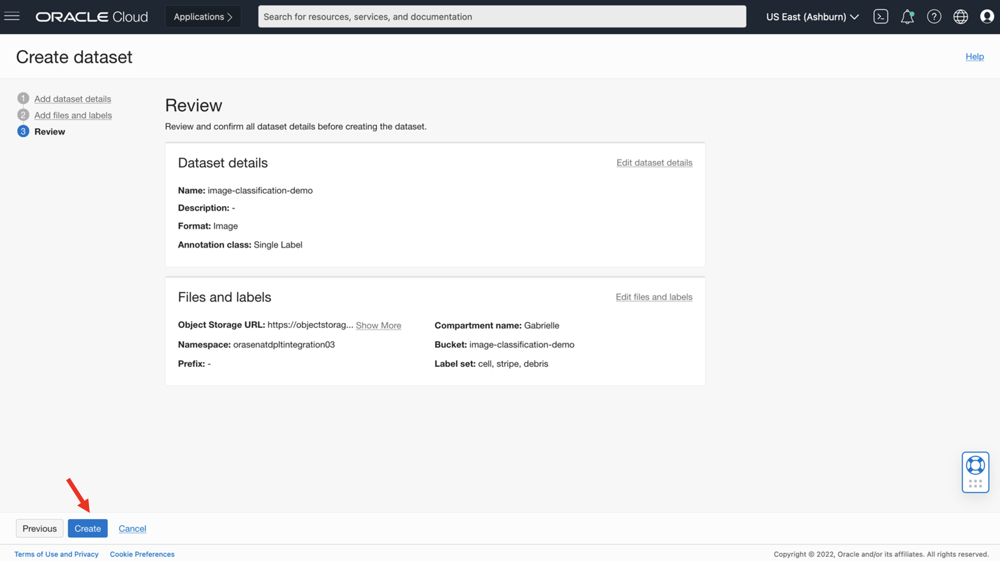

5. Retrieve the Dataset OCID- you will need this during the next Task. Dataset OCID can be found here:
  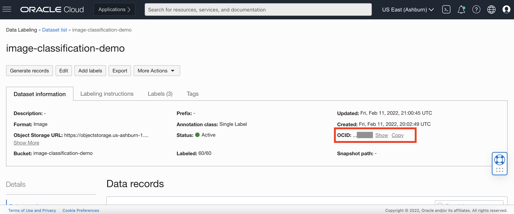

## **Task 4:** Populate Your DLS Dataset With the Data From Your Object Storage Bucket
1. Click into your new Dataset. When all of the data has been imported into your DLS Dataset from your Object Storage Bucket, it will be time to perform a bulk-labeling operation on your data.

2. Download the bulk-labeling tool to your machine. Navigate to the link [here](https://github.com/scacela/oci-dls-bulk-labeling), select 'Code' and select 'Download ZIP' to download the tool locally.
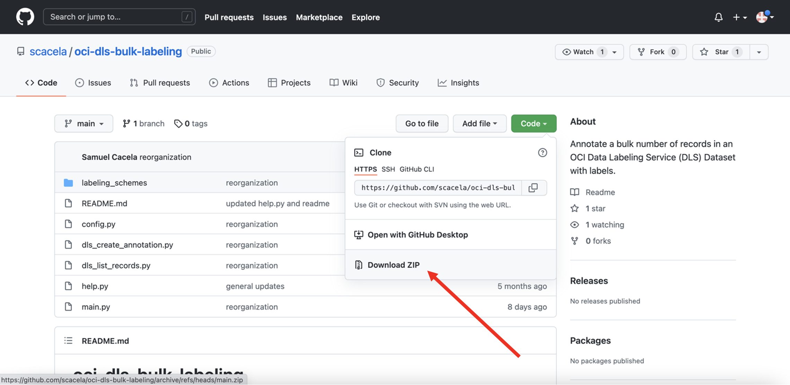

3. Open the file named config.py from the bulk-labeling tool contents, and replace the values with your own (config file path, region identifier, compartment id, dataset id, labels).

  Note: Enter "cell", "stripe", "debris" as the 3 labels.

4. Open your Command-Line Interface (CLI) and navigate to the folder where the bulk-labeling tool files exist on your machine.

5. Bulk-label the records in your DLS Dataset by running the following command
    ```
    <copy>python3 main.py</copy>
    ```

6. Verify that your images have been labeled by navigating to the dataset created earlier and selecting one of the images.

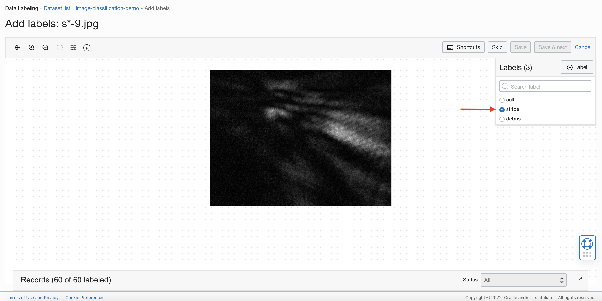

Congratulations on completing this lab!

[Proceed to the next section](#next).

## Acknowledgements
* **Authors**
    * Samuel Cacela - Staff Cloud Engineer
    * Gabrielle Prichard - Cloud Solution Engineer

* **Last Updated By/Date**
    * Gabrielle Prichard - Cloud Solution Engineer, March 2022
