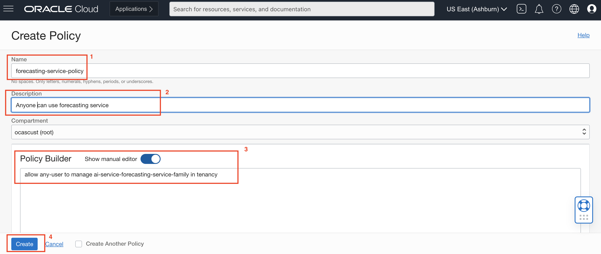

# Forecasting Service

## Introduction

Forecasting is a common data science problem that aids companies with effective and efficient planning, goal setting to forecast future key business metrics like demand ,sales, revenue, inventory, demand.This can be used for several scenarios across different industries like for ATM cash management or credit card transactions on offers in banking and dinance industry, Sales based on promotions in retail industry , effective transportation planning, demand forecasting for effective manufacturing in supply chain and logistics and many more.

OCI forecasting service uses state-of-the-art machine learning  & deep learning algoritms to deliver high quality and reliable forecasts with auto-ml capability such as automatic data preprocessing , developer-focused AI and explainability 

The Forecasting Service at OCI (Oracle Cloud Infrastructure) will create customized Machine Learning models by taking the data uploaded by users, using the core algorithm to train the model, and hosted in the cloud to be ready for detection. Users will be able submit historical data as inline data via forecasting end-points and get forecast for the desired horizon. In addition to providing forecasts, this service also focuses on explaining predictions from the model by leveraging state-of-the-art Model Explainability techniques.
 
The *OCI Forecasting Service* which is fully managed, serverless, multi-tenant service, accessible over public *REST APIs* by authenticated users via Cloud Console (only Data Science Notebooks currently available). OCI CLI, SDK will be added in upcoming releases.

This workshop contains 4 required lab sessions for user to get familiar with required data, and the full cycle of building the forecasting model and generate forecasts. At the end of the workshop, user will be able to  understand how the training data should be prepared,leverage the APIs for model training and getting forecast along with explainability 

*Estimated Lab Time*: 70 minutes (4 regular sessions)

### Objectives:

* Understand a high level overview of the OCI Forecasting Service
* Understand the full cycle/workflow of services provided in the OCI Forecasting Service
* Learn to use REST API to interact with Forecasting Service
* Learn basic data analysis preprocessing techniques to prepare data for model training
* Hand-on activities to experience the whole pipeline of machine learning model development from training to forecasting

### Prerequisites:
* An Oracle Free Tier, or Paid Cloud Account
* Grant proper permission for user to use the Forecasting Service
* Additional prerequisites (cloud services) are mentioned per lab
* Familiar with services on Oracle Cloud Infrastructure (OCI), such as Data Science Notebooks, Object Storage
* Familiar with machine learning, data processing, statistics is desirable, but not required
* Familiar with Python/Java programming is strongly recommended (Optional for API integration)
* Familiar with editing tools (vim, nano) or shell environments (cmd, bash, etc) (Optional for API integration)

## Forecasting Service Concepts
* Data Science Notebook Session: Learn how to to set up a [Data Science Notebook Session](https://docs.oracle.com/en-us/iaas/data-science/using/use-notebook-sessions.htm)
* Project: Projects are collaborative workspaces for organizing data assets, models, and forecasting portals.
* Data Assets: An abstracted data format to contain primary , additional and meta information of the actual data source for model training; it supports only *inline data generated from csv files* as data sources
* Model: The ML model that was trained by forecasting algorithms and can forecast using univariate/multivariate time-series data along with meta data. A few parameters are exposed so user can choose to select, but also default values are suggested.
* Forecasting: Once a model is trained successfully, it is automatically deployed into the cloud environment os user can use send new data to the API to get forecasting results.

## Forecasting Service Process

At a high level, here are the process of completing a full cycle of using forecasting service.

1. Create a Data Science Notebook Session: Data Science notebook sessions provide us with Jupyter Notebook that for interactive coding environment for building and training models.
2. Create a project. A project is used to include and organize different assets, models and private endpoints for data connection in the same workspace.
3. Create a data asset. Data asset is an abstracted data representation for a data source.Currently it supports inline data generated from  csv files uploaded in the notebook session folder. 
4. Train a model. After specifying a data asset and the training parameters, you can train a forecasting  model.It will take 5-10 minutes or longer depending on the data size and number of models to be test as parameter. Once a model is trained successfully, it is deployed automatically with an endpoint ready to take any new incoming testing data.
5. Forecasting with new data. User can send newer data with same attributes of the training data to the deployment endpoint to get forecast results.

Note that one project can have multiple data assets and multiple models.

## Task 1: Set Up Policy

In order for users to create and manage the resource used inForecasting service, the administrators of the tenancy need to add proper policy to grant permissions to users.

### 1. Navigate to Policies

Log into OCI Cloud Console. Using the Burger Menu on the top left corner, navigate to Identity & Security and click it, and then select Policies item under Identity.


### 2. Create Policy

Click Create Policy button. **Note only tenancy administrators or user in administrator group have permissions to create new policies.**


### 3. Create a new policy with the following statements:

If you want to allow all the users in your tenancy to use forecasting service. Create a new policy with the below statement:

```
<copy>allow any-user to manage ai-service-forecasting-service-family in tenancy</copy>
```



If you want to limit access to a user group, you can create a new policy with the below statement:

```
<copy> allow group <group-name> to manage ai-service-forecasting-service-family in tenancy</copy>
```

[Proceed to the next section](#next).

## Acknowledgements
* **Authors**
    * Ravijeet Kumar - Senior Data Scientist - Oracle AI Services


