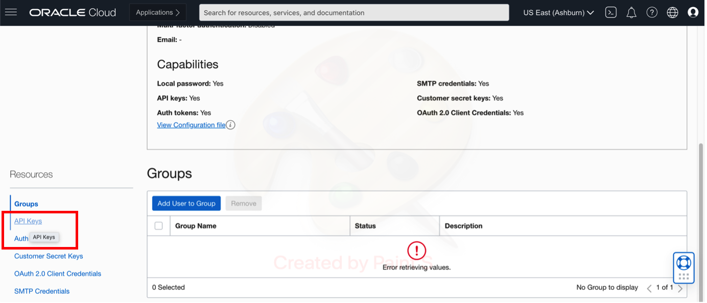
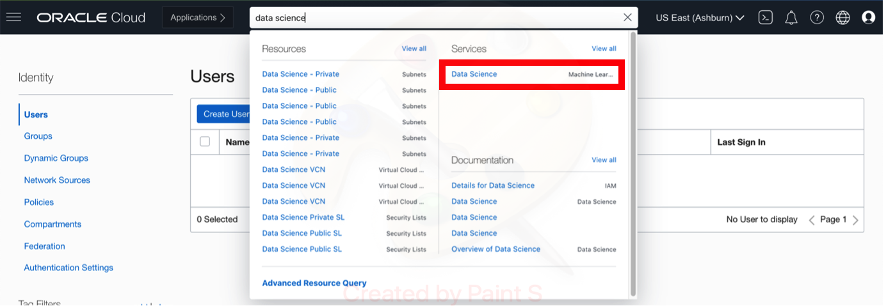
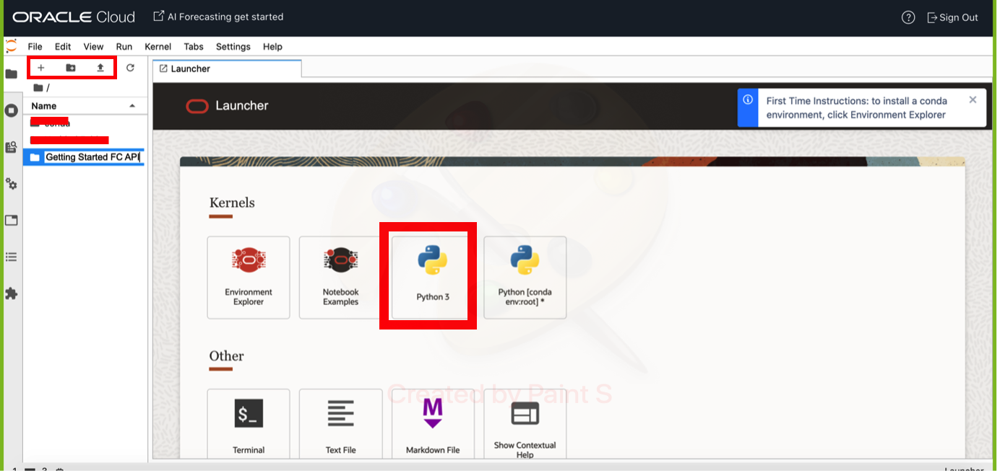

# Lab 1: Set up Data Science Notebook 

## Introduction

 In this lab, we will learn how to set up a Data Science notebook session to start using the Forecasting service APIs. Also, we will learn about API key generation which are needed for authentication purpose.

*Estimated Time*: 30 minutes

### Objectives:

In this lab, you will:
*	Learn how to generate API key 
*	Learn how to create a project in Data Science service 
*	Learn how to set up a notebook session inside a data science project 

### Prerequisites:
*	A free tier or paid tenancy account in OCI
*   You have completed all the tasks in Getting Started.  

## Task 1: API key generation  
1.  Log in to your Oracle Cloud account, expand the Profile menu and click on User Settings:
    

2.  Under User Settings click on the API Keys under Resources on the left :
    

3. Click on the Add API Key
    

4. Download the private key on your system. We will use this later for authorization when using the forecasting APIs. After downloading, click on Add button. By clikcing on Add, this key would get listed under API Keys and become active.  
    

5. Save the contents of the configuration file preview in a text file on your system. Details such as user, fingerprint, tenancy, region etc. will be needed when setting up authorization for using the forecasting APIs.
    


## Task 2: Create a Data Science project


1.  Log in to your OCI account and search for data science in the top search bar. Click on the Data Science under Services:
    

2.  Select the root compartment and press the create project button. 
    

3.  Fill the name and description field and press the create button: 
    


## Task 3: Create a notebook session


1.  Log in to your OCI account and search for data science in the top search bar. Click on the Data Science under Services:

    

2.  Select the root compartment and open the project where you want to create a notebook session. 
    
    

3.  On opening a project, you will see the button to create a notebook session. Click the create notebook session: 
    

4.  Give a name to the notebook session. Select appropriate compute, storage, VCN and subnet. Press the create button
    
    

5.  It takes a few minutes (5-10 minutes) for the newly created notebook session to become active. It can be seen under the     project. Once it has become active, open it.

    

6.  Click on the open button:
    
    

7.  A new notebook can be created by using Python 3 kernel. Also a new folder can be created and given a custom name by using the + button:
    

8.  Setting up authorization for to use forecasting APIs
Use the tenancy, user and fingerprint from the configuration file as shown in API key generation step. Also upload the private API key that you downloaded in the API key generation step and give its path to private_key_file. Don’t change the pass_phrase. 

    ```Python
    from oci.signer import Signer

    auth = Signer(
        tenancy='ocid1.tenancy.oc1-------------------------------------------',
        user='ocid1.user.oc1..-------------------------------------------,
        fingerprint='00:ff:00:::::::::::::::60',
        private_key_file_location='api_key.pem',
        pass_phrase='test'  # optional
    )

    ```

    


You may now proceed to the next lab

## Acknowledgements
* **Authors**
    * Ravijeet Kumar - Senior Data Scientist - Oracle AI Services
    * Anku Pandey - Data Scientist - Oracle AI Services
    * Sirisha Chodisetty - Senior Data Scientist - Oracle AI Services
    * Sharmily Sidhartha - Principal Technical Program Manager - Oracle AI Services
    * Last Updated By/Date: Ravijeet Kumar, 19th-January 2022


