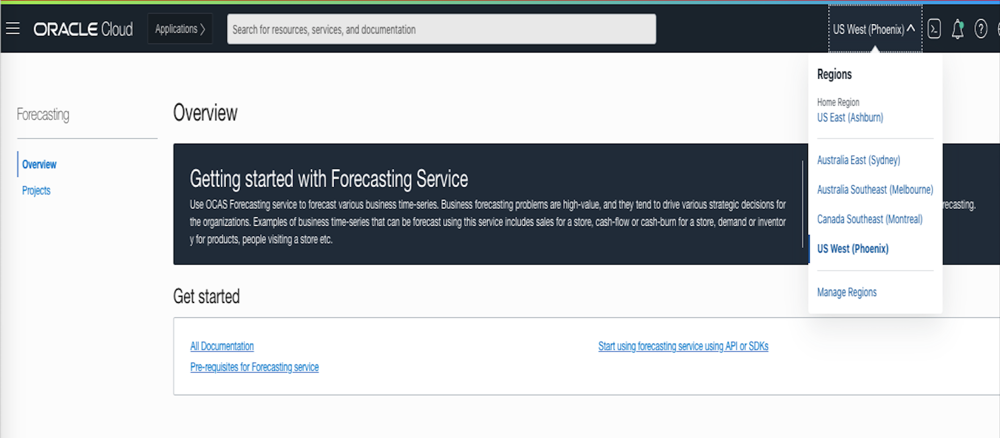
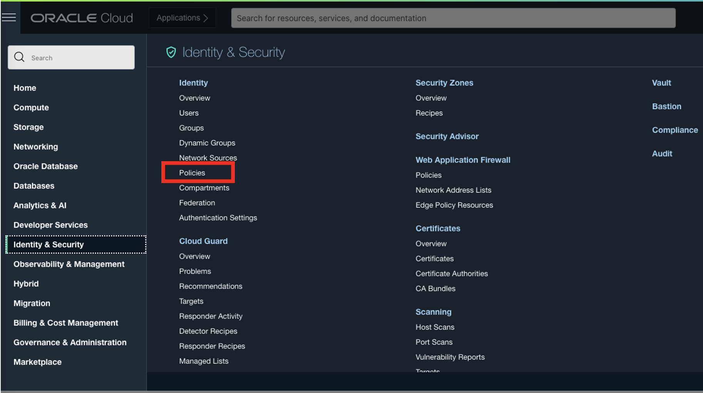
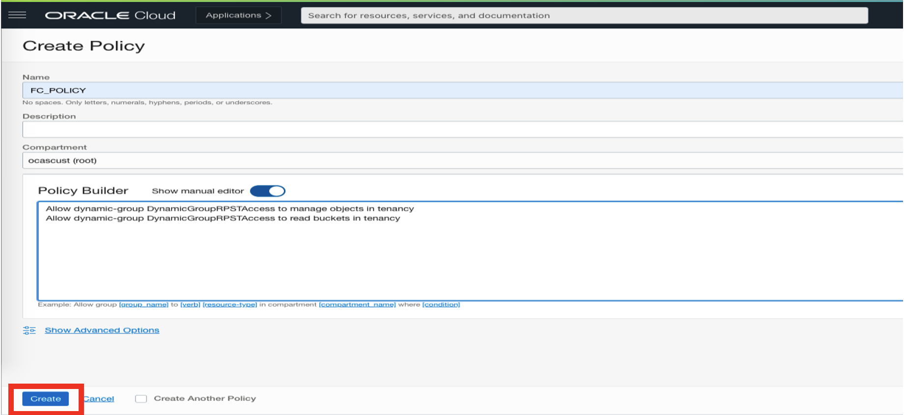
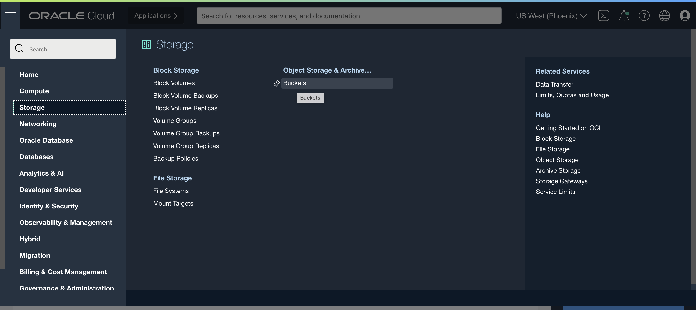
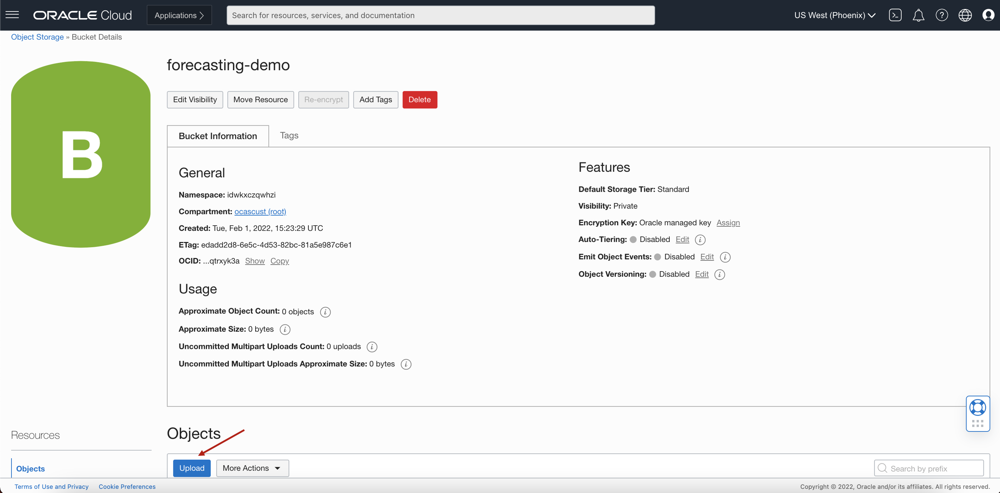
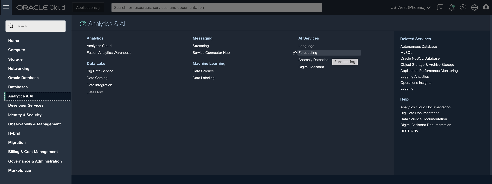

# Lab 5: Learn how to access Forecast Service from OCI Console

## Introduction

In this session, we will show you how to create the forecast project, upload data into object storage, create the data assets , train model , get forecasts and predictions intervals for the forecast horizon from OCI console 

***Estimated Time***: 20 minutes

### Objectives

In this lab, you will:
- Learn how to set up pre-requisites for using console
- Learn the data requirements and download data
- Learn how to create a forecast project from console
- Learn how to upload data into Oracle object storage
- Learn how to create data asset to refer data in Oracle object storage
- Learn to train an forecasting model with created data asset
- Explore forecast results and prediction intervals

### Prerequisites
- A Free tier or paid tenancy account in OCI
- Tenancy must be whitelisted to use Forecasting Service
- Tenancy must be subscribed to US West (Phoenix)
- You have completed **Introduction and Getting Started** sections

## Task 1: Set up pre-requisites for console

1. If the user tenancy is not subscribed to US West (Phoenix) then user should look for tenancy region drop down for US West (Phoenix) and select it as below :
  

2. Now, you need to create a Dynamic group in your tenancy by following below steps:

    - Go to Identity & Security from Sidebar Menu of OCI console and select Dynamic Groups
        

    - Now, click on Create Dynamic Group
        

    - Now, fill in the below details in the relevant fields as shown in image:
        Name: DynamicGroupRPSTAccess 
        Rule: ANY {resource.type='aiforecastproject'}
        

    - Now, you can verify that dynamic group DynamicGroupRPSTAccess is created:    
        

3. Now, you need to create a Policy in your tenancy by following below steps:

    - Go to Identity & Security from Sidebar Menu of OCI console and select Policies
        


    - Now, click on Create policy
        


    - Now, fill in the below details in the relevant fields as shown in image:

        Name: FC_POLICY

        Policy statements:
        ```
        Allow dynamic-group DynamicGroupRPSTAccess to manage objects in tenancy
        Allow dynamic-group DynamicGroupRPSTAccess to read buckets in tenancy
        ```

        


    - Now, you can verify that FC_POLICY policy is created:    
        


## Task 2: Understand Data Requirements
 Our forecasting service provides an AutoML solution with multiple univariate/multivariate algorithms that can run on single series or multiple series at once. For this, there are some data validations and data format requirements that the input data must satisfy.
### **Data Validations**
For a successful forecast, the input data should pass the following data validations:

* Number of rows for a time series >= 10 and <= 5000
* Series length >= 3 X Forecast Horizon
* Series length >= 2 X Major Seasonality
* If the series is non-seasonal, at least one non-seasonal method needs to be available for running.
* If ensemble method is selected, at least 2 other methods need to be selected as well.
* Number of missing values <= 10% of series length
* If there are missing values for 5 consecutive time steps, throw an error.
* All the timestamps in the primary data source should exist in the secondary data source also the number of rows in the additional data source should be equal to the number of rows in the primary data source + forecast horizon size (adjusted by input and output frequency).
* Check if there are any duplicate dates in timeseries after grouping also (Check for both additional and primary data).
* All values have to be >= 0.

### **Data format requirements**
The data should contain one timestamp column and other columns for target variable and series id (if using grouped data).
- timestamp column should contain dates in standard [ISO 8601]('https://en.wikipedia.org/wiki/ISO_8601') format e.g., 2020-07-13T00:00:00Z. If the input date doesn't follow this format then it needs to be converted in the required format. Python code for converting different date strings to ISO 8601 format is provided in Step 2 of Task 4 in this lab.
- target_column should contain target values of time series. For example it be sales number of a sales data 
- series_id column should contain identifiers for different series e.g., if the data is having sales for different products, then series id can have product codes. 

**Note**: The column names used in the examples here are just for representation and actual data can have diffrent custom names.  

Currently, our APIs support datasets that can be in one of the following formats:

1.  Single time series without any additional data:**
    Such datasets have only two columns in them. The first column should be a timestamp column and the second column should be the target column.

    **Here is a sample CSV-formatted data:**
    ```csv
    timestamp,target_column
    2020-07-13T00:00:00Z,20
    2020-07-14T00:00:00Z,30
    2020-07-15T00:00:00Z,28
    ...
    ...
    ```
2.  Multiple time series without any additional data:** 
    The input data can have multiple time series in it(grouped data). For such datasets there must be a column to identify different time-series.

    **Here is a sample CSV-formatted data:**
    ```csv
    timestamp,target_column,series_id
    2020-07-13T00:00:00Z,20,A
    2020-07-14T00:00:00Z,30,A
    2020-07-15T00:00:00Z,28,A
    ....
    ....
    2020-07-13T00:00:00Z,40,B
    2020-07-14T00:00:00Z,50,B
    2020-07-15T00:00:00Z,28,B
    ....
    ....
    2020-07-13T00:00:00Z,10,C
    2020-07-14T00:00:00Z,20,C
    2020-07-15T00:00:00Z,30,C
    ....
    ....
    ``` 
3.  Time series with additional data:** 
    The input data can have additional influencers that help in forecasting. We call the two datasets as primary and additional. The primary data should have three columns - timestamp, target column and a column for series id. The additional data should have a timestamp column, a series id column and columns for additional influencers.   

    **Here is a sample CSV-formatted data:**

    Primary data 
    ```csv
    timestamp,target_column,series_id
    2020-07-13T00:00:00Z,20,A
    2020-07-14T00:00:00Z,30,A
    2020-07-15T00:00:00Z,28,A
    ....
    ....
    2020-07-13T00:00:00Z,40,B
    2020-07-14T00:00:00Z,50,B
    2020-07-15T00:00:00Z,28,B
    ....
    ....
    2020-07-13T00:00:00Z,10,C
    2020-07-14T00:00:00Z,20,C
    2020-07-15T00:00:00Z,30,C
    ....
    ....
    ```
    Additional data 
    ```csv
    timestamp,feature_1,series_id
    2020-07-13T00:00:00Z,0,A
    2020-07-14T00:00:00Z,1,A
    2020-07-15T00:00:00Z,2,A
    ....
    ....
    2020-07-13T00:00:00Z,0,B
    2020-07-14T00:00:00Z,0,B
    2020-07-15T00:00:00Z,1,B
    ....
    ....
    2020-07-13T00:00:00Z,1,C
    2020-07-14T00:00:00Z,0,C
    2020-07-15T00:00:00Z,0,C
    ....
    ....
    ```
    The service currently accepts *Inline Data* that can be generated from csv files.
    Steps on how to generate inline data from csv files are given in Task 3 below.
    
    **Note:**
    * Missing values are permitted (with empty), data is sorted by timestamp, and boolean flag values should be converted to numeric (0/1).
    * The last row of input data should be an observation and not an empty row. 

## Task 3: Download Sample Data

Here is a sample dataset to help you to easily understand how the input data looks like, Download the files to your local machine.

* [Primary data](files/favorita-13-beverages-primary.csv)
* [Additional data](files/favorita-13-beverages-add.csv)
  

## Task 4: Upload Data to Object Storage

After downloading the dataset , you need to upload the sample training data into Oracle object storage, to be used for Data Asset creation for model training in next steps.

1.  Create an Object Storage Bucket (This step is optional in case the bucket is already created)

    First, From the OCI Services menu, click Object Storage.
    

    Then, select Compartment from the left dropdown menu and choose the compartment matching your name or company name. Next, click on Create bucket and fill out the dialog box:

    * Bucket Name: Provide a name <br/>
    * Storage Tier: STANDARD
    
    Then click Create
    


2.  Upload the Downloaded training csv data file into Storage Bucket

    Switch to OCI window and click the bucket name that you created just now.
    
    

    Bucket detail window should be visible. Scroll down 
    


    Click on Upload and then browse to file which you desire to upload
    


    More details on Object storage can be found on this page. [Object Storage Upload Page](https://oracle.github.io/learning-library/oci-library/oci-hol/object-storage/workshops/freetier/index.html?lab=object-storage) to see how to upload.

## Task 5: Create a project 

Project is a way to organize multiple data assets, models, deployments to the same workspace. It is the first step to start.

1.  Log into OCI Cloud Console. Using the Burger Menu on the top left corner, navigate to Analytics and AI menu and  click it, and then select Forecasting item under AI services

    

2.  Clicking the Forecasting Option will navigate one to the Forecast Console.
    
    Under Projects, select compartment and click Create Project

    

3.  The Create Project button navigates User to a form where they can specify the compartment in which to create a Forecast Project. The project we create here is named demo_forecast.
    

4. Once the details are entered click the Create Button. If the project is successfully created it will show up in    projects pane. From here onwards, select ad_demo.
    

## Task 6: Create Data Asset 

We now need to create a data asset to refer to the previously uploaded object storage.
There are two ways to create data assets, showing as follows.

1.  Directly create new data asset 

    Click the Data Asset menu on the middle left, and Click the Create Data Asset button.
    

Then you can specify the compartment of Object storage that houses the data. Click Create Button.


After a few seconds, the data asset will be shown in the data asset main panel.


2.  Use the Train Model button to create a new data asset (Optional)

The Create and Train Model will take user to a form with the option to either choose an existing dataset or create a new dataset. Select `Create a new data asset` radio button.


Create a new dataset navigates the User to a form, where they can specify the compartment of Object storage that houses the data. Click Create Button.


## Task 7: Train a Forecast Model and Create Forecasts


## Task 8: Explore the Forecast and Explainability  


**Note** : It is not needed to create new projects everytime . A project once created can be used again to create new forecast

Congratulations on completing this lab!

You may now proceed to the next lab


## Acknowledgements
* **Authors**
    * Ravijeet Kumar - Senior Data Scientist - Oracle AI Services
    * Anku Pandey - Data Scientist - Oracle AI Services
    * Sirisha Chodisetty - Senior Data Scientist - Oracle AI Services
    * Sharmily Sidhartha - Principal Technical Program Manager - Oracle AI Services
    * Last Updated By/Date: Ravijeet Kumar, 19th-January 2022
