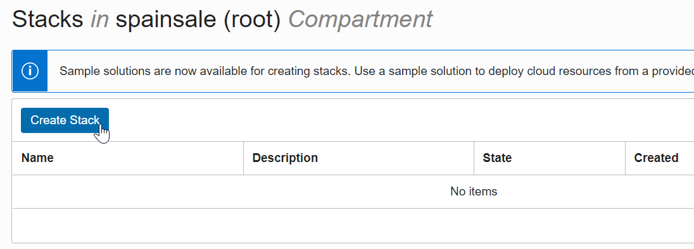
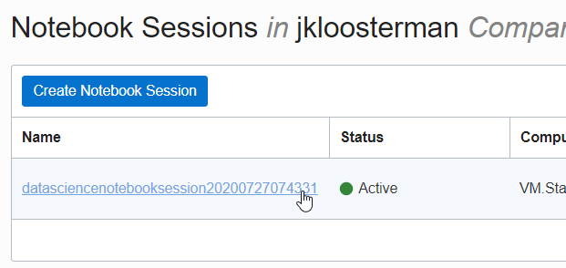
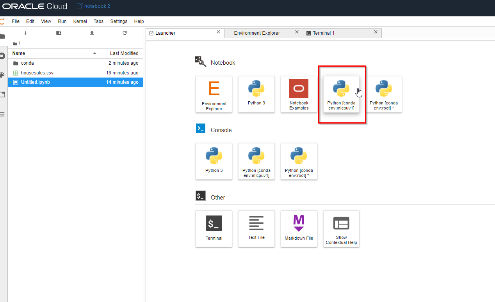

# Lab: Getting Started with OCI Data Science

## Introduction

This lab will guide you on provisioning an OCI Data Science environment.

Estimated lab time: 15 minutes (video 8 minutes, exercise +/- 80 minutes)

### Objectives

In this lab you will:
* Become familiar with the set up of the OCI Data Science service.

### Prerequisites

* An Oracle Free Tier, Always Free, Paid or LiveLabs Cloud Account (see prerequisites in workshop menu)

## Task 1: Provision OCI Data Science

This guide shows how to use the Resource Manager to provision the service using Resource Manager. This process is mostly automated. However, if you prefer a step-by-step manual approach to control every aspect of the provisioning, please follow the following instructions instead: [manual provisioning steps](https://docs.cloud.oracle.com/en-us/iaas/data-science/data-science-tutorial/tutorial/get-started.htm#concept_tpd_33q_zkb).

1. Download the terraform configuration source

    Download [Terraform configuration source](https://objectstorage.eu-frankfurt-1.oraclecloud.com/p/Y1AdqPkxQdFho1SEuMMO7W8DlMWAkr0FUwdnL-m3ysgXirfHz9IV48yyAkRARF-b/n/odca/b/datascienceworkshop/o/oci-ods-orm.zip) and store it on your local PC. Depending on the browser you might have to use Left/Right click to do this. Make sure the extension of the saved file is .zip

2. In your Oracle Cloud console, open the menu.
   

3. Select Resource Manager -> Stacks.

   

4. Click the "Create Stack" button.

   

5. Select the configuration source you download earlier

    Select ".ZIP" and drag the file you downloaded to the box.

    

6. Choose a compartment that you've created or use Root.

   

7. Click "Next".

   

8. Disable Project and Notebook creation

    In the section "Project and Notebook Configuration" *uncheck* the checkbox "Create a Project and Notebook Session" (we will create them using the console later).

    

9. Make sure "Enable Vault Support" is disabled

   

10. Make sure "Provision Functions and API Gateway" is disabled

   

11. Click "Next".

   

12. Click "Create".

   

13. Run the job

   Go to "Terraform Actions" and choose "Apply".

   

14. Click Apply once more to confirm the submission of the job.

   Provisioning should take about 5 minutes after which the status of the Job should become "Succeeded".

15. Create Oracle Data Science Project

    Open the OCI Data Science projects and choose "Create Project".

    

    

    Choose a name and description and press "Create".

    

16. Provision an Oracle Data Science notebook

    

    - Select a name.
    - We recommend you choose VM.Standard2.8 (*not* VM.Standard.*E*2.8) as the shape. This is a high performance shape, which will be useful for tasks such as AutoML.
    - Set blockstorage to 50 GByte.
    - Select defaults for VCN and subnet. These should point to the resources that were created earlier by the resource manager.

    

    Finally click "Create". The process should finish after about 5 minutes and the status of the notebook will change to "Active".

## Task 2: Open the OCI Data Science notebook

1. Open the notebook that was provisioned

   The name of the notebook may be different than shown here in the screenshot.

   

   

## Task 3: Install a Conda Package

   A Conda package is a collection of libraries, programs, components and metadata. It defines a reproducible set of libraries that are used in the data science environment. We are going to use the General Machine Learning for CPUs conda. The following commands will install this Conda.

   1. Open a terminal window by clicking on **File**, **New** and then **Terminal**.
   1. Run the command: `odsc conda install -s mlcpuv1`
   1. You will receive a prompt related to what version number you want. Press `Enter` to select the default.
   1. Wait for the conda package to be installed.

   This will take about 5 minutes.

## Task 4: Prepare the House Sales Data for analysis

1. Download the dataset with the house prices and characteristics.

    Download [The training dataset](files/housesales.csv) (the dataset is public). Depending on the browser you might have to use Left/Right click to do this. Make sure the extension of the saved file is .csv

2. Review the dataset (e.g. use a text editor).

   The column names are explained [here](files/data-description.txt). This document also explains the possible list-of-values for categorical attributes.

3. Upload the dataset by dragging it to the left panel

   

## Task 5: Start the Python notebook

1. Download the wallet from your ADW instance by selecting Database Connection. Make sure that

    If you don't have a launcher open yet, do so by going to File -> New Launcher. .

2. Start notebook

    It is **important** to select the Python environment with the right Conda environment that we just installed. Look for the notebook that uses Conda **"mlcpuv1"** and open it. 

[Proceed to the next section](#next).

## Acknowledgements
* **Authors** - Jeroen Kloosterman - Product Strategy Manager - Oracle Digital, Lyudmil Pelov - Senior Principal Product Manager - A-Team Cloud Solution Architects, Fredrick Bergstrand - Sales Engineer Analytics - Oracle Digital, Hans Viehmann - Group Manager - Spatial and Graph Product Management
* **Last Updated By/Date** - Jeroen Kloosterman, Oracle Digital, Jan 2021

