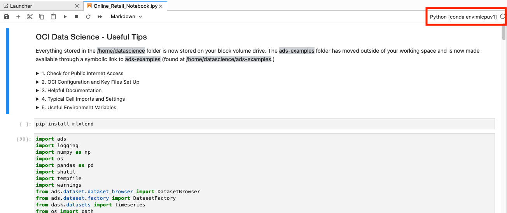
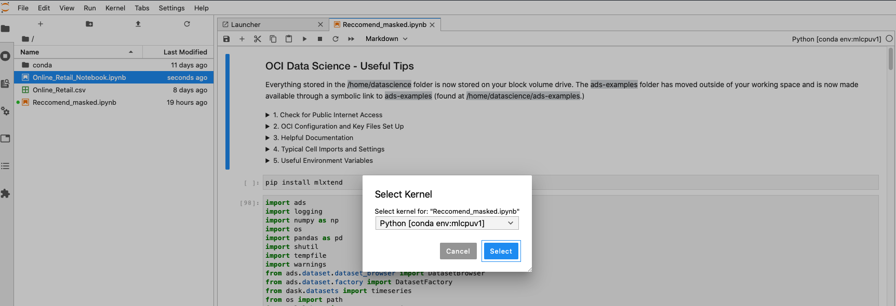
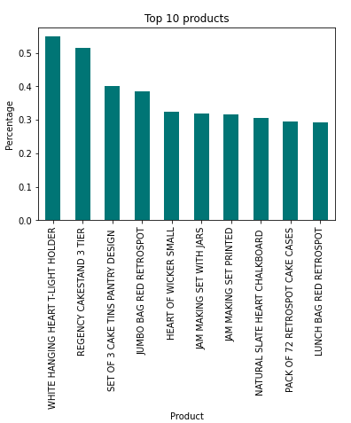

# Lab: Data Exploration, Data Preperation, and Building The Model

## Introduction

In this lab we will build a Apriori model to recognize. We will explore the statistical trends of the data, prep the data to optimize the efficieny of the model, and build the model itself.

Estimated lab time: 45 minutes

### Objectives

In this lab you will:
* Learn how to prepare data for the Apriori Algorithm.
* Learn commonly used data exploration techniques.
* Learn how build the market basket analysis model and analyze results.

### Prerequisites

* An Oracle Free Tier, Always Free, Paid or LiveLabs Cloud Account (see prerequisites in workshop menu)
* OCI Data Science service with dependencies (see previous lab)

## Task 1: Open the Notebook

1. Download the notebook and save it locally on your machine.

   The .ipynb notebook can be found at the below. 

   

2. Upload the notebook

   Drag and drop the .ipynb file to the left hand side of the notebook session.

   

3. Select the installed kernel

   Open the .ipynb file, and select the kernel on the top right side of the page.

   

   Select the kernel [conda env:mlcpuv1] from the drop down menu

   

4. Install mlxtend

   Next we will have to install the package mlxtend on the kernel. Mlxtend (which stands for machine learning extensions) is a Python library that consists of useful data
   science tools. The library has its own Apriori Algorithm built in that we will use for the association rule learning.

   Run the first cell that contains the command 'pip install mlxtend' by putting the cursor into the cell and selecting the play icon at the top of the page.

   


5. Restart the Kernel

   In order for the tools in the mlxtend package to become available, you must restart the kernel.

   Select kernel in the drop down bar at the top of the page and then "Restart Kernel"

   

## Task 2: Data Exploration and Data Preparation

   In this lab we will walk through the data exploration phase of the notebook. Before you begin, make sure to run the cell that contains all import statements to set
   up the necessary environment. We will begin under the heading "Local File Storage".

   1. Visualize the Pandas Data Frame 
   
   The first cell imports more libraries that are needed for the lab. The next cell reads the CSV file into a pandas dataframe, which we will be using for the rest of 
   the lab. The shape in paranthesis indicates that there are 8 columns and 142961 rows in the data frame. You should be able to see the first 5 rows of the data frame.

   

   2. Plot the top 5 products

   Next, you will set up a bar graph that shows the top 10 most column products by percente occurence. You can see here that there is no product appears very frequently
   (as the most common product only appears in 0.5% of the occurence). 

   

   As it turns out, lots of products in this dataset appear to few times to draw any meaningful statistical conclusions. So in the next cell, you will go ahead and trim the 
   data frame so that only products that appear more than 0.2% of the time remains in the dataset. As you can see, the reduced the number of rows in the dataframe down to
   1,742.

   3. Feature Engineer

   Next you will run a crosstab on the dataframe. Here you will create a new dataframe where each row is a unique customer id, each column is a unique product, and each
   value is the quantity the customer purchased of the product. This new data frame will allows us to focus on the columns of the initial data frame that actual provide 
   relevant information for this specific use case.

    


## Task 3: Apply the Apriori Algorithm

1. Applying thresholds

   The first few cells under "Apply Apriori algorithm" applies thresholds on support on lift. Afterwhich. you will wrangle the data so that we see support, confidence, lift
   and other metrics for each product.

   As the notebook describes,

   Measure 1: Support. This says how popular an itemset is, as measured by the proportion of transactions in which an itemset appears. If an item is purchased in 4 out of 8     
      transactions, then the support is 50%.
   Measure 2: Confidence. This says how likely item Y is purchased when item X is purchased, expressed as {X -> Y}. This is measured by the proportion of transactions with item
      X, in which item Y also appears. If beers are purchased 3 times out of 4 transctions where apples are purchased, then the confidence is 3 out of 4, or 75%.
   Measure 3: Lift. This says how likely item Y is purchased when item X is purchased, while controlling for how popular item Y is. A lift value of 1,which implies no
      association between items. A lift value greater than 1 means that item Y is likely to be bought if item X is bought, while a value less than 1 means that item Y is unlikely to be bought if item X is bought.

2. Visualize the data

   Next you will visualize the data using Networkx to be able to see the relationships between each of the products. As you can see, a large number of association rules have
   been discovered. Visualizing saves you time from having to manually scroll through all the association rules. The association rules should resemble the picture below.

    

## Task 4: Analyze the data

1. Reformat data

   First, you will restructure the data frame to a table of products that was purchased by each customer. After inputting values for null quantities, you will drop any customers
   who did not purchase any products. 

   

2. Confusion Matrix

   Next you will form a confusion matrix for all the products we have. The way a confusion matrix works is it lists all the products on both the x and y axis, and
   inputs a value at each (x,y) cordinate specifying the correlation between x and y. The stronger the association between the problems, the closer the value is
   to 1. The weaker the association is, the closer the value is to 0.

   Notice that the confusion matrix is symmetrical around the diagnol. That is because all products are listed on both axis, and the order of the products ((x,y) vs (y,x)) does
   not matter. You'll also notice that the diagnol is 1. That is because at the diagnol, the products on both axis are the same.

   

3. Reccomend products

   Next you'll create a table that lists the most reccomended products based on cosine similarity.

   

   For those intersted in the mathematical derivation of cosine similarity, you can read more about it 

# Task 4: Store the model in the catalog and deploy it

1. Make sure you have a working model

    The following requires that you built a model successfully in steps 1 to 4.

2. Store the model in the model catalog

    If we want applications/business processes to make good use of our model, then we need to deploy it first. We start by publishing the model to the model catalog. The following will **serialize** the model along with some other artifacts and store it in the catalog under the name "house-price-model".

    ```python
    <copy>
    import ads
    from ads.common.model_artifact import ModelArtifact
    from ads.common.model_export_util import prepare_generic_model
    import os
    from os import path
    from joblib import dump
    import cloudpickle
    ads.set_auth(auth='resource_principal')
    path_to_model_artifacts = "online-retail"
    generic_model_artifact = prepare_generic_model(
        path_to_model_artifacts,
        force_overwrite=True,
        function_artifacts=False,
        data_science_env=True)
    with open(path.join(path_to_model_artifacts, "model.pkl"), "wb") as outfile: cloudpickle.dump(model, outfile)
    catalog_entry = generic_model_artifact.save(display_name='online-retail-model',
        description='Model to reccommend online retaiL products')
    </copy>
    ```

3. Deploy the model

    Now we're going to deploy this model to its own compute instance. This will take the model from the catalog and create a runtime version of it that's ready to receive requests. This uses normal OCI compute shapes. Next, choose "Create Deployment".

    
    

    - Give the model deployment a name, e.g. "house price model deployment"
    - Choose the right model (house-price-model)
    - Choose a shape, one instance of VM.Standard2.1 is sufficient. Note that we could have chosen multiple instances, this is useful for models that are used very intensively.

    Finally, submit the deployment. This should take about 10 minutes. Finally, you should see that the compute instance is active.

    
Congratulations on completing this lab!

[Proceed to the next section](#next).

## Acknowledgements
* **Authors** - Jeroen Kloosterman - Product Strategy Manager - Oracle Digital, Lyudmil Pelov - Senior Principal Product Manager - A-Team Cloud Solution Architects, Fredrick Bergstrand - Sales Engineer Analytics - Oracle Digital, Hans Viehmann - Group Manager - Spatial and Graph Product Management
* **Last Updated By/Date** - Jeroen Kloosterman, Oracle Digital, Jan 2021

