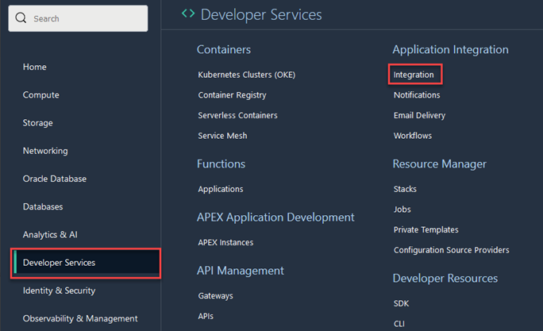
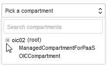
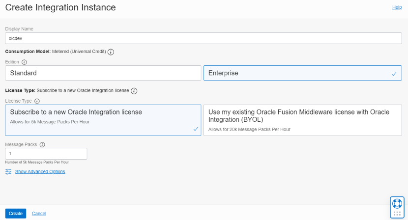
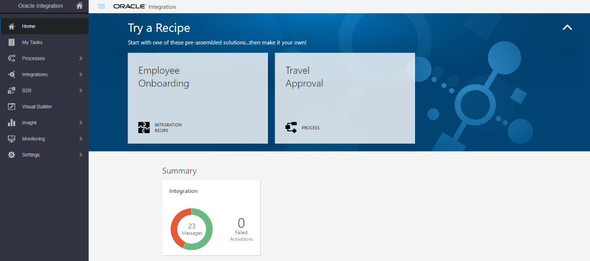

# Provision Oracle Integration

## Introduction

This lab walks you through the process of provisioning an instance of Oracle Integration, assuming you don't already have one available to you. If you do, you can skip this lab and move on to the next one.

Estimated Time: 10 minutes

### Objectives

In this lab, you will:
* Provision Integration Instance.

### Prerequisites

This lab assumes you have:
* An Oracle account.

### Background

If you just created a new Cloud account following the instructions in Getting Started, you must wait up to 30 minutes before you attempt to create an instance of Oracle Integration. (It could take anywhere between 10 and 30 minutes for a new user account to be fully provisioned) If you already have a Cloud account, you don't need to wait. Either way, make sure you've signed in to the Oracle Cloud as an Oracle Identity Cloud Service user before proceeding.

## Task 1: Create an Instance of Oracle Integration

1. On the Oracle Cloud Get Started page, select the region in the upper right where you want to create your Oracle Integration instance. Once created, instances are visible only in the region in which they were created.

2. On the Oracle Cloud Get Started page, click the menu in the upper left corner to display the services you can provision.

	

3. Open the navigation menu and click Developer Services. Under Application Integration, click Integration

	

4. From the Compartment list, click through the hierarchy of compartments and select the one in which to create the instance. You may need to expand the + icon to find the compartment to use. Compartments can contain other compartments. It may take several minutes for the new compartment to appear after the policy has been created.

	

5. Click the **Create** button.

6. Enter the following details, and click **Create**
| Field &nbsp; &nbsp; &nbsp; &nbsp; &nbsp; &nbsp; &nbsp; &nbsp; | Description |
| --- | --- |
| Display Name |Enter the display name for the instance. Note that the display name becomes part of the URL for accessing the instance.|
| Consumption Model |Lists consumption models available in this tenancy. Typically, one model (Metered) is displayed, but multiple consumption models are listed if your tenancy is enabled for more than one. Available models include:

<ul><li>Metered (Universal Credit)</li></ul><ul><li>Subscription (OIC4SaaS)</li></ul><ul><li>Oracle Integration Government</li></ul>|
| Edition | Select Enterprise. Two editions are provided. See [Oracle Integration Editions](https://docs.oracle.com/en/cloud/paas/integration-cloud/oracle-integration-oci/oracle-integration-editions.html#GUID-ED23D612-B34E-400D-8039-DBCEF5101AF4) to see what's licensed in each edition.|
| License Type |Select - Subscribe to a new Oracle Integration License|
| Message Packs |1|
| Access Token | If this field is displayed, you are creating an instance as a non-federated user. Sign in as a federated user and restart creating an instance.|

	

7. You should see your instance in the Creating state. It will take several minutes for the instance to be created. When instance creation completes successfully, the instance shows as Active and you'll receive an email. You are now ready to access your instance.

## Task 2: Accessing an Oracle Integration Instance

Navigate to an Oracle Integration instance in the Oracle Cloud Infrastructure Console to open it.

1. On the Oracle Cloud Get Started page, select the region in the upper right where you created your Oracle Integration instance. Open the navigation menu in the upper left and click Developer Services. Under Application Integration, click Integration.
2. If needed, select the compartment where you created your Oracle Integration instance. You should see your instance.
3. At the far right, click the Task menu and select Service Console. A new browser window will open to your Oracle Integration home page.
	

	You may now [proceed to the next lab](#next).

## Learn More

* [Provisioning Oracle Integration Instance](https://docs.oracle.com/en/cloud/paas/integration-cloud/oracle-integration-oci/creating-oracle-integration-instance.html#GUID-930F40E8-5149-4091-9CDA-8E05C8449BA6)

## Acknowledgements
* **Author** - Kishore Katta, Technical Director, Oracle Integration Product Management
* **Contributors** - Subhani Italapuram, Oracle Integration Product Management
* **Last Updated By/Date** - Oracle Integration team, December 2021
