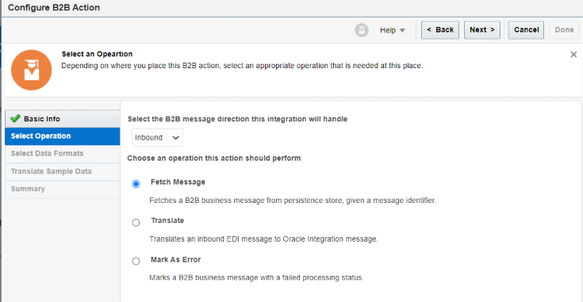

# Understand B2B Action

## Introduction

This lab walks you through the concepts of B2B Action and their usage in B2B Inbound and Outbound Message Processing

Estimated Lab Time: 10 minutes

### Objectives

In this lab, you will:
* Understand B2B Actions
* Usage of B2B Action in Inbound and Outbound Message Processing

### Prerequisites

This lab assumes you have:
* All previous labs successfully completed

## B2B Actions Available in Trading Partner Mode

The function of B2B Action is to produce schemas  that adhere to B2B global standards like X12. B2B Action works for both Inbound and Outbound. This section describes the operations provided by the B2B action during trading partner mode configuration.

B2B action is available from Action Menu

There are five operations available in the inbound and outbound directions.

Of these five operations, you must use the three **highlighted** below in your backend integrations. Those are the only ones you need to more fully understand. The remaining operations are used in the B2B transport integrations (that is, B2B integrations for receiving messages and sending messages). Because those integrations are automatically created, you don't need to understand their usage in as much detail.

**Inbound**

For inbound scenario, it would  be essentially EDI payload (This would be X12 or EDIFACT type documents) that are coming in, which  go through the EDI translation step that produces a translation output. This would mean once  the X12 documents actually go through the B2B Action, it would be generating an EDI  XML format which will then be mapped over to application formats that gets consumed by backend  applications like ERP Cloud, NetSuite, etc

Below are the operations supported in Inbound scenario.

| Operation     | Used By                                | Purpose                                                                                                                                                                                                                                                                                                                                                                                                                                                                                                                                                                                                                                                                                                                                                                                                       |
|---------------|----------------------------------------|---------------------------------------------------------------------------------------------------------------------------------------------------------------------------------------------------------------------------------------------------------------------------------------------------------------------------------------------------------------------------------------------------------------------------------------------------------------------------------------------------------------------------------------------------------------------------------------------------------------------------------------------------------------------------------------------------------------------------------------------------------------------------------------------------------------|
| <b>Fetch Message</b> | Inbound backend integration            | This operation retrieves an already processed B2B business message from the Oracle Integration persistence store. It outputs the B2B canonical XML format for a business message, given b2b-message-reference as input. The canonical XML format is represented by the edi-xml-document element. It is accessible inside an inbound backend integration. You use the mapper to transform it into a backend application format. You must select a specific B2B document during design time when you configure this operation. At runtime, it only retrieves a compatible document. If this operation is given a b2b-message-reference for a different B2B document, an error occurs (for example, if the fetch message is configured for a purchase order and at runtime it was asked to retrieve an invoice). |
| Translate     | B2B integration for receiving messages | The B2B integration for receiving messages uses this operation for parsing and debatching an inbound EDI message into B2B canonical XML format, represented by the edi-xml-document element. One inbound EDI message may produce multiple B2B business messages (each one having a separate canonical XML document). The action outputs a collection of repeating b2b-message-reference elements, each containing an internal message ID of one business message. The canonical XML format is accessible inside the integration with the fetch message operation.                                                                                                                                                                                                                                             |
| <b>Mark As Error</b> | Inbound backend integration            | This operation provides for more robust error handling, in case of failures. This operation updates a B2B business message and reflects the failure to process this message by the backend integration, if an error occurs.                                                                                                                                                                                                                                                                                                                                                                                                                                                                                                                                                                                   |

**Outbound**

In the outbound case, once the application format  messages are mapped over to a EDI XML format, the EDI translate actually creates the X12  or EDIFACT or other payloads (example X12). Those transactions can then be transmitted and sent out to your trading partners. The essential function for B2B function is to produce schemas  that adhere to B2B global standards like X12.

Below are the operations supported in Outbound scenario.

| Operation     | Used By                                             | Purpose                                                                                                                                                                                                                                                                                                                                                                                                                                                                                                              |
|---------------|-----------------------------------------------------|----------------------------------------------------------------------------------------------------------------------------------------------------------------------------------------------------------------------------------------------------------------------------------------------------------------------------------------------------------------------------------------------------------------------------------------------------------------------------------------------------------------------|
| <b>Translate</b>     | Outbound backend integration                        | You must use this action directly within your outbound backend integrations. An outbound backend integration uses this operation to translate from a B2B canonical XML format to an EDI format. The EDI format cannot be accessed inside the integration directly. Instead, an internal message ID is assigned that is returned in the element b2b-message-reference. You can view or download the EDI-formatted payload from Monitoring > B2B Tracking > Business Message or by using the [B2B Monitoring REST APIs.](https://docs.oracle.com/en/cloud/paas/integration-cloud/rest-api/api-b2b-monitoring.html) |
| Mark As Error | B2B integrations for receiving and sending messages | This operation provides for more robust error handling, in case of failures. This operation updates a B2B wire message and reflects the failure to process this message by the B2B integration for sending messages. For example, for the FTP sending messages integration, if the file write operation fails, this operation updates the wire message as failed. There is also a similar error condition that can occur while sending back a functional acknowledgment in the B2B integration for receiving.        |

You may now [proceed to the next lab](#next).

## Learn More

* [Use B2B Action](https://docs.oracle.com/en/cloud/paas/integration-cloud/integration-b2b/use-b2b-action-trading-partner-mode.html)

## Acknowledgements
* **Author** - Kishore Katta, Technical Director, Oracle Integration Product Management
* **Contributors** -  Subhani Italapuram, Oracle Integration Product Management
* **Last Updated By/Date** -
