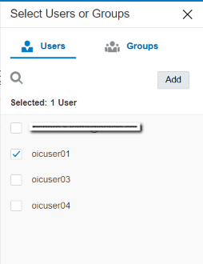

# Setup the Lab prerequisites

## Introduction

This lab walks you through the steps to setup the Lab Prerequisites.

Estimated Lab Time: 5 minutes

### Objectives

In this lab, you will:

* Create the required File Server directories and configure permissions.
* Connect an FTP Client to the Oracle Integration File Server.

### Prerequisites

This lab assumes you have:

* Successfully provisioned Oracle Integration Instance and able to access the home page.
* Successfully enabled Oracle Integration File Server.
* All instructions assume you are starting from the Oracle Integration home page.

## Task 1: Configure File Server

Configure File Server settings.

1. Starting at the Oracle Integration Home page, select **Settings**, then **File Server** from the left Navigation pane.

2. Select **Settings** from left Navigation pane to open the **File Server Settings** page and review the File Server health and main settings.

 
Note: Leave the default Authentication Type to be **Password or Key**.

3. Select **Files** from left Navigation pane.

 

4. From the Top right corner Click **Create** and create a folder named **B2BWorkshop**.

 
5. Select the **B2BWorkshop** folder and create two additional folders named **B2BTPDELLIn** and **B2BTPDELLOut** within the **B2BWorkshop** folder.

  

Note: You will be using the above folder structure in next labs.

6. Select **Users** from left Navigation pane. Find and select the user you are currently logged in as. If your user has not yet been configured to use File Server, click **Select** to configure your user.

7. Configure your user as follows:

* Select Home Folder Type as **Custom**.
* Select Home Folder as **B2BWorkshop**.

 

8. Click on the **X** icon to close the Window. Expand your user details and notice that Folder permissions are not yet provided.

 

9. Select **Files** from left Navigation pane. Click Permissions on the **B2BWorkshop** folder.
 

10. Click **Add Permissions** and select your user. Click **Add**.
 

11. Select **All** and **Propagate to subfolders**. All of the permission check boxes should be checked. Click **Save** and exit the Permissions page.
 

## Task 2: Connect to File Server with FTP Client

To access files on the File Server you will need to use an FTP Client. You will need to configure your FTP Client with the following:
* File Server IP Address.
* File Server Port.
* Your Oracle Integration username.
* Your Oracle Integration password.

1. To obtain the File Server IP Address and Port, select **Settings** from left Navigation pane. The IP and Port are located in the **IP and Port Information** section of the **Settings** page.

2. Using your favorite FTP Client to connect to the File Server using SFTP - SSH File Transfer Protocols.

A Sample Configuration using FileZilla FTP Client.
 

Directory Listing created in File Server. If all the permissions are provided you should be able to read/write/list files from the **B2BWorkshop**, **B2BTPDELLIn**, and **B2BTPDELLOut** folders.
 

## Task 3: Creating Connection with File Server

To access the File Server, you will need to create an FTP Connection.

Note: You can use an existing connection if one has already been configured for your environment.

1. Starting at the Oracle Integration Home page, select **Integrations**, then **Connections** from the left Navigation pane.
2. Click **Create**, then select the **FTP** Adapter and click **Select**.
3. From the Create Connection dialog, name your connection **File Server** and leave the rest of the configurations as defaulted. Click **Create**.  
Note: If you get an error that the identifier already exists, change the Connection name and remember this name for use later in the workshop.
4. Enter the following configurations in the FTP Connection with the information you previously gathered from the File Server Settings page.  
| Field                   | Value                                                 |
|-------------------------|-------------------------------------------------------|
| FTP Server Host Address | From File Server Settings - IP and Port Information   |
| FPT Server Port         | From File Server Settings - IP and Port Information   |
| SFTP Connection         | Yes                                                   |
| Security                | FTP Server Access Policy                              |
| Username                | Your Oracle Integration username                      |
| Password                | Your Oracle Integration username                      |

5. Confirm your Connection by clicking **Test**, the **Diagnose & Test**. You should see the Connection File Server was tested successfully confirmation message. Click **Save** and exit the Connection editor.

## Task 4: Creating Connection with REST Adapter

To expose your B2B integrations as an API, you will need to create a REST Connection.

Note: You can use an existing connection if one has already been configured for your environment.

1. If you are not already on the Connections page, starting at the Oracle Integration Home page, select **Integrations**, then **Connections** from the left Navigation pane.
2. Click **Create**, then select the **REST** Adapter and click **Select**.
3. From the Create Connection dialog, name your connection **REST Interface**. Set the Role to **Trigger** and leave the rest of the configurations as defaulted. Click **Create**.  
Note: If you get an error that the identifier already exists, change the Connection name and remember this name for use later in the workshop.
4. Set the Security Poilicy to **OAuth 2.0 Or Basic Authentication**.  

5. Confirm your Connection by clicking **Test**. You should see the Connection REST Interface was tested successfully confirmation message. Click **Save** and exit the Connection editor.

You may now [proceed to the next lab](#next).

## Learn More

* [File Server](https://docs.oracle.com/en/cloud/paas/integration-cloud/file-server/file-server-overview.html)
* [About Connections](https://docs.oracle.com/en/cloud/paas/integration-cloud/integrations-user/integration-cloud-service-concepts.html#GUID-DDA9C4B9-BCB0-4F4D-BA51-44FB610AEA1C)

## Acknowledgements

* **Author** - Kishore Katta, Technical Director, Oracle Integration Product Management
* **Contributors** - Subhani Italapuram, Oracle Integration Product Management
* **Last Updated By/Date** - Oracle Integration team, December 2021
