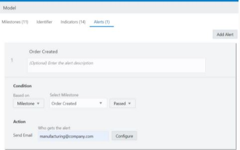

# Define an Alert

## Introduction

The Lab will cover how to add an alert to your Model.

Estimated Time: 25 minutes

## Prerequisites

This lab assumes you have:
- Completed Labs 1 through 11

## Learning Objectives

In this lab, you will learn how to create the following:

- Add an Alert
- Test the Alert

First practice the steps to familiarize yourself with the commands and then do the Labs.

### How to Add an Alert

    A. On the Models page, click the name or Edit icon icon of the model for which you want to create alerts. 
        1. If the model is not a draft, click Create Draft.
        2. Click <Alerts>
            a. If no alerts exist for the model, the Alerts page looks like this:
            
            b. If alerts have been defined for the model, the Alerts page looks like this:
            
        3. Click <Add Alert>, then enter an alert name and optional description.
        4. Define the required alert <Condition>:
            a. To define an alert based on whether or not a milestone is reached:
                i. <Based On>: <Select Milestone>.
               ii. <Select Milestone>: Select the milestone for which you want to define an alert.
              iii. Select whether the alert should be issued when the specified milestone is <Passed> or <Not Passed Within> a selected time.
            b. To define an alert based on the value of an indicator (dimension or measure):
                i. <Based On>: <Select Indicator>.
               ii. <Select Indicator>: Select the indicator for which you want to define an alert.
              iii. <Operator> and <Value>: Select the operator and enter a value to define the condition for issuing the alert.
        5. Define the alert <Action>:
            a. Click <Configure> to open the Configure Alert dialog:
            b. Configure the email for the alert notification:
                i. <To>: Enter one or more individual or group email addresses, separated by commas.
               ii. <From>: Select a sender from the dropdown list, which is populated by the configuration on the Notifications page in Oracle Integration. See **[Send Service Failure Alerts, System Status Reports, and Integration Error Reports by Notification Emails] (https://docs.oracle.com/pls/topic/lookup?ctx=en/cloud/paas/integration-cloud/user-int-insight-oci&id=ICSUG-GUID-4A8952AD-00AB-423A-ABE5-94C01ABF4AC3)** in Using Integrations in Oracle Integration.
              iii. <Subject and Body>: Enter text you want to provide for the notification. The body text supports HTML markup tags. Type $ to select and insert the unique instance identifier, indicators, or a link to the Business Transaction Details dashboard.
             * Note: To be successfully extracted, the identifier and indicator values must be mapped to the same milestone for which the alert is configured. See Define a Unique Instance Identifier.
             In the notification email that the recipient receives, the indicator placeholders in subject and body are replaced with the actual values. The link placeholder is replaced with a clickable link to the Business Transaction Details dashboard. For those indicators whose values are not available, their placeholders will be replaced with the text [Not Available].
        6. Click <Done> and <Save>


Now that we have instructed you on how to create an alert, it's your turn.

You will be using your existing Active Model. You will be creating alerts by adding new milestones, indicators and add an alert for them. You will be testing your alert as well.

## Task 1: De-Activate

Open your existing Model and move it into Draft mode.

## Task 2: Add Milestones

You will need to add an *error milestone* named *Backordered* and move this new Milestone before the existing *Shipped* Milestone. Add the *Backordered* milestone to the *Order Number* Identifier.

## Task 3: Add Indicators

Add *Backordered* milestone Indicators named *Backordered Quantity* (Measure of type Integer)

## Task 4: Add Alert

Create the Indicator type Alert named **Backordered Quantity**. Set the condition to *Backordered Quantity > 100*. Set the *Action to Send email>* and enter your email address and configure the email. Select your OIC instance for the Email *from* field. Set the email Subject to *Backordered Quantity* **exceeded** threshold. Set the email Body to *You have an excess backorder of ${Backordered Quantity} units for product ${Product}*.
Next, create a Milestone Type Alert named **Shipping Delay**, set the From Milestone to *Backordered*. Set the To Milestone to *Shipped*. Set the condition to *Not Passed* with *1* minute. Set the *Action Email* and enter your email address and configure the email by selecting your OIC instance fro the email From field. SE
setting the email Subject to *Backorder has delayed shipping*. Set the email Body to *You have a backorder of ${Backordered Quantity} units for product ${Product} which is delaying shipping*.
Save and Close.

## Task 5: Map Milestone and Indicators

Now, you need to map the *Backordered* Milestone *ON Exit* event to the *Backordered* activity. Set the *Order Number* Identifier Extraction Criteria for the *Backordered* Milestone to *$Backordered Quantity*. Map the *Backordered* Milestone Indicators by setting the *Backordered Quantity* Indicator Extraction Criteria to *$BackorderedQuantity*.
Save your work. 

Verify your Insight Model is in the Configured state and then Activate you Insight Model.

## Task 6: Testing your Alert

Open the Integration named **Order Processing Lab** in Test.  Invoke the *OrderReceived* operation by copying the following information:

```
    <copy>
{  
"orderId": "1002",  
"product": "USB Cable", 
"quantity": 250, 
"unitPrice": 12,  
"discount": 0,  
"country": "DE"  
} 
    </copy>
```
Wait at least 1 minute and invoke the *shipping* operation by copying the following information:
```
    <copy>
{  
"orderId": "1002",
"quantity": 250,  
"availableQuantity": 250,    
} 
    </copy>
```

Go to your email and verify you received 2 emails. One with the subject: **Backordered Quantity exceeded threshold** , and another with the subject: **Backorder has delayed shipping**. 

Try running some of your own test instances (Order Id 1000+ are reserved for lab test data)

## Summary

Congratulation in completing this Lab.

## Learn More

More about key concepts and terminology can be found at [https://docs.oracle.com/en/cloud/paas/integration-cloud/user-int-insight-oci/work-models-integration-insight.html](http://docs.oracle.com)

## Acknowledgements

* **Author** - Lucy Cortez, Product Enablement Management - Oracle Integration
* **Last Updated By/Date** - Lucy Cortez, April 2022
