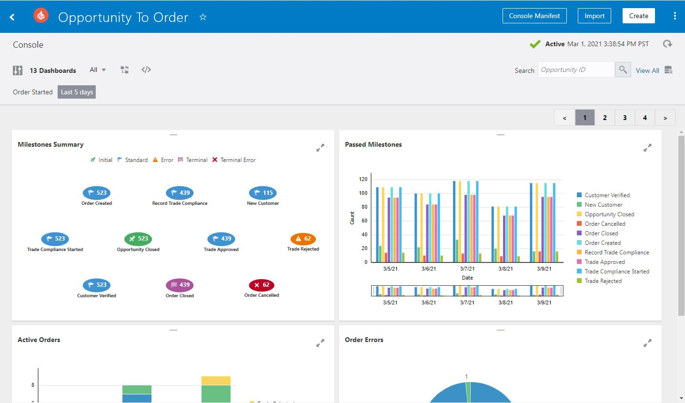

# Oracle Insight Navigation

## About this Workshop

The workshop will cover how to navigate to Insight and the command fields you will experience while working with a model.

Estimated Workshop Time: 5 Minutes

## Introduction

The Integration Insight feature (commonly referred to as Insight) is located in home page of Oracle Integration.

## Objectives

In this workshop, you will:

* Navigate Insight

## Task 1: Navigate
### Main Page
Click the hamburger  at the top left hand site of the home screen. Click on the Insight  and you will see Consoles and Models.

## Task 2: Models
Click on Models  to commence creating or modify models.

In Models, starting left to right, you will see the search tool, filter tool, refresh, list horizontal, or list by block. Above that you will see the Import button or Create button.

## Task 3:Consoles
Click Consoles  to view consoles. 

In Consoles, starting left to right, you will see the search tool, filter tool, the number of how many consoles are listed, refresh, list horizontal, or list by block. 

Consoles are created once you activate a model and will have different icons next to the respective titles. You will see the Name, Favorite start, its Status, the Status Last Updated date/timestamp and Today's Business Transactions.

## Task 5: Dashboards
  
Open Dashboards via clicking on a Console name to open its related Dashboard. 
In the Dashboards, starting left to right, you will see the search tool, filter tool, All Dropdown (where you can locate preconfigured or create a custom Dashboard), Rearrange Dashboard, Embed Dashboard, Search Order Number, View All, Purge Console Data, and Refresh. 

Top right side, you will see the Console Manifest, Import, Create and the three dots, which is for the Details information. Lastly, you will see blocks with the dashboards displays as built within the model.   

You may now **Proceed to the next lab**

## Want to Learn More

* [https://docs.oracle.com/en/cloud/paas/integration-cloud/index.html](http://docs.oracle.com)
* [https://docs.oracle.com/en/cloud/paas/integration-cloud/integration-insight.html](http://docs.oracle.com)

## Acknowledgements
* **Author** - Lucy Cortez, Product Enablement Manager, OIC
* **Contributors** -  Nathan Angstadt, Senior Director, Oracle Integration Product Management
* **Last Updated By/Date** - Lucy Cortez, August 2021
