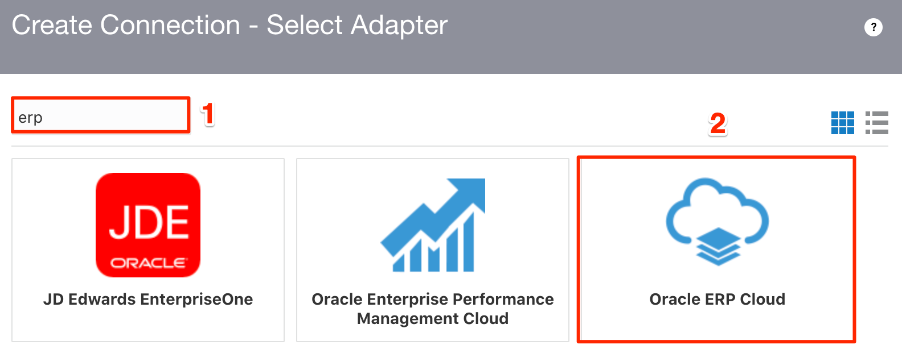
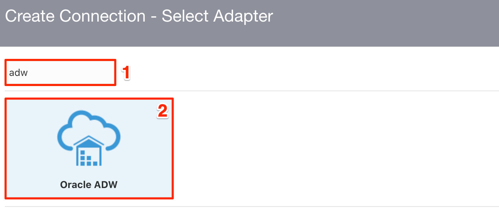
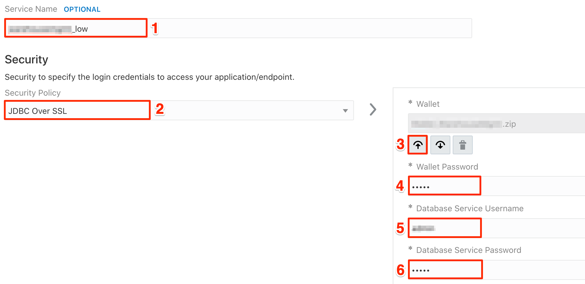

# Create Connections
Before you can build an integration, you have to create the connections to the applications with which you want to share data. Follow these steps to create an ERP Cloud connection.

## Introduction
This demo lab will walk you through the steps to create connections for all the services which will used in the ERP Purchase Order Event integration.

Estimated Time: 10 minutes

### Objectives
In this lab, you will:
- Create an Oracle ERP Cloud Adapter Connection 
- Create an Oracle Autonomous Data Warehouse connection

### Prerequisites
This lab assumes you have:
- Completed the Lab Setup

## **Task 1:** Create an Oracle ERP Cloud Adapter connection 
Create a connection with the Oracle ERP Cloud Adapter.

1. Show the left Navigation menu, and click **Integrations** > **Connections**.

2. Click **Create**.

3. In the *Create Connection - Select Adapter* dialog, select the **Oracle ERP Cloud** adapter to use for this connection. To find the adapter, enter `erp` in the search field. Click on the highlighted adapter and hit **Select**.
    

4. In the *Create Connection* dialog, enter the following information:

    | **Field**        | **Value**          |       
    | --- | ----------- |
    | Name         | `LLDemo_ERP`       |
    | Description  | `ERP Connection for LiveLabs demo` |
    |

    Keep all other values as default.

5. In the *Oracle ERP Cloud Connection* dialog, enter the following information:

    | **Field**  | **Values** |
    |---|---|
    |ERP Cloud Host | `your-erp-host-name` |
    |Security Policy | `Username Password Token`|
    |Username | `<user>`|
    |Password | `<password>`|
    |

6. Click on **Test** and wait until you receive a 
confirmation box that the test was successful.

    > **Note:** The first time you run the Test, it could take up to 2 minutes. 

7. Click **Save** and wait for the confirmation box. Exit the connection canvas by clicking the back button on the top left side of the screen.

## **Task 2:** Create an Oracle Autonomous Data Warehouse Connection 
Create a connection with the Oracle Autonomous Data Warehouse Adapter.

1. From the *Connections* window, click **Create**.

2. In the *Create Connection - Select Adapter* dialog, select the **Oracle ADW** adapter to use for this connection. To find the adapter, enter `adw` in the search field. Click on the highlighted adapter and hit **Select**.
    

3. In the *Create Connection* dialog, enter the following information:

    | **Field**        | **Value**          |       
    | --- | ----------- |
    | Name         | `LLDemo_ADW`       |
    | Description  | `ADW Connection for LiveLabs demo` |
    |

    Keep all other values as default.

4. In the *Oracle ADW Connection* dialog, enter the following information:

    | **Field**  | **Value** |
    |---|---|
    |Service Name | `<your-adb-tns-name>` |
    |Security Policy | **JDBC Over SSL**|
    |Wallet | **Upload wallet file (Zip)** |
    |Wallet Password | `<password>`|
    |Database Service Username | `<db-service-user>` (Default: `ADMIN`)|
    |Database Service Password | `<db-service-password>` |
    |

    
    
5. Click on **Test**, followed by **Save**. Exit the connection canvas by clicking the back button on the top left side of the screen.

You have completed the final step of Lab 1. Please **proceed to the next lab**. 

## Acknowledgements
* **Author** - Ravi Chablani, Product Management - Oracle Integration
* **Last Updated By/Date** - Ravi Chablani, February 2022