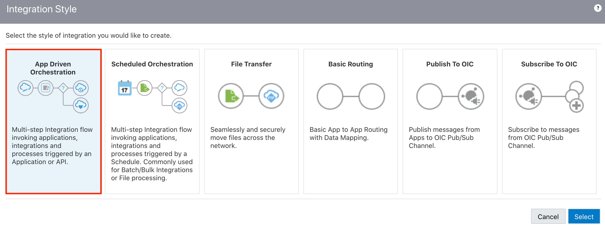
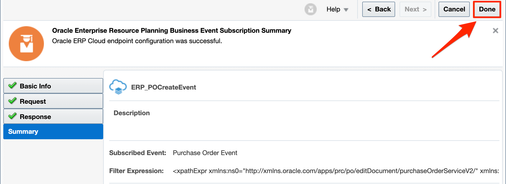
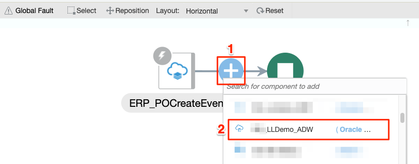
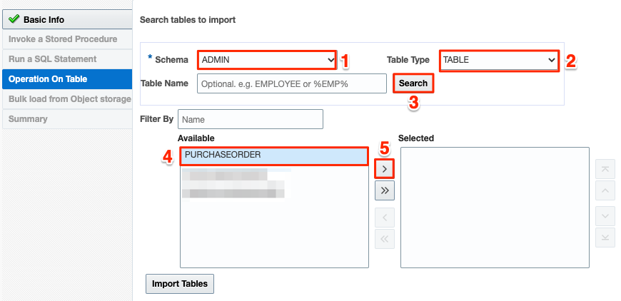
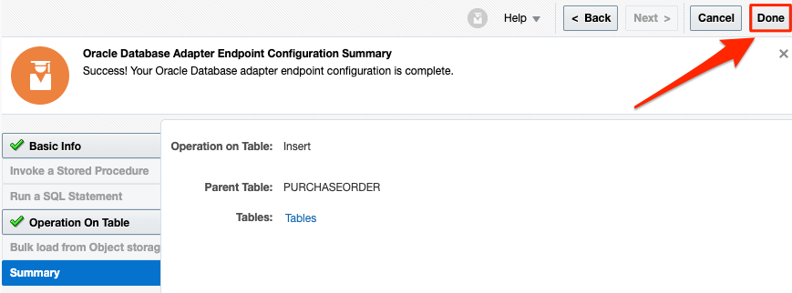

# Create the Purchase Order Event Integration flow

## Introduction
This demo lab will walk you through the steps to create an end-to-end integration of receiving ERP Purchase Order events and persisting the data in an ADW Table.

### Objectives
You will demo the following:
- Initiate an App Driven integration flow
- Define ERP Purchase Order (PO) Event trigger
- Add the PO Record to DB Table activity
- Map data between ERP trigger and ADW invoke
- Define the Tracking Fields
- Activate the integration

## Task 1: Initiate an App Driven integration flow
We will start by creating a new integration and adding some basic info.

1. In the left Navigation pane, and click **Integrations** > **Integrations**.
2. On the Integrations page, click **Create**. 
3. On the *Integration Style* dialog, select **App Driven Orchestration**, followed by **Select**. 

    

4. In the *Create New Integration* dialog, enter the following information:

    | **Element**        | **Value**          |       
    | --- | ----------- |
    | Name         | `LLERPEventDemo`       |
    | Description  | `ERP Event integration for Livelabs demo` |
    |

    Accept all other default values. 

5. Click **Create**. 

6. Click **Save** to persist changes. 

## Task 2: Define ERP Purchase Order (PO) Event trigger
Add ERP PO Event trigger to the empty integration canvas.

1. Click the **+** sign below *START* in the integration canvas.

2. Select the configured ERP Cloud adapter. This invokes the Oracle ERP Cloud Endpoint Configuration Wizard.

3. On the Basic Info page, for *What do you want to call your endpoint?* element, enter `ERP_POEvent`. 

4. Click **Next**.

5. On the Request page, select the following values:

    | **Element**        | **Value**          |       
    | --- | ----------- |
    | Define the purpose of the trigger         | **Receive Business Events raised within ERP Cloud**       |
    | Business Event for Subscription  | **Purchase Order Event** |
    | Filter Expr for Purchase Order Event | `<xpathExpr xmlns:ns0="http://xmlns.oracle.com/apps/prc/po/editDocument/purchaseOrderServiceV2/" xmlns:ns2="http://xmlns.oracle.com/apps/prc/po/editDocument/purchaseOrderServiceV2/types/">$eventPayload/ns2:result/ns0:Value/ns0:PurchaseOrderLine/ns0:ItemDescription=`**"LL demo"**`</xpathExpr>` |
    |

    > **Note:** You can use a custom filter expression by inserting a different value under **ItemDescription**. The value you enter is case sensitive. 

    

6. Click **Next**.

7. On the Response page, for *Response Type* element, choose **None**. Click **Next**.

8. On the Summary page, click **Done**.

    

9. On the integration canvas, from the Layout list, choose **Horizontal**. 

    

10. Click **Save** to persist changes. 
 

## Task 3: Add the PO Record to DB activity
Add the Oracle Autonomous Data Warehouse Adapter invoke to the integration canvas.

1. Hover you cursor over the **+** sign that is displayed after the trigger activity in the integration canvas. Click the **+** sign and select the ADW connection created in Lab 1. 

    

    This invokes the Oracle Autonomous Data Warehouse Endpoint Configuration Wizard.

2. On the Basic Info page, select the following values:

    | **Element**        | **Value**          |       
    | --- | ----------- |
    | What do you want to call your endpoint? | `ADW_InsertPO`       | 
    | What operation do you want to perform? | **Perform an Operation on a Table** |
    | What operation do want to perform on Table? | **Insert** |
    |

3. On the Table Operation page, select the following values:

    | **Element**        | **Value**          |       
    | --- | ----------- |
    | Schema | **ADMIN**  |
    | Table Type | **TABLE** |
    | Table Name | \<keep blank\> and click **Search** |
    | Available | **PURCHASEORDERS** and click **>** to move the table to the *Selected* column |
    |

    

4. Click on **Import Tables**, wait and hit **Next**.

5. When the *Select the parent database table* element appears, click **Next**.

6. On the Summary page, click **Done**.

    

7. Click **Save** to persist changes. 

