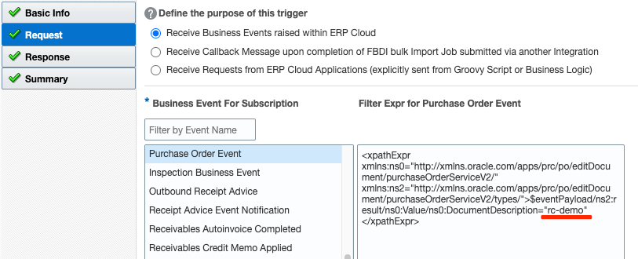
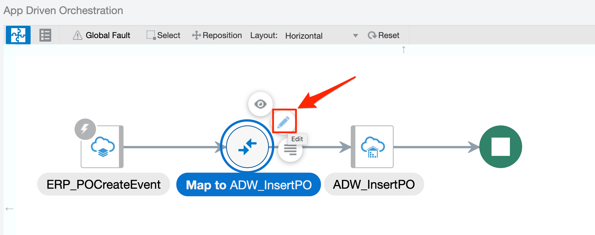
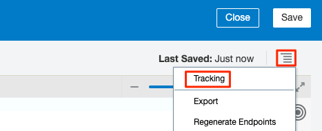

# Create Integration flow

## Introduction
This demo lab will walk you through the steps to create an end-to-end integration of receiving ERP Purchase Order events and persisting the data in an ADW Table.

### Objectives
You will demo the following:
- Initiate an App Driven integration flow
- Define ERP Purchase Order (PO) Event trigger
- Add the ADW invoke activity
- Map data between ERP trigger and ADW invoke
- Define Tracking Fields
- Activate the integration


### Prerequisites
This lab assumes you have:
- Completed Lab 1 by creating the required connections 


## **Task 1:** Initiate an App Driven integration Flow
We will start by creating a new integration and adding some basic info.

1. In the left Navigation pane, click **Integrations** > **Integrations**.
2. On the Integrations page, click **Create**. 
3. On the *Integration Style* dialog, select **App Driven Orchestration**, followed by **Select**. 

    

4. In the *Create New Integration* dialog, enter the following information:

    | **Element**        | **Value**          |       
    | --- | ----------- |
    | Name         | `LLERPEventDemo`       |
    | Description  | `ERP Event integration for LiveLabs demo` |
    |

    Accept all other default values. 

5. Click **Create**. 

6. Click **Save** to apply changes. 


## **Task 2:** Define ERP Purchase Order (PO) Event trigger
Add ERP PO Event trigger to the empty integration canvas.

1. Click the **+** sign below *START* in the integration canvas.

2. Select the configured ERP Cloud adapter. This invokes the Oracle ERP Cloud Endpoint Configuration Wizard.

3. On the Basic Info page, for *What do you want to call your endpoint?* element, enter `ERP_POEvent`. 

4. Click **Next**.

5. On the Request page, select the following values:

    | **Element**        | **Value**          |       
    | --- | ----------- |
    | Define the purpose of the trigger         | **Receive Business Events raised within ERP Cloud**       |
    | Business Event for Subscription  | **Purchase Order Event** |
    | Filter Expr for Purchase Order Event | [see code snippet below] |
    |

    ```
    <copy><xpathExpr xmlns:ns0="http://xmlns.oracle.com/apps/prc/po/editDocument/purchaseOrderServiceV2/" xmlns:ns2="http://xmlns.oracle.com/apps/prc/po/editDocument/purchaseOrderServiceV2/types/">$eventPayload/ns2:result/ns0:Value/ns0:DocumentDescription="demo"</xpathExpr></copy>
    ```

    > **Tip:** If you are working on a shared ERP Cloud environment, it is recommended to use a distinct value in the filter expression under **DocumentDescription**. For example `<your-initials>-demo`. The value you enter is case sensitive. Write down this value for later use. 
    

    > **Note:** The filter is not required, however it does allow you to control which integration should be triggered. This is useful if there are multiple integrations subscribed to the PO Event in the same ERP Cloud environment. Without the filter expression, all integrations subscribed to the PO Event would get triggered whenever that specific event occurs. 

6. Click **Next**.

7. On the Response page, for *Response Type* element, choose **None**. Click **Next**.

8. On the Summary page, click **Done**.

    

9. On the integration canvas, from the Layout list, choose **Horizontal**. 

    


10. Click **Save** to persist changes. 
 

## **Task 3:** Add the ADW invoke activity
Add the Oracle Autonomous Data Warehouse Adapter invoke to the integration canvas.

1. Hover you cursor over the arrow in the integration canvas to display the **+** sign. Click the **+** sign and select the ADW connection created in Lab 1. 

    

    This invokes the Oracle Autonomous Data Warehouse Endpoint Configuration Wizard.

2. On the Basic Info page, select the following values:

    | **Element**        | **Value**          |       
    | --- | ----------- |
    | What do you want to call your endpoint? | `ADW_InsertPO`       | 
    | What operation do you want to perform? | **Perform an Operation on a Table** |
    | What operation do want to perform on Table? | **Insert** (Default)|
    |

3. On the Table Operation page, select the following values:

    | **Element**        | **Value**          |       
    | --- | ----------- |
    | Schema | **ADMIN**  |
    | Table Type | **TABLE** |
    | Table Name | &lt;keep blank&gt; and click **Search** |
    | Available | Select **PURCHASEORDER** and click **>** to move it to the *Selected* box |
    |

    

4. Click on **Import Tables**, wait and press **Next**.

5. When the *Select the parent database table* element appears, click **Next**.

6. On the Summary page, click **Done**.

    

7. Click **Save** to apply changes. 


## **Task 4:** Map data between ERP trigger and ADW invoke
Use the mapper to drag fields from the source structure (ERP PO event data)  to the target structure (ADW PO table) to map elements between the two.

When we added the ADW invoke to the integration, a map icon was automatically added. 

1. Hover you cursor over the ERP-ADW **Mapper** icon, click once, then select **Edit**.
   

2. Use the mapper to drag element nodes in the source ERP Cloud structure to element nodes in the target Oracle ADW structure.

    Expand the Source node:
    
        ERP_POCreateEvent Request > Get Purchase Order Response > Result > #2 &lt;<sequence\> > Value


    Expand the Target node:
    
        ADW_InsertPO Request > Purchaseorder


    Complete the mapping as below:    

    | **Source** *(ERP_POCreateEvent)*        | **Target** *(ADW_InsertPO)* |
    | --- | ----------- |
    | PO Header Id | poheaderid |
    | Order Number | ordernumber |
    | Sold To Legal Entity Id | soldtolegalentityid |
    | Creation Date | creationdate |
    | Document Status | status |
    | Total Amount | total |
    |

   

3. Click **Validate**, then wait for the confirmation message *Mapping is valid and ready to use.*

4. Click **Close**

5. Click **Save** to persist changes. 


## **Task 5:** Define Tracking Fields
Manage business identifiers that enable you to track fields in messages during runtime. 

> **Note:** If you have not yet configured at least one business identifier **Tracking Field** in your integration, then an error icon is displayed in the design canvas. 
    

1. Click the **Actions** menu on the top right, then select **Tracking**.
    

2. From the *Source* section, expand **getPurchaseOrderResponse** > **result**, click **Load more**, expand **Value**, and click **Load more**. Drag the **POHeaderId** and **OrderNumber** field from ERP PO source to the *Drag a trigger field here* section:

    

3. Click **Save**. 

4. On the Integration canvas, click **Save**, followed by **Close**.

## **Task 6:** Activate the integration

1. On the *Integrations* page, click on the **Activate** icon.

    

2. On the *Activate Integration* dialog, select **Enable Tracing**, followed by **Include Payload** options. 

3. Click **Activate**.
    
    The activation will complete in a few seconds. If activation is successful, a status message is displayed in the banner at the top of the page, and the status of the integration changes to *Active*. 


You may now **proceed to the next lab**.


## Acknowledgements
* **Author** - Ravi Chablani, Product Management - Oracle Integration
* **Last Updated By/Date** - Ravi Chablani, February 2022