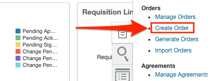

# Run Demo

## Introduction
This demo lab will walk you through the steps to create an ERP Purchase Order and validate how the data is processed in the integration flow. 

### Objectives
- Create Purchase Order (PO) in ERP Cloud
- View message flow triggered by the PO Create Event
- Verify PO record in ADW Table

## Task 1: Create Purchase Order in ERP Cloud
1. Access your ERP Cloud environment. Login with a user having the correct roles and priviliges to create a PO. 

2. Navigate to the **Procurement** Tab.

3. Click **Purchase Orders**.

4. In the **Overview** section, click **Tasks** menu on the right.
   

    This opens the Tasks menu. 

5. Under the *Orders* section, select **Create Order**.
  

    The *Create Order* dialog is displayed.

6. Enter a valid entry in the *Supplier* field, for example `ABC Consulting`, and select the corresponding supplier in the drop down. 

    > You can search for valid suppliers using the **Search** icon. 

7. Click **Create**.

8. In the *Edit Document (Purchase Order)* page, enter the same value used under the *Filter Expr for Purchase Order Event*. For example: `"LL demo"` 

## Task 2: View message flow of the running integration
Use the Oracle Integration dashboard to see the data flow resulting from the create Purchase Order event in ERP Cloud. 

1. In the navigation pane, click **Home** > **Monitoring** > **Integrations** > **Dashboard**

2. 

## Task 3: Verify PO record in ADW Table

