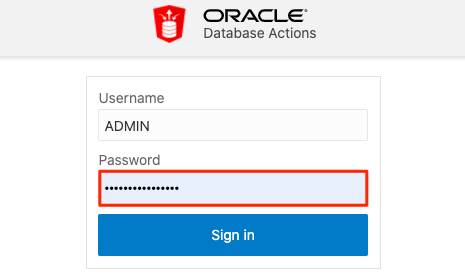

# Lab Setup

## Introduction

This lab walks you through the setup required to complete this demo workshop.

Estimated Lab Time: 5 minutes

### Objectives
In this lab, you will:
- Obtain Database Connection details
- Create Database Table using a SQL script


### Prerequisites
* Completion of the **Provision an Oracle Autonomous Database** section in the **Contents** menu on the left


## Task 1: Obtain Database Connection details
1. If you are not already logged in to Oracle Cloud Console, log in and select **Autonomous Database** from the navigation menu under Oracle Database.

    

    > **Note:** You can also directly access your Autonomous Data Warehouse or Autonomous Transaction Processing service in the **Quick Actions** section of the dashboard.

2. Navigate into your demo database by clicking on the instance link.

    

    > **Note:** Similar steps apply to either Autonomous Data Warehouse and Autonomous Transaction Processing.

3.  In your Autonomous Database Details page, click the **DB Connection** button.

4. In the displayed *Database Connection* dialog, click **Download Wallet**. 

5. Provide a Wallet password, then click **Download**. Save the wallet file (ZIP) on your local machine. This file will be used later when creating the Autonomous Database connection in Oracle Integration. 

6. Under *Connection Strings*, select one of the *TNS Name* entries and write it down. This value will used later when creating the Autonomous Database connection in Oracle Integration.

7. Click **Close**.


## Task 2: Create a database table using a SQL script
Follow these steps to create a DB table which will be used as part of this workshop. 

1.  If you are not already logged in to SQL Worksheet, in your ADW Database Details page, click the **Database Actions** button.

    

    > If you are automatically signed is as *ADMIN* user, then skip to step 4. 

2. A sign-in page opens for Database Actions. For this lab, simply use your database instance's default administrator account, Username = `ADMIN` and click **Next**.

   

3.  Enter the **ADMIN** password you specified when creating the database and click **Sign in**.

    

4. The Database Actions page opens. In the *Development* box, click **SQL**.

    

5. The SQL Worksheet appears. Copy below code snippet:
    ```
    CREATE TABLE PURCHASEORDER 
    (
    POHEADERID NUMBER GENERATED BY DEFAULT AS IDENTITY INCREMENT BY 1 MAXVALUE 9999999999999999999999999999 MINVALUE 1 CACHE 20 NOT NULL 
    , ORDERNUMBER VARCHAR2(20 BYTE) 
    , SOLDTOLEGALENTITYID NUMBER 
    , CREATIONDATE DATE 
    , STATUS VARCHAR2(20 BYTE) 
    , TOTAL NUMBER(*, 2) 
    , CONSTRAINT PURCHASEORDER_PK PRIMARY KEY 
    (
        POHEADERID 
    )
    USING INDEX 
    (
        CREATE UNIQUE INDEX PURCHASEORDER_PK ON PURCHASEORDER (POHEADERID ASC) 
        LOGGING 
        TABLESPACE DATA 
        PCTFREE 10 
        INITRANS 20 
        STORAGE 
        ( 
            INITIAL 65536 
            NEXT 1048576 
            MINEXTENTS 1 
            MAXEXTENTS UNLIMITED 
            BUFFER_POOL DEFAULT 
        ) 
        NOPARALLEL 
    )
    ENABLE 
    ) 
    LOGGING 
    TABLESPACE DATA 
    PCTFREE 10 
    INITRANS 10 
    STORAGE 
    ( 
    INITIAL 65536 
    NEXT 1048576 
    MINEXTENTS 1 
    MAXEXTENTS UNLIMITED 
    BUFFER_POOL DEFAULT 
    ) 
    COLUMN STORE COMPRESS FOR QUERY HIGH ROW LEVEL LOCKING 
    NO INMEMORY 
    NOPARALLEL;
    ```

6. Paste the script in SQL Worksheet, then click **Run It** button. This will create the **PURCHASEORDER** table. The table is created successfully when you see the notification in the **Script Output**. 

    

Now you have an external table which will be used in the demo flow. 

You have completed the final step of this lab.


## Acknowledgements
* **Author** - Ravi Chablani, Product Management - Oracle Integration
* **Last Updated By/Date** - Ravi Chablani, March 2022
