# Discover and Mask Sensitive Data

## Introduction

Data Discovery helps you find sensitive data in your target databases. You tell Data Discovery what kind of sensitive data to search for, and it inspects the actual data in your target database and its data dictionary, and then returns to you a list of sensitive columns. By default, Data Discovery can search for a wide variety of sensitive data pertaining to identification, biographic, IT, financial, healthcare, employment, and academic information.

Data Masking provides a way for you to mask sensitive data so that the data is safe for non-production purposes. For example, organizations often need to create copies of their production data to support development and test activities. Simply copying the production data exposes sensitive data to new users. To avoid a security risk, you can use Data Masking to replace the sensitive data with realistic, but fictitious data.

Start by discovering sensitive data on your target database by using the Data Discovery feature. Then, mask the sensitive data by using the default masking policy generated by the Data Masking feature. View the before and after effect on the masked data by using the web tool in Oracle Cloud Infrastructure called Database Actions.

Estimated Lab Time: 30 minutes

### Objectives

In this lab, you will:

- View sensitive data in your target database
- Discover sensitive data in your target database by using Data Discovery
- Create a PDF of the Sensitive Data Model report
- Create a masking policy for your target database
- Mask sensitive data in your target database by using Data Masking
- View the Data Masking report
- Create a PDF of the Data Masking report
- Validate the masked data in your target database

### Prerequisites

This lab assumes you have:

- Obtained an Oracle Cloud account and signed in to the Oracle Cloud Infrastructure Console
- Prepared your environment for this workshop (see [Prepare Your Environment](?lab=prepare-environment)). It's important that your ATP database is registered with Oracle Data Safe, the Data Discovery and Data Masking features are enabled on your target database, and you have the appropriate permissions in Oracle Cloud Infrastructure Identity and Access Management to use the Data Discovery and Data Masking features with your target database.
- Registered your Autonomous Database with Oracle Data Safe and loaded sample data into it. Make sure to have the `ADMIN` password for your database on hand (see [Register an Autonomous Database](?lab=register-autonomous-database)).

### Assumptions

- Your data values are most likely different than those shown in the screenshots.

## Task 1: View sensitive data in your target database

Use Oracle Database Actions to query sensitive data in your database. You can access Database Actions from your database's Console in Oracle Cloud Infrastructure.

1. From the navigation menu for Oracle Cloud Infrastructure, select **Oracle Database**, and then **Autonomous Transaction Processing**.

2. Under **COMPARTMENT**, make sure that your compartment is selected.

3. From the **Workload Type** drop-down list, select **All**.

4. Click the name of your target database.

5. On the **Autonomous Database Details** page, click **Database Actions** and wait for a new browser tab to open.

    - If you created the target database, you are automatically signed in as the `ADMIN` user.

6. If needed, sign in as the `ADMIN` user.

7. Under **Development**, click **SQL**.

8. If a help note is displayed, click the **X** button to close it.

9. On the **Navigator** tab, select the `HCM1` schema from the first drop-down list. In the second drop-down list, leave **Tables** selected.

    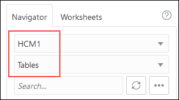

10. Drag the `EMPLOYEES` table to the worksheet.

    

11. When prompted to choose an insertion type, click **Select**, and then click **Apply**.

    

12. View the SQL query on the worksheet.

    

13. On the toolbar, click the **Run Statement** button (green circle with a white arrow) to execute the query.

    

14. Review the query results. If needed, click the **Query Result** tab.

    - Data such as `employee_id`, `first_name`, `last_name`, `email`, `phone_number`, and `hire_date`, are considered sensitive data and should be masked if shared for non-production use, such as development and analytics.
    - Keep this tab open so that you can return to it later.

    

## Task 2: Discover sensitive data in your target database by using Data Discovery

In Data Discovery, you can select the sensitive types that you want to discover in your target database. Data Discovery then generates a sensitive data model that contains sensitive columns in your target database.

1. Return to the browser tab for **Autonomous Database | Oracle Cloud Infrastructure**. If needed, sign in again.

2. From the navigation menu, select **Oracle Database** and then **Data Safe**.

    The **Overview** page for the Oracle Data Safe service is displayed.

3. Click **Security Center**, and then click **Data Discovery**.

    

4. From the **Compartment** drop-down list, select your compartment.

    A Data Discovery dashboard is displayed with statistics for the top five target databases in your compartment. Your dashboard is most likely empty because this is the first time you are using Data Discovery in this workshop.

    

5. Click **Discover Sensitive Data**.

    The **Create Sensitive Data Model** page is displayed.

6. In the **Sensitive Data Model Information** section, do the following, and then click **Next**.

    - In the **Name** box, enter **SDM1** for the sensitive data model.
    - Leave the compartment set to your compartment.
    - In the **Description** box, enter **Sensitive Data Model 1**.
    - Select your target database

    

7. For **Select Schemas**, leave **Select specific schemas only** selected. Scroll down and select the **HCM1** schema, and then click **Next**. You may need to click the right arrow button at the bottom of the page to navigate to page 2.

    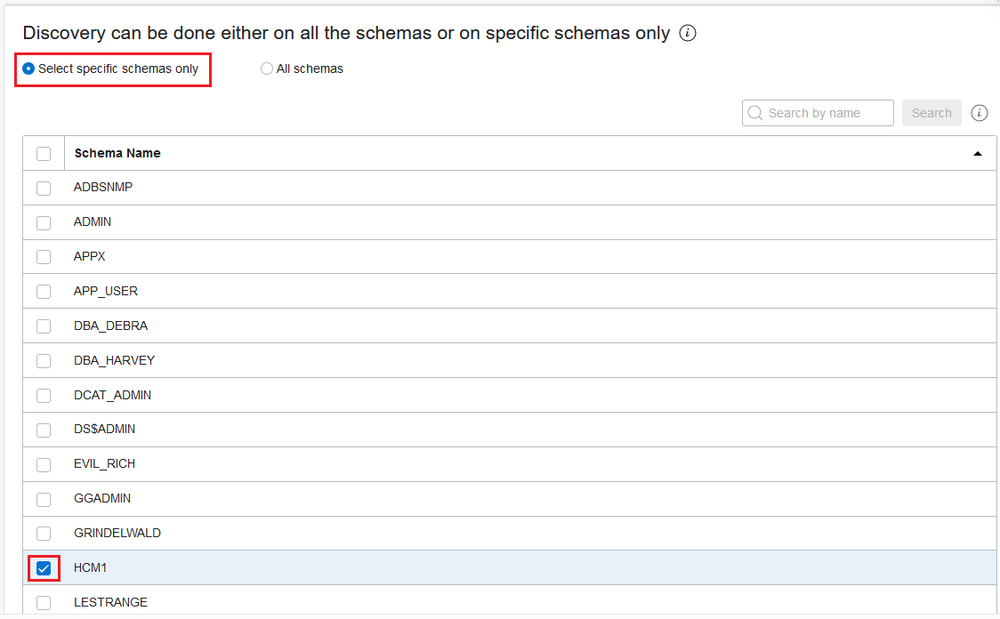

8. For **Select Sensitive Types**, expand all of the sensitive categories by moving the **Expand All** slider to the right. Scroll down the page and review the sensitive types. Notice that you can select individual sensitive types, sensitive categories, and all sensitive types. At the top of the page, select the **All** check box, and then click **Next**.

    

9. In the **Select Discovery Options** section, select **Collect, display and store sample data**, and then click **Create Sensitive Data Model** at the bottom of the page to begin the data discovery process.

    

10. After your sensitive data model is created, review its information on the **Sensitive Data Model Details** page.

    - The **Sensitive Data Model Information** tab lists information about your sensitive data model, including its name and Oracle Cloud identifier (OCID), the compartment to which you saved it, the date and time when it was created and last updated, the target database associated with it, and totals for sensitive schemas, sensitive tables, sensitive columns, sensitive types, and sensitive values. You can click the **View Details** link to view the work request information. The pie chart compares the number of sensitive values per sensitive category and sensitive type. *If the total values are not displayed, please refresh the browser tab.*
    - The **Sensitive Columns** table lists the sensitive columns retrieved by the data discovery job. By default, the table is displayed in **Flat View** format. For each sensitive column, you can view its schema name, table name, column name, sensitive type, parent column, data type, estimated row count, and sample data (if you retrieved sample data and if it exists). Review the sample data to get an idea of what it looks like.

    
    

11. Position your mouse over the **Identification Information** category in the chart to view its value.

    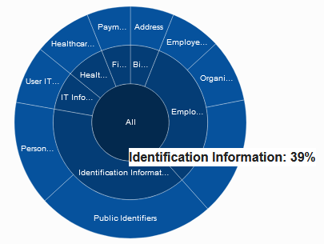

12. With your mouse still over **Identification Information**, click the pie slice to drill down. Notice that the **Identification Information** category is now divided into two smaller categories (**Personal Identifiers** and **Public Identifiers**).

    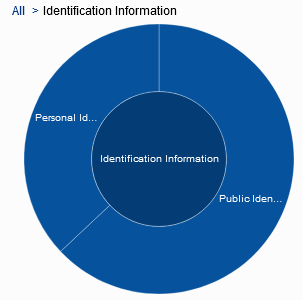

13.  To drill-up, click the **All** link in the chart's breadcrumb.

14. From the drop-down list, select **Sensitive Type View** to sort the sensitive columns by sensitive type. By default, all items are expanded in the view. You can collapse the items by moving the **Expand All** slider to the left.

    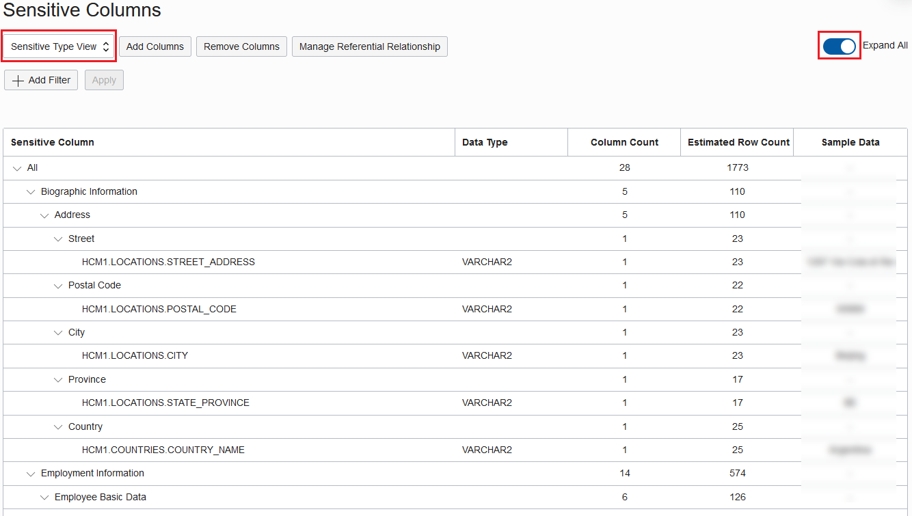

15. From the drop-down list, select **Schema View** to sort the sensitive columns by table name.

    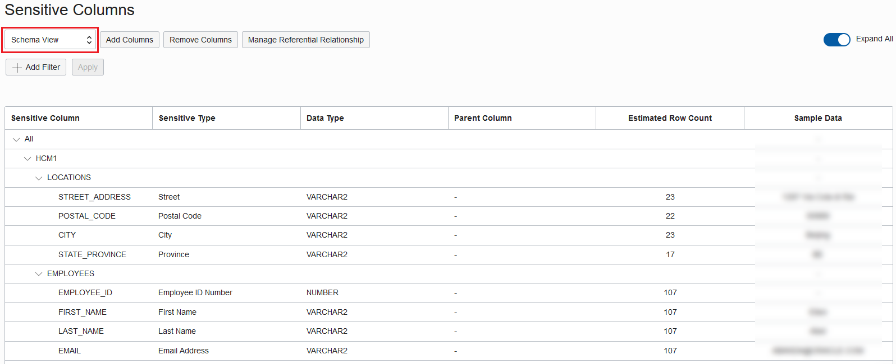

16. Identify the sensitive columns that are discovered because they have a relationship to another sensitive column and that relationship is defined in the database's data dictionary. For example, `MANAGER_ID` in the `EMPLOYEES` table has a relationship to `EMPLOYEE_ID` in the `EMPLOYEES` table (as shown under **Parent Column**).

    

## Task 3: Create a PDF of the Sensitive Data Model report

1. At the top of the page, click **Generate Report**.

    A **Generate Report** dialog box is displayed.

2. Leave **PDF** selected, click **Generate Report**, and wait for the report to be 100% generated. Click **Close**.

    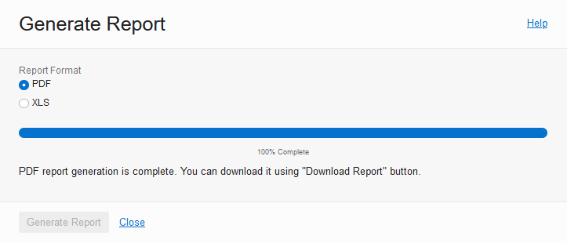

3. At the top of the page, click **Download Report**.

    A **Download Report** dialog box is displayed.

4. Leave **PDF** selected, and click **Download Report**.

    

5. In the dialog box, leave **Save File** selected, and then click **OK**. Browse to the desktop of your local computer, leave **SDM1.pdf** set as the file name, and then click **Save**. On your desktop, open **SDM1.pdf** and view the report.

    - The **Summary** table shows totals for columns and values scanned, sensitive types, sensitive tables, sensitive columns, and sensitive values.
    - The **Sensitive Columns** table lists the sensitive columns in the sensitive data model. For each sensitive column, the table shows you its sensitive type, schema name, table name, column name, sensitive value count, whether the column data was matched (Y or N), whether the column name was matched (Y or N), and whether the column comment was matched (Y or N).

    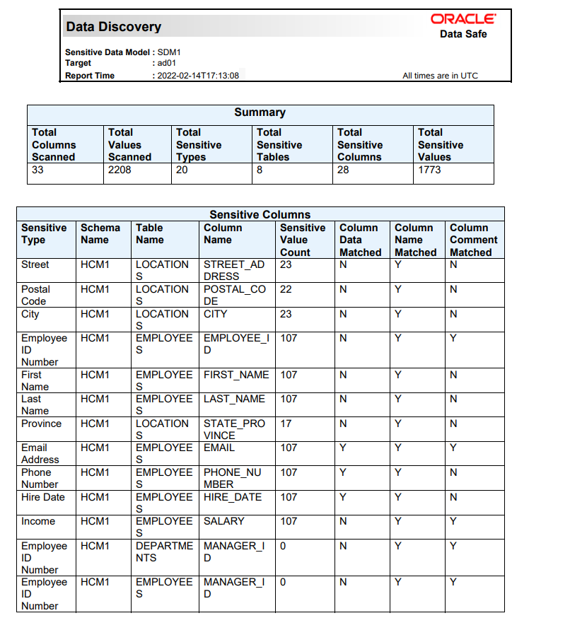

6. Close the PDF report and return to the **Sensitive Data Models Details** page.

## Task 4: Create a masking policy for your target database

Data Masking can generate a masking policy for your target database based on your sensitive data model. It automatically tries to select a default masking format for each sensitive column. You can edit these default selections and select different ones as needed. Occasionally you are prompted to address masking formats in your masking policies that are causing issues.

1. In the breadcrumb at the top of the page, click **Data Safe**.

2. On the left under **Data Safe**, click **Security Center**.

3. Click **Data Masking**.

    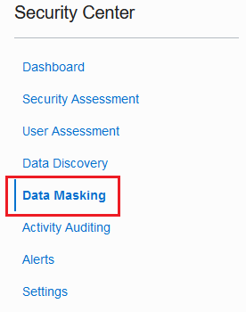

4. Under **Related Resources**, click **Masking Policies**.

    The **Masking Policies** page is displayed and shows that there is no masking policy available for your target database.

    

5. Click **Create Masking Policy**.

    The **Create Masking Policy** panel is displayed.

6. Configure the masking policy as follows, and then click **Create Masking Policy**.

    *Important! Please do not close the panel until the masking policy is created; otherwise, the operation to add columns to the masking policy is not initiated.*

    - Name: **Mask SDM1**
    - Compartment: **Select your compartment**
    - Description: **Masking policy for SDM1**
    - Choose how you want to create the masking policy: **Using a sensitive data model**
    - Sensitive Data Model: **SDM1**

    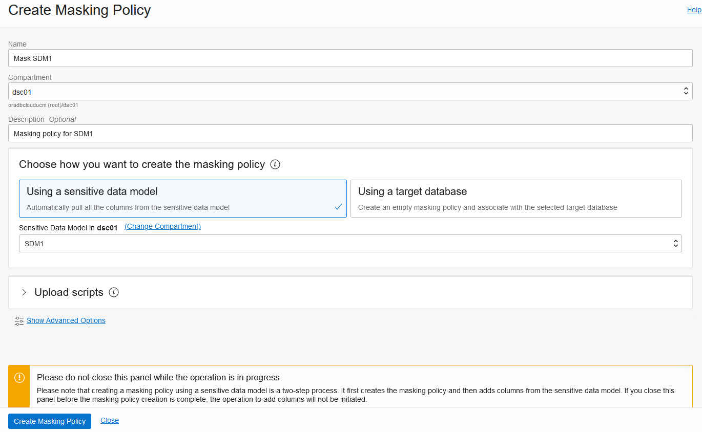

7. Review the masking policy.

    - On the **Masking Policy Information** tab, you can view the masking policy name (and edit it), the Oracle Cloud Identifier (OCID) for the masking policy, a link to the work request for the masking policy, the compartment in which the masking policy is stored, the target database and sensitive data model to which the masking policy is associated, and the date/time in which the masking policy was created and last updated.
    - The **Masking Columns** table lists all the sensitive columns and default masking formats. If needed, you can select a different masking format for any sensitive column. You can click the pencil icon next to a masking format to edit it.

    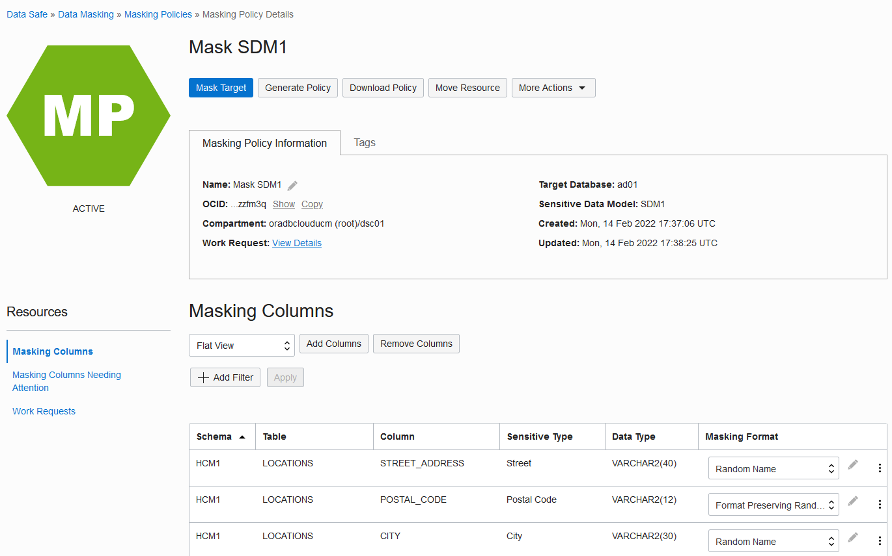

8. Under **Resources**, click **Masking Columns Needing Attention**.

    The **Masking Columns Needing Attention** section is displayed at the bottom of the page. This section informs you of sensitive columns that do not have a masking format. Currently, there are no sensitive columns without a masking format.

    

## Task 5: Mask sensitive data in your target database by using Data Masking

After you create a masking policy, you can run a data masking job against your target database from the **Masking Policy Details** page. You can also run a data masking job from the **Data Masking** page.

1. On the **Masking Policy Details** page, click **Mask Target**.

    

    The **Mask Sensitive Data** panel is displayed.

2. From the **Target Database** drop-down list, select your target database, and then click **Mask Data**.

    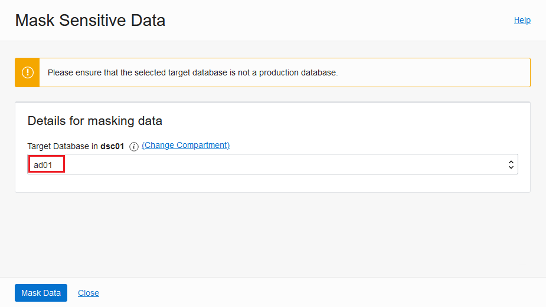

    The **Work Request** page is displayed.

3. Monitor the progress of the data masking job and wait for the status to read **SUCCEEDED**.

    

## Task 6: View the Data Masking report

1. While on the **Work Request** page, next to **Masking Report** on the **Work Request Information** tab, click **View Details**.

    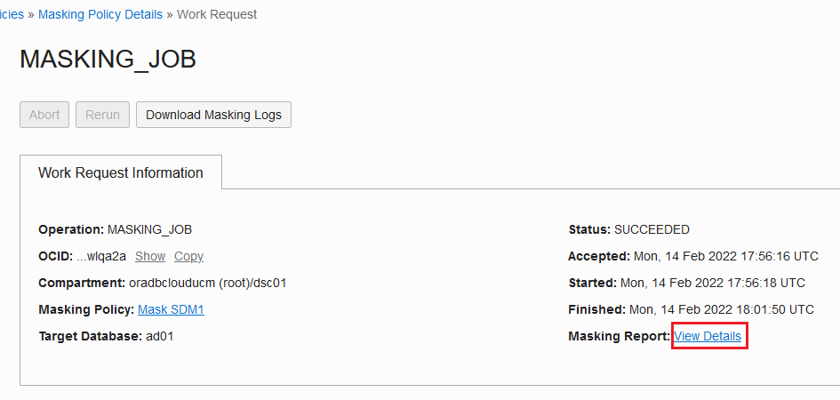

    The **Masking Report Details** page is displayed.

2. Review the masking report.

    - The **Masking Report Information** tab shows you the target database name, masking policy name (you can click a link to view it), Oracle Cloud Identifier (OCID) for the masking policy, the date and time when the data masking job started and finished, and the number of masked sensitive types, schemas, tables, columns, and values. There is also a pie chart that shows you the masked value percentages for each sensitive type. You can click on a pie slide to drill down into the chart.
    - The **Masked Columns** table lists each masked sensitive column and its respective schema, table, masking format, sensitive type, parent column, and total number of masked values.

    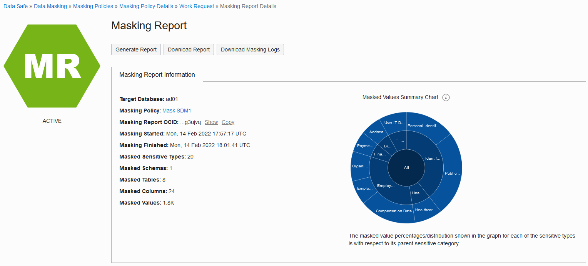
    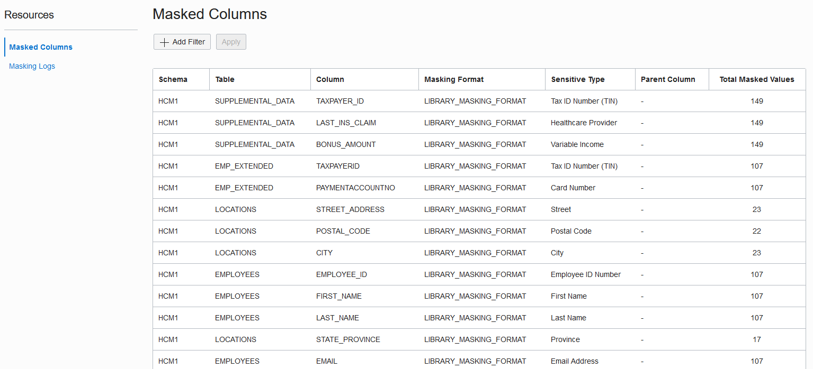

## Task 7: Create a PDF of the Data Masking report

1. At the top of the **Masking Report Details** page, click **Generate Report**.

    The **Generate Report** dialog box is displayed.

2. Leave **PDF** selected, and click **Generate Report**. Wait for the report to generate, and then click **Close**.

    

3. Click **Download Report**.

    A **Download Report** dialog box is displayed.

4. Leave **PDF** selected, and click **Download Report**.

    

    A dialog box is displayed with options to open or save the PDF.

5. Select **Open with**. Leave the default application selected, and then click **OK**.

6. Review the PDF report and then close it.

    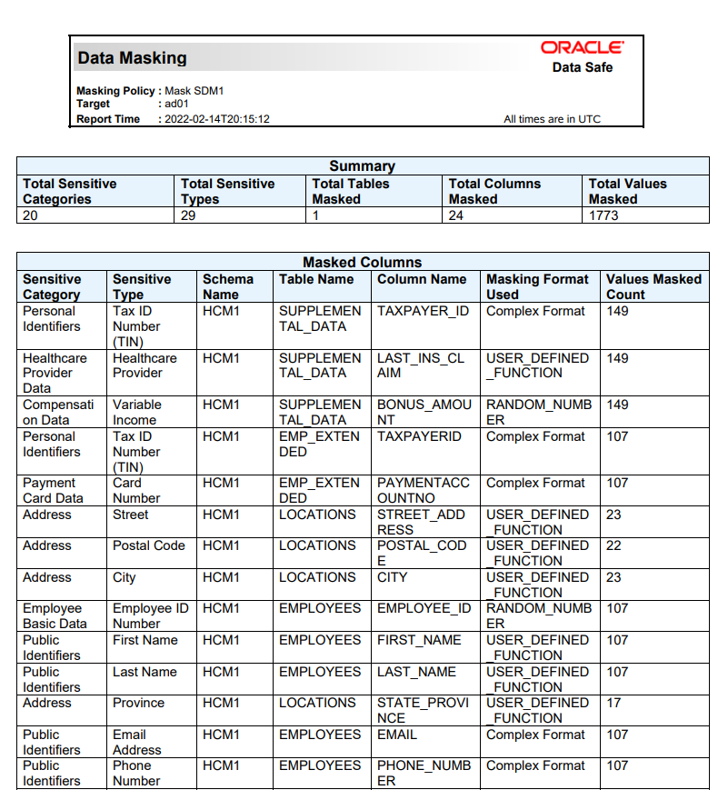

## Task 8: Validate the masked data in your target database

1. Return to the browser tab for **SQL | Oracle Database Actions**. You should have a SQL Worksheet open. If your session expired, sign in again as the `ADMIN` user.

2. Take a moment to review the original data.

    

3. On the toolbar, click the **Run Statement** button (green circle with a white arrow) to execute the query.

4. Review the masked data. You can resize the panel to view more data, and you can scroll down and to the right.

    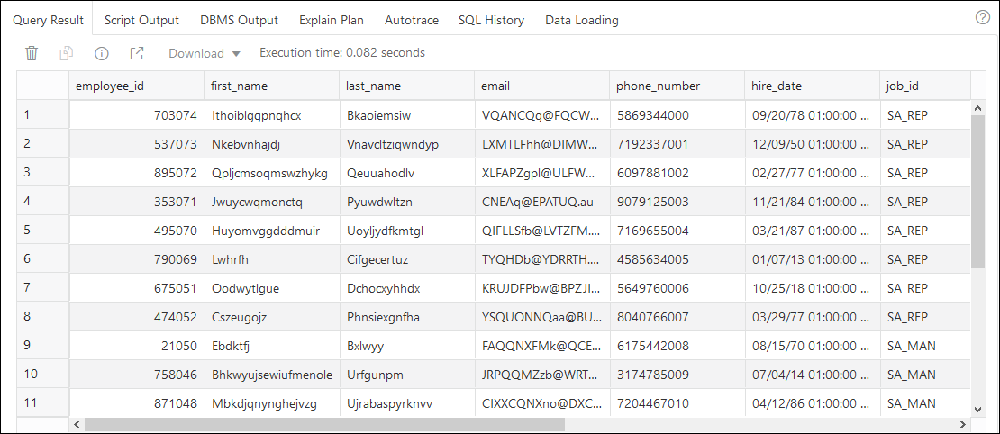

## Learn More

* [Data Discovery](https://docs.oracle.com/en-us/iaas/data-safe/doc/data-discovery.html)
* [Data Masking](https://docs.oracle.com/en-us/iaas/data-safe/doc/data-masking.html)

## Acknowledgements
* **Author** - Jody Glover, Consulting User Assistance Developer, Database Development
* **Last Updated By/Date** - Jody Glover, February 15, 2022
