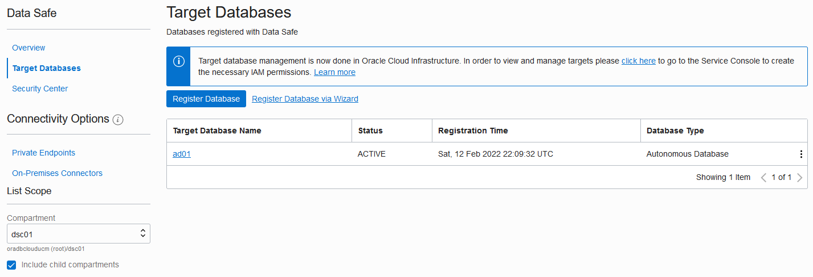
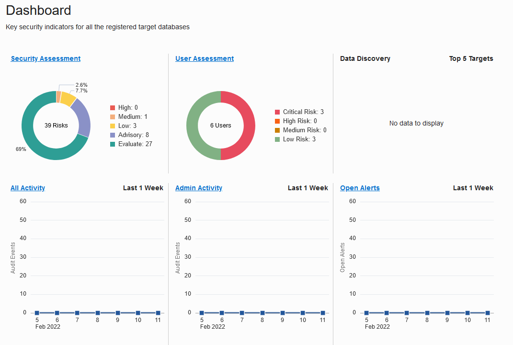

# Register an Autonomous Database with Oracle Data Safe

## Introduction

To use a database with Oracle Data Safe, you first need to register it with Oracle Data Safe. If there is no option to register your database, it is because you are working in a region that does not have the Oracle Data Safe service enabled in it.

The following security elements need to be configured for you to use a database with Oracle Data Safe:
- A policy in Oracle Cloud Infrastructure Identity and Access Management (IAM) that grants you permission to use the Autonomous Database in your compartment and use all Oracle Data Safe features. If you are a tenancy administrator, a policy is not required. By default, when you register an Autonomous Database with Oracle Data Safe, your user account is automatically granted Oracle Data Safe permissions for that database. The privileges granted depend on whether you are a regular user or an administrator. A regular user can use User Assessment, Security Assessment, and Activity Auditing with the Autonomous Database. A tenancy administrator or an Oracle Data Safe administrator can use all the Oracle Data Safe features on any registered target database.
- One or more Oracle Data Safe roles granted to the Oracle Data Safe service account on the database. The roles enable Oracle Data Safe features on the database. By default, the Oracle Data Safe service account on an Autonomous Database has all the roles granted, except for Data Masking.

Begin by registering your Autonomous Transaction Database (ATP) with Oracle Data Safe. After registering it, run the `load-data-safe-sample-data_admin.sql` SQL script to load sample data into your database. This script creates several tables with sample data that you can use to practice with the Oracle Data Safe features. It also enables the Data Masking feature on your database. Next, access Oracle Data Safe in Oracle Cloud Infrastructure and view the list of registered target databases to which you have access. Access and review Security Center. You can access all features through this interface.

Estimated Lab Time: 30 minutes

### Objectives

In this lab, you will:

- Register your ATP database with Oracle Data Safe
- Run a SQL script using Oracle Database Actions to load sample data into your database
- Access Oracle Data Safe and view the list of registered target databases to which you have access
- Access and review Security Center

### Prerequisites

This lab assumes you have:

- Obtained an Oracle Cloud account
- Prepared your environment for this workshop (see [Prepare Your Environment](?lab=prepare-environment))

### Assumptions

- Your data values are most likely different than those shown in the screenshots.

## Task 1: Register your Autonomous Database with Oracle Data Safe

1. Sign in to Oracle Cloud Infrastructure with your Oracle Cloud account. Make sure that you have the correct region selected.

2. From the navigation menu, select **Oracle Database**, and then **Autonomous Transaction Processing**.

3. From the **Compartment** drop-down list, select your compartment.

4. On the right, click then name of your database.

    The **Autonomous Database Information** tab is displayed.

5. Under **Data Safe**, click **Register**.

     

6. In the **Register Database with Data Safe** dialog box, click **Confirm**.

7. Wait for the registration process to finish and for the status to read **Registered**.

    

## Task 2: Run a SQL script using Oracle Database Actions to load sample data into your database

1. At the top of the **Autonomous Database Details** page, click **Database Actions** and wait for a new browser tab to open.

2. If you are prompted to sign in to your target database, sign in as the `ADMIN` user.

    - If a tenancy administrator provided you an Autonomous Database, obtain the password from your tenancy administrator.
    - If you are using an Oracle-provided environment, enter the `ADMIN` password that was provided to you.

3. Under **Development**, click **SQL**.

4. If a help note is displayed, click the **X** button to close it.

5. Download the [load-data-safe-sample-data_admin.sql](https://objectstorage.us-ashburn-1.oraclecloud.com/p/Y5Wmkg4hP-ijM96-6IR6gIwxkVc8ejvWoDtzyFsOw6uMaU6fcXO_52jd2_mL_tzc/n/c4u04/b/security-library/o/load-data-safe-sample-data_admin.zip) script, and then unzip it in a directory of your choice. Next, open the file in a text editor, such as NotePad.

6. Copy the entire script to the clipboard and then paste it into a worksheet in Database Actions.

7. On the toolbar, click the **Run Script** button.

    

    - The script takes a few minutes to run.
    - In the bottom-left corner, the cog wheel may remain still for about a minute, and then turn as the script is processed. The script output is displayed after the script is finished running.
    - Don't worry if you see some error messages on the **Script Output** tab. These are expected the first time you run the script.
    - The script ends with the message **END OF SCRIPT**.

8. When the script is finished running, on the **Navigator** tab on the left, select the `HCM1` schema from the first drop-down list. In the second drop-down list, leave **Tables** selected.

9. If `HCM1` is not listed, sign out of Database Actions and sign in again. To do so, in the upper-right corner, from the `ADMIN` drop-down list, select **Sign Out**. Click **Sign in**. In the **Username** field, enter `ADMIN`, and then click **Next**. In the **Password** field, enter the `ADMIN` password, and then click **Sign in**. Under **Development**, click **SQL**. On the **Navigator** tab, select the `HCM1` schema from the first drop-down list.

10. On the toolbar, click the **Clear** button (trash can icon) to clear the worksheet.

11. Click the **Script Output** tab. If needed, click the **Clear output** button (trash can icon) to clear the output.

12. For each table listed below, drag the table to the worksheet and run the script. Choose **Select** as the insertion type when prompted. Make sure that you have the same number of rows in each table as stated below.

    - `COUNTRIES` - 25 rows
    - `DEPARTMENTS` - 27 rows
    - `EMPLOYEES` - 107 rows
    - `EMP_EXTENDED` - 107 rows
    - `JOBS` - 19 rows
    - `JOB_HISTORY` - 10 rows
    - `LOCATIONS` - 23 rows
    - `REGIONS` - 4 rows
    - `SUPPLEMENTAL_DATA` - 149 rows

13. If your data is different than what is specified above, rerun the [load-data-safe-sample-data_admin.sql](https://objectstorage.us-ashburn-1.oraclecloud.com/p/Y5Wmkg4hP-ijM96-6IR6gIwxkVc8ejvWoDtzyFsOw6uMaU6fcXO_52jd2_mL_tzc/n/c4u04/b/security-library/o/load-data-safe-sample-data_admin.zip) script.

14. Sign out of Database Actions and close the tab. You are returned to the **Autonomous Database | Oracle Cloud Infrastructure** tab.

## Task 3: Access Oracle Data Safe and view the list of registered target databases to which you have access

1. From the navigation menu, select **Oracle Database**, and then **Data Safe**.

    - The **Overview** page for the Oracle Data Safe service is displayed. From here you can access Security Center, register target databases, and find links to useful information.

2. On the left, click **Target Databases**.

3. From the **Compartment** drop-down list under **List Scope**, select your compartment. Your registered target database is listed on the right.

    

3. Click the name of your target database to view its registration details.

    - On the **Target Database Details** tab, you can view/edit the target database name and description. You can also view the Oracle Cloud Identifier (OCID), when the target database was registered, the compartment name to where the target database was registered, the database type (Autonomous Database) and the connection protocol (TLS). The information varies depending on the target database type. You have options to edit connection details (change the connection protocol), move the target database registration to another compartment, deregister the target database, and add tags.

## Task 4: Access and review Security Center

1. In the breadcrumb at the top of the page, click **Target Databases**.

    The **Target Databases** page is displayed.

2. Under **Data Safe** on the left, click **Security Center**.

    - In Security Center, you can access all the Oracle Data Safe features, including the dashboard, Security Assessment, User Assessment, Data Discovery, Data Masking, Activity Auditing, Alerts, and Settings.
    - By default, the dashboard is displayed and the **Security Assessment** and **User Assessment** charts are automatically populated.
    - Make sure your compartment is selected under **List Scope**.

    

## Learn More

  - [Provision Autonomous Data Warehouse](https://docs.oracle.com/en/cloud/paas/autonomous-data-warehouse-cloud/user/autonomous-provision.html#GUID-0B230036-0A05-4CA3-AF9D-97A255AE0C08)
  - [Loading Data with Autonomous Data Warehouse](https://docs.oracle.com/en/cloud/paas/autonomous-data-warehouse-cloud/user/load-data.html#GUID-1351807C-E3F7-4C6D-AF83-2AEEADE2F83E)
  - [Target Database Registration](https://docs.oracle.com/en/cloud/paas/data-safe/admds/target-database-registration.html)

## Acknowledgements
  * **Author** - Jody Glover, Consulting User Assistance Developer, Database Development
  * **Last Updated By/Date** - Jody Glover, February 12, 2022
