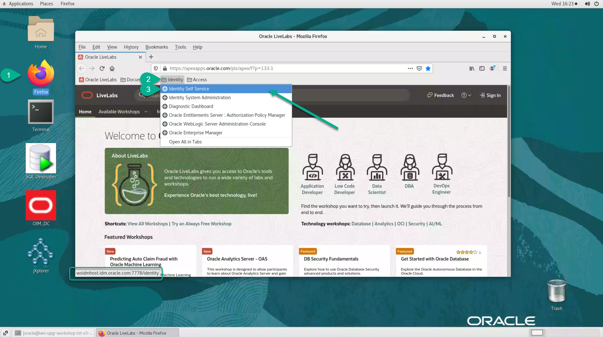
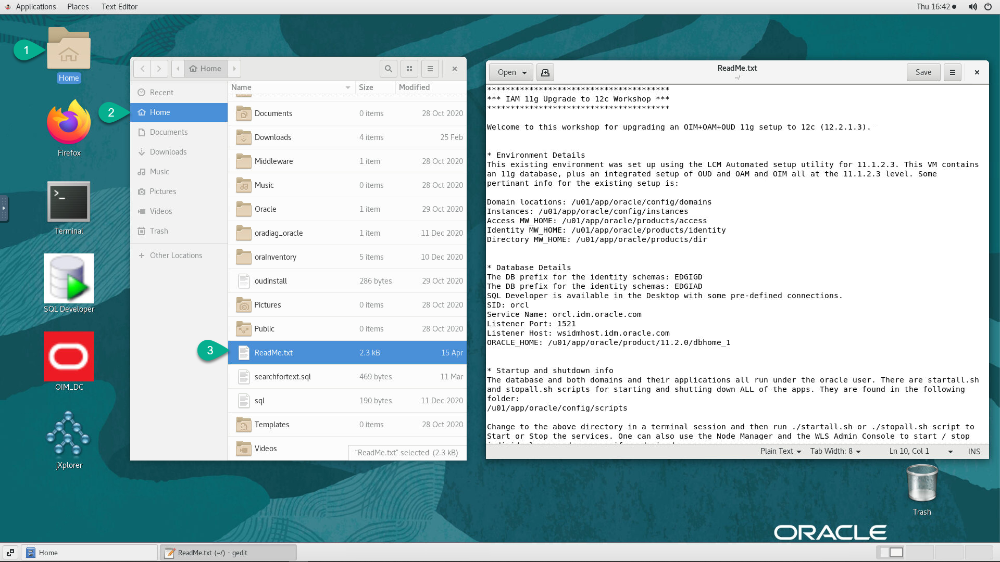
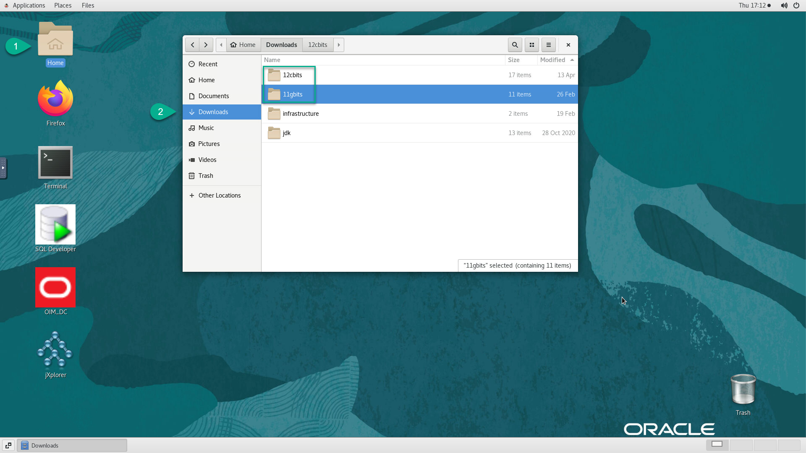

# Initialize the Environment

## Introduction

In this lab we will review and setup all components required to successfully upgrade IAM 11.1.2.3 to 12.2.1.4 version.

*Estimated Lab Time*:  30 minutes

### Objectives
- Initialize the IAM 11.1.2.3 baseline workshop environment.

### Prerequisites
This lab assumes you have:
- A Free Tier, Paid or LiveLabs Oracle Cloud account
- You have completed:
    - Lab: Prepare Setup (*Free-tier* and *Paid Tenants* only)
    - Lab: Environment Setup

## Task 1: Start Oracle IAM 11.1.2.3 Components

1. Now with access to your remote desktop session, proceed as indicated below to validate your environment before you start executing the subsequent labs.
Start a terminal session from your remote desktop session, proceed as shown below to start all components as **oracle** user

    ```
    <copy>/u01/app/oracle/config/scripts/startall.sh</copy>
    ```

    

    ***Note:*** This will take between 20-30 minutes.

2. Launch *Chrome* from the remote desktop session and test the base installation by accessing the Identity Manager Admin Console:

    ```
    URL: <copy>http://wsidmhost.idm.oracle.com:7778/oim</copy>
    ```
    ```
    User: <copy>xelsysadm</copy>
    ```
    ```
    Password: <copy>IAMUpgrade12c##</copy>
    ```

    

    ***Note:*** Important URLs needed throughout the workshop have been bookmarked as you can see above under 3 groups. Documentation, Identity, and Access.

    
    

3. If for any reason you need to restart all processes you can use one of the following options:

    - Reboot the instance as user *opc* from the SSH terminal session you started using the SSH key (not the remote desktop session).

    ```
    <copy>sudo init 6</copy>
    ```

    - Restart processes

    ```
    <copy>/u01/app/oracle/config/scripts/stopall.sh</copy>
    ```
    ```
    <copy>systemctl restart oracle-database</copy>
    ```
    ```
    <copy>/u01/app/oracle/config/scripts/startall.sh</copy>
    ```

## Task 3: Review the ReadMe.txt and Binaries

1. Review environment details to learn more about the setup. Navigate to the file browser as shown below and open *ReadMe.txt*.

    

2. For your convenience, all software binaries needed throughout the workshop have been staged on the instance. Refer to the details below to review

    - Review 12c Binaries
    ```
    <copy>ls -ltrh /home/oracle/Downloads/12cbits </copy>
    ```
    - Review 11g Binaries
    ```
    <copy>ls -ltrh /home/oracle/Downloads/11gbits </copy>
    ```
    

## Task 4: Login to Host using SSH Key based authentication (Optional)
While all command line tasks included in this workshop can be performed from a terminal session from the remote desktop session as shown above, you can optionally use your preferred SSH client.

Refer to *Lab Environment Setup* for detailed instructions relevant to your SSH client type (e.g. Putty on Windows or Native such as terminal on Mac OS):
  - Authentication OS User - “*opc*”
  - Authentication method - *SSH RSA Key*
  - OS User – “*oracle*”.

1. First login as “*opc*” using your SSH Private Key

2. Then sudo to “*oracle*”. E.g.

    ```
    <copy>sudo su - oracle</copy>
    ```

You may now [proceed to the next lab](#next).

## Learn More
Use these links to get more information about Oracle Identity and Access Management:
- [Oracle Identity Management 12.2.1.4.0](https://docs.oracle.com/en/middleware/idm/suite/12.2.1.4/index.html).

## Acknowledgements
* **Author** - Anbu Anbarasu, Director, Cloud Platform COE
* **Contributors** -  Eric Pollard - Sustaining Engineering, Ajith Puthan - IAM Support, Rene Fontcha
* **Last Updated By/Date** - Sahaana Manavalan, LiveLabs Developer, NA Technology, May 2022
