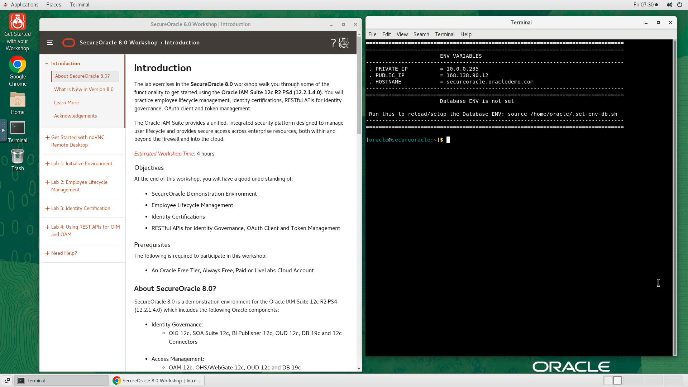
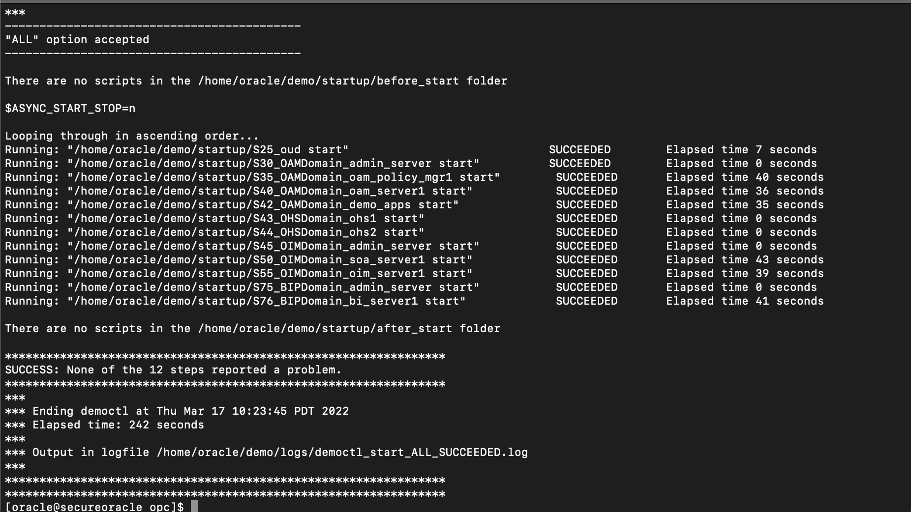

# Initialize SecureOracle Environment

## Introduction

In this lab we will review and startup all components required to successfully run this workshop.

*Estimated Lab Time*:  30 minutes

### Objectives
- Initialize SecureOracle workshop environment.

### Prerequisites
This lab assumes you have:
- A Free Tier, Paid or LiveLabs Oracle Cloud account
- You have completed:
    - Lab: Prepare Setup (*Free-tier* and *Paid Tenants* only)
    - Lab: Environment Setup

## Task 1: Validate That Required Processes are Up and Running

1. Now with access to your remote desktop session, proceed as indicated below to validate your environment before you start executing the subsequent labs. The following Processes should be up and running:

    - Database Listeners
        - LISTENER (1521)
    - Database Server Instances
        - IAMDB
    - Hedwig Mail Server

    

2.  Run the following from the *Terminal* session, to validate that the expected processes are up.

    ```
    <copy>
    systemctl status hedwig.service
    systemctl status oracle-database
    systemctl status oracle-db-listener
    </copy>
    ```

    
    

    If all expected processes are shown in your output as seen above, then your environment is ready for the next task.

3. If you see questionable output(s), failure or down component(s), restart the service accordingly

    ```
    <copy>
    sudo systemctl restart oracle-database
    sudo systemctl restart oracle-db-listener
    </copy>
    ```
    To restart the *Hedwig Mail server*:

    ```
    <copy>
    export JAVA_HOME=/home/oracle/products/jdk
    sudo -E /home/oracle/demo/hedwig-0.7/bin/run.sh stop
    sudo -E /home/oracle/demo/hedwig-0.7/bin/run.sh start
    </copy>
    ```
## Task 2: Start OIG Components
1. Open a new terminal session *remotely using an SSH client* and proceed as shown below to start all components as “*oracle*” user

    ```
    <copy>sc start all</copy>
    ```

    **Note:** the time to start the OIG components varies between 15-20 minutes.
        

    For your reference, the following commands are available to start or stop the different components and applications.

    ```
    sc <start|stop|status> oim          // start, stop or status OIG, SOA Server and OUD
    sc <start|stop|status> oim_bip      // start, stop or status OIG, SOA Server, OUD and BIP Server
    sc <start|stop|status> oam          // start, stop or status OAM, OUD and both OHS Servers
    sc <start|stop|status> oam_ohs1     // start, stop or status OAM, OUD and OHS Server 1
    sc <start|stop|status> oam_ohs2     // start, stop or status OAM, OUD and OHS Server 2
    sc <start|stop|status> all          // start, stop or status all OIG and OAM components
    ```


## Task 3: Running Development Tools

The development tools in SecureOracle are aimed to support use cases like editing SOA composites for OIG workflow approvals but also to help in customizing and configuring the different components as needed.


1. From the terminal session opened on your remote desktop, run the following commands to start **Oracle JDeveloper with SOA extensions** :

    ```
    <copy>
    cd ~
    ./startJDEVSOA.sh
    </copy>
    ```

    **Note**: You can find sample applications showcasing SOA composites with OIG workflows available under folder **`/home/oracle/jdevhome`**.

    ```
    NAME                                 DESCRIPTION
    RoleOwnerApproval.jws                Role single approval
    MultiRoleOwnerApproval.jws           Role multi-approval
    CustomDisconnectedProvisioning.jws   Disconnected app approval based on Sales Role
    ```

    Additionally you can find OIM out-of-the-box SOA composites in the following folder:

    ```
    /home/oracle/products/oam/idm/server/workflows/composites
    ```

2. To start **Oracle SQLDeveloper** run the following commands:

    ```
    <copy>
    ./startSQLDEV.sh
    </copy>
    ```

    **Notes**: Three connections: `HR`, `HEDWIG` and `IAMDB` are already defined to access My HR, Hedwig and IAM database schemas. Alternatively you can install SQL Developer in your local host computer to access the different database schemas.

3. To start **Apache Studio** and manage the OUD/LDAP instance run the following commands:

    ```
    <copy>
  	./startAStudio.sh
    </copy>
    ```

    **Note**: A connection `IAM-OUD` is already defined to access OUD.

4. To start **Oracle PL/SQL** command line tool pointing to the IAM database, run the following commands:

    ```
    <copy>
    cd ~
    . ./setDBenv.sh
    ./startPLSQL.sh
    </copy>
    ```

## Task 4: Admin Consoles, Applications and User Credentials


If you prefer accessing these from your local computer then chose one of the following options:
- Use the URLs provided in this section as shown, after adding the host entry below to **`/etc/hosts`** on your local Mac/Linux host or **`C:\Windows\System32\drivers\etc\hosts`** for Microsoft Windows hosts

    ```
    <copy><public_ip> secureoracle.oracledemo.com  secureoracle</copy>
    ```
- Substitute **`secureoracle.oracledemo.com`** in each URL below with the instance's `Public_IP_Address`

1. Use the following URLs and credentials to access all the different web consoles:

    Oracle Identity Manager Web Admin Console:

    ```
    URL         http://secureoracle.oracledemo.com:14000/sysadmin
    User        xelsysadm
    Password    Oracle123
    ```

    Oracle Identity Manager Self Service:

    ```
    URL         http://secureoracle.oracledemo.com:14000/identity
    User        xelsysadm
    Password    Oracle123
    ```

    Oracle Identity Manager Design Console. First run the following commands to start the design console:

    ```
    <copy>
    cd /home/oracle/products/oim/idm/designconsole
    ./xlclient.sh
    </copy>
    ```

    When prompted, enter the following URL and credentials:

    ```
    URL         t3://secureoracle.oracledemo.com:14000
    User        xelsysadm
    Password    Oracle123
    ```

    Oracle BI Publisher Admin Console:

    ```
    URL         http://secureoracle.oracledemo.com:9502/xmlpserver
    User        xelsysadm
    Password    Oracle123
    ```

    Oracle Identity Manager EM Console:

    ```
    URL         http://secureoracle.oracledemo.com:7001/em
    User        weblogic
    Password    Oracle123
    ```

    Oracle Access Manager Admin Console:

    ```
    URL         http://secureoracle.oracledemo.com:8001/oamconsole
    User        oamadmin
    Password    Oracle123
    ```

    Oracle Access Manager EM Console:

    ```
    URL         http://secureoracle.oracledemo.com:8001/em
    User        weblogic
    Password    Oracle123
    ```

    Email Server Admin Console (Hedwig Mail Server):

    ```
    URL         http://secureoracle.oracledemo.com:7001/hedwig-web-0.6/
    User        admin
    Password    Oracle123
    ```
    **Note**: The **Hedwig Mail Server** can be re-started if you experience issues when connecting with the Roundcube email client. E.g run the following commands to re-start the Hedwig Mail Server as user *opc*:

    ```
    <copy>
    export JAVA_HOME=/home/oracle/products/jdk
    sudo -E /home/oracle/demo/hedwig-0.7/bin/run.sh stop
    sudo -E /home/oracle/demo/hedwig-0.7/bin/run.sh start
    </copy>
    ```

    Email Web Client (Roundcube):

    ```
    URL         http://secureoracle.oracledemo.com/roundcubemail-1.4.1/
    User        admin
    Password    Oracle123
    Server      secureoracle.oracledemo.com
    ```

    My HR Application:

    ```
    URL         http://secureoracle.oracledemo.com:7001/ords/f?p=100
    User        hradmin
    Password    Oracle123
    ```

    My IGA Application:

    ```
    URL         http://secureoracle.oracledemo.com:7001/ords/f?p=102
    User        mgraff
    Password    Oracle123
    ```

    APEX Admin Console

    ```
    URL         http://secureoracle.oracledemo.com:7001/ords/apex_admin
    User        admin
    Pass        #Oracle123
    ```

    APEX HR Workspace

    ```
    URL         http://secureoracle.oracledemo.com:7001/ords/
    Workspace   HRSPACE
    User        hradmin
    Pass        Oracle123
    ```

    **Note**: My HR and My IGA Applications are available after the OIG domain is started as the service (Oracle REST Data Services) supporting these applications is deployed in the OIG Admin Server.

2. The following credentials are available to access other middleware components.

    Oracle IAM database:

    ```
    Host/port       secureoracle.oracledemo.com:1521
    Service name    iamdb.oracledemo.com
    User            sys as SYSDBA
    Password        Oracle123
    ```

    My HR Application database:

    ```
    Host/port       secureoracle.oracledemo.com:1521
    Service name    iamdb.oracledemo.com
    User            hr
    Password        Oracle123
    ```

    Oracle Unified Directory (OUD):

    ```
    Host/port       secureoracle.oracledemo.com:1389
    User            cn=Directory Manager
    Password        Oracle123
    ```

## Task 5: Branding SecureOracle (optional)
Use the following instructions to customize the logo in the OIG Self Service interface. For illustrations we will use a sample logo image staged on your instance. Feel free to use your own image if preferred. Should you elect to use your own logo, ensure follow the recommended size of 145 x 38 pixels.

1. Copy the image file to *`/home/oracle/products/oim/idm/server/apps/oim.ear/iam-consoles-faces.war/images`*

    ```
    <copy>
    cp /home/oracle/demo/sample-data/mylogo.png /home/oracle/products/oim/idm/server/apps/oim.ear/iam-consoles-faces.war/images
    </copy>
    ```

2. Login to the OIG Self Service console as user **xelsysadm**. Click on the **Sandboxes** link located in the top right corner of the Self Service page.

3. In the **Manage Sandboxes** tab, click on **Create Sandbox**, enter a name and click on **Save and Close** and then **OK**.

4. Click on the **Customize** link located in the top right corner of the current page.

5. The customization panel is displayed at the top of the page. Click on **Structure** and then click on the Oracle logo image, in the pop-up window **Confirm Shared Component Edit** click on **Edit** button.

6. Next, click in the **Gear and Pencil** icon located in the top of the right panel.

7. In the **Component Properties: commandImageLink** window, click the **Down Arrow** icon next to the Icon property, and select **Expression Builder**.

8. Enter the path image as follow.

    E.g. enter the path using the following format:

    ```
    <copy>
    /home/oracle/products/oim/idm/server/apps/oim.ear/iam-consoles-faces.war/images/mylogo.png
    </copy>
    ```

9. Click **OK** to close the expression builder window, and then **OK** again to confirm the changes. The custom logo image should be displayed instead of the Oracle logo image.

10. Click in the **Close** button located in the top right corner to close the customization panel.

11. Go back to the **Manage Sandboxes** tab, select the sandbox name you created and click on **Publish Sandbox** and then click **Yes** to confirm.


## **Appendix**: About the Sample Organization

1. SecureOracle includes a sample top OIM organization **Oracle Users** and two child departments **Sales** and **Finance**. For each department an administrator account has been defined to demonstrate delegated administration. In addition, sample users have been added to demonstrate manager approval, escalation and organizational transfers.

    

    Figure 4. Sample OIG Organization

2. The following is a quick reference to the demo users included in SecureOracle, please refer to the use cases documentation for more details in how these users and organizations are used in the sample demonstrations.

    ```
    USERNAME        ORGANIZATION     TITLE                        ADMIN ROLE      SCOPE OF CONTROL
    FINANCEADM      Finance          Administration Assistant     FinanceAdmin    Finance
    SALESADM        Sales            Administration Assistant     SaleseAdmin     Sales
    MGRAFF          Sales            Sales Manager
    HDANIELS        Sales            Sales Manager
    JSMITH          Finance          Finance Manager
    ```

3. In addition, email accounts have been created for all demo users.You can access their in-boxes using the [Roundcube](http://secureoracle.oracledemo.com/roundcubemail-1.4.1/) email client with credentials **USERNAME/Oracle123**.

    ```
    USERNAME     EMAIL
    AHUTTON      ahutton@oracledemo.com
    JMALLIN      jmallin@oracledemo.com
    DFAVIET      dfaviet@oracledemo.com
    SMAVRIS      smavris@oracledemo.com
    MCHAN        mchan@oracledemo.com
    HDANIELS     hdaniels@oracledemo.com
    MGRAFF       mgraff@oracledemo.com
    SALESADM     salesadm@oracledemo.com
    ECLARK       eclark@oracledemo.com
    JSMITH       jsmith@oracledemo.com
    PSONG        psong@oracledemo.com
    PCAR         pcar@oracledemo.com
    FINANCEADM   financeadm@oracledemo.com
    DCOBY        dcoby@oracledemo.com
    GMARTON      gmarton@oracledemo.com
    RLAURIA      rlauria@oracledemo.com
    RMAINOR      rmainor@oracledemo.com
    ```
You may now *proceed to the next lab*.

## Learn More
Use these links to get more information about Oracle Identity and Access Management:
- [Oracle Identity Management Website](https://docs.oracle.com/en/middleware/idm/suite/12.2.1.4/index.html)
- [Oracle Identity Governance Documentation](https://docs.oracle.com/en/middleware/idm/identity-governance/12.2.1.4/index.html)
- [Oracle Access Management Documentation](https://docs.oracle.com/en/middleware/idm/access-manager/12.2.1.4/books.html)

## Acknowledgements
- **Author** - Ricardo Gutierrez, Solution Engineering - Security and Management
- **Contributors** - Rene Fontcha, Sahaana Manavalan
- **Last Updated By/Date** - Sahaana Manavalan, LiveLabs Developer, NA Technology, March 2022
