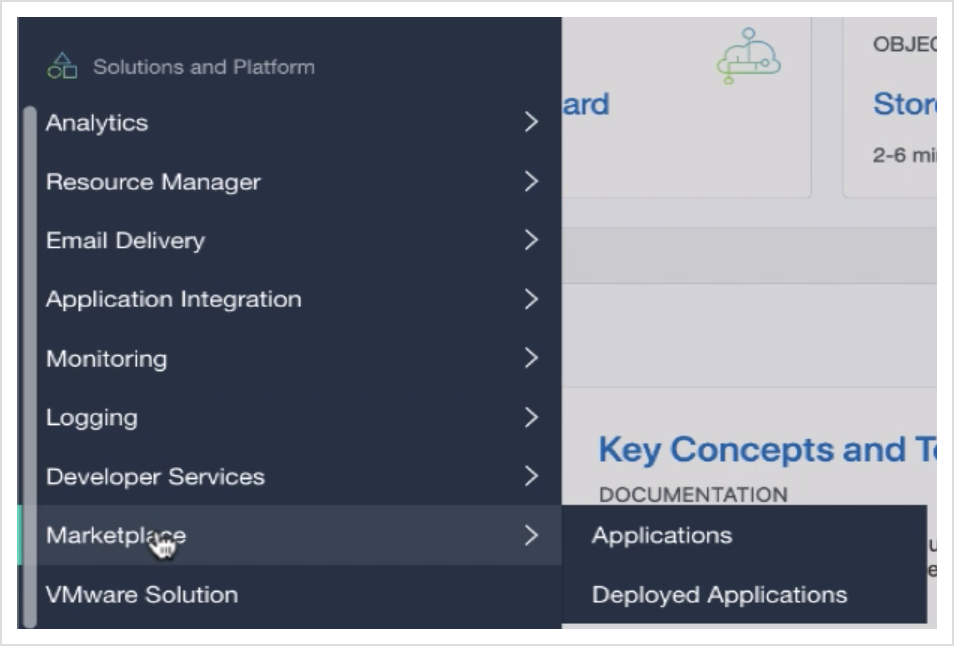
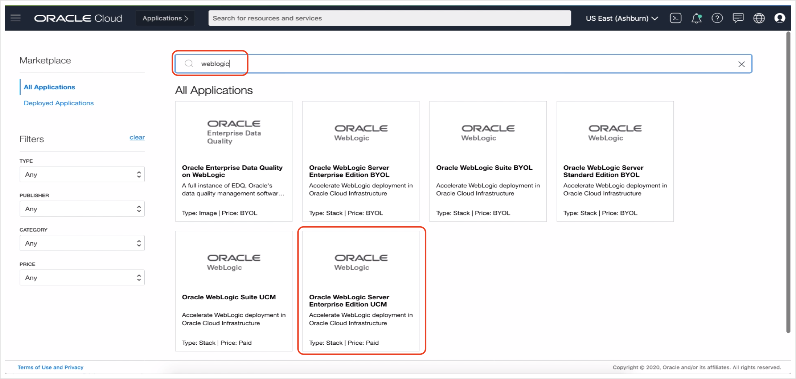
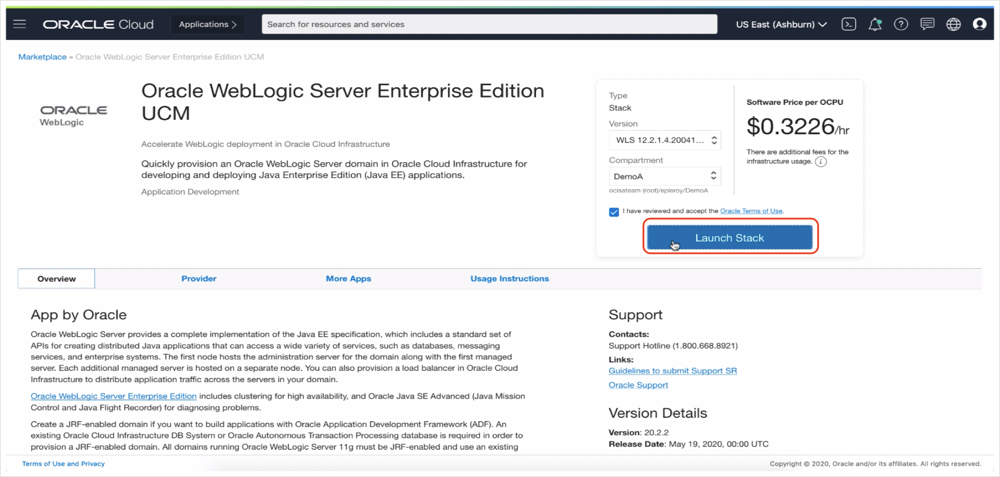
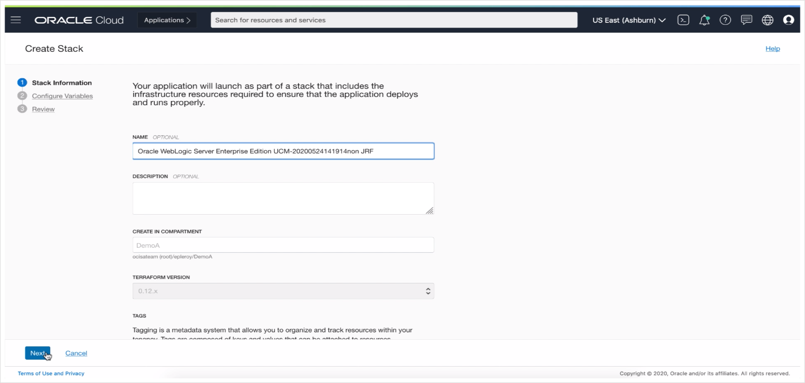
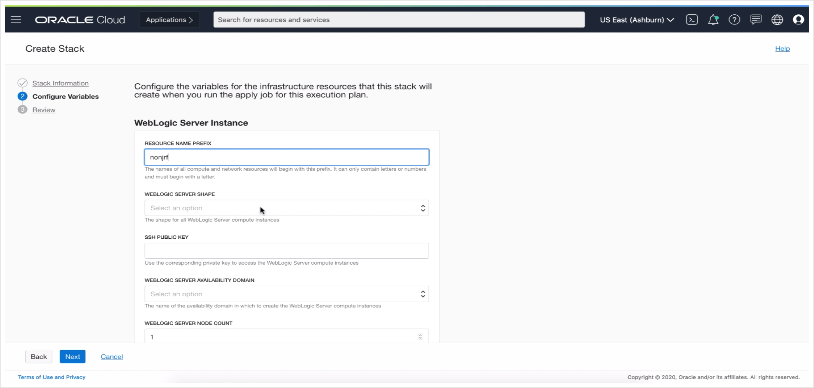
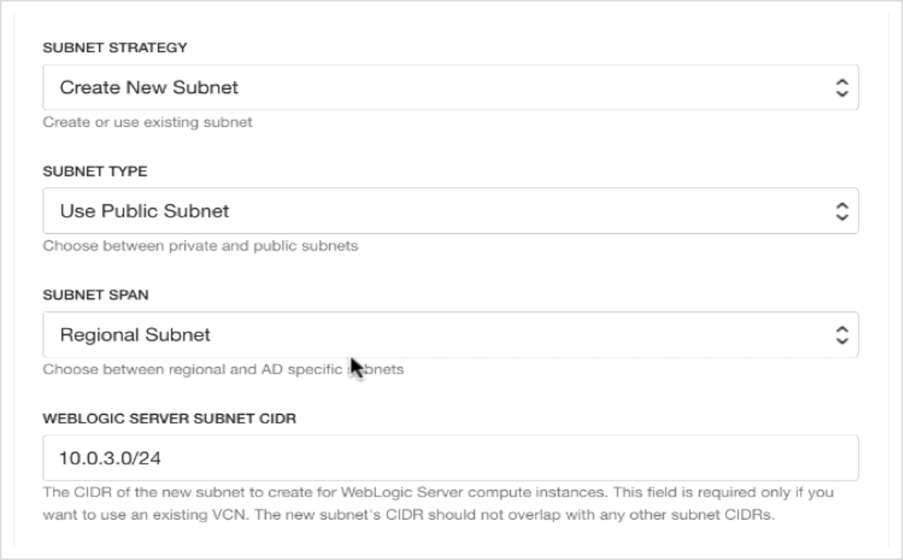
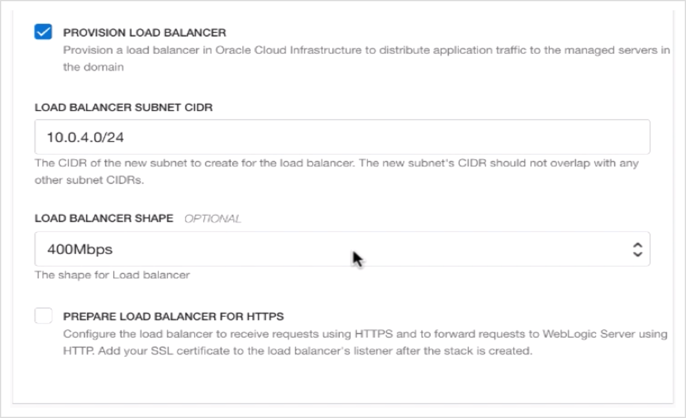
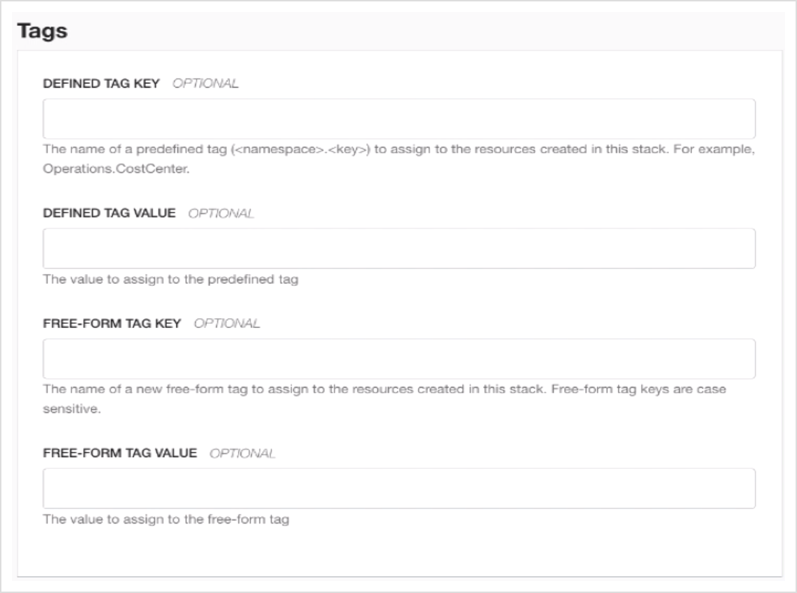
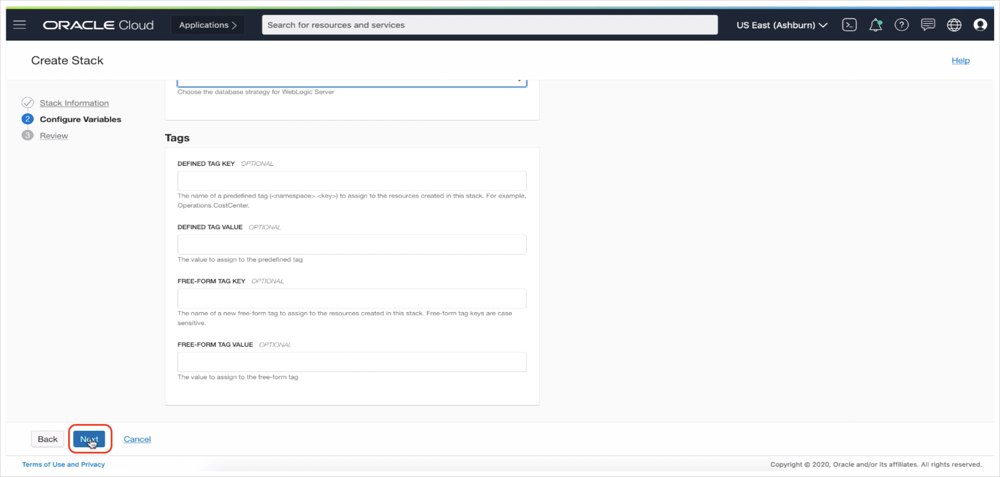
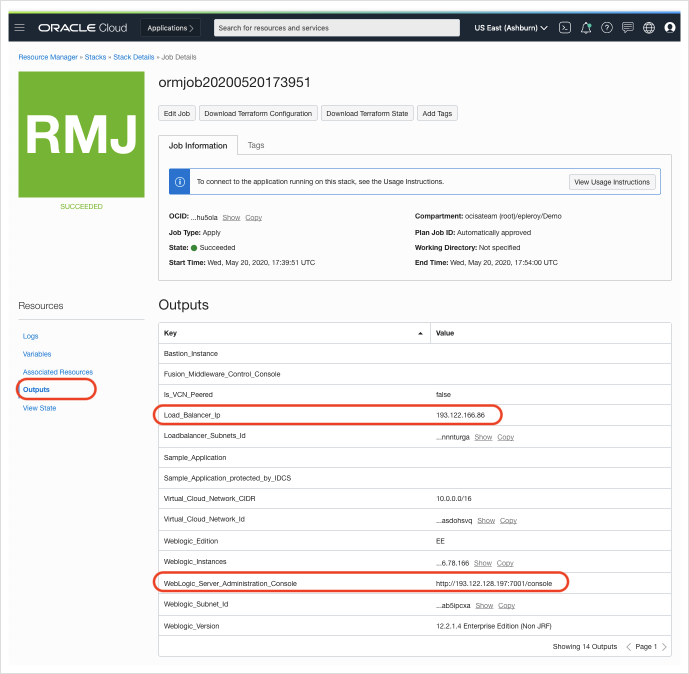

# Lab 300: Provision the WebLogic infrastructure

See Requirements to get the code and the required Docker images.

## Introduction: This 30 mins lab walks you through provisioning the WebLogic Infrastructure by leveraging the OCI Marketplace image. 

## Task 1: Provision the stack through the Marketplace

- Go to **Solutions and Platforms** 

  

- In the search input, type "`weblogic`". For this lab, we'll use the **WebLogic Enterprise Edition UCM**

   

- Make sure you are in the **Compartment** you want to use, use the **default WebLogic version** available, accept the License agreement and click **Launch the Stack**

   

- **Name** the stack and click **Next**

   

   

- **Enter** a **Resource Name Prefix**.

  It will be used to prefix the name of all the resources (domain, managed servers, admin server, cluster, machines...)

  The next steps in this workshop assumes the resource name prefix is `nonjrf`, so it is highly recommended to use this name.

  

- **Select** a **Shape**.

   In a real world situation, choose a shape appropriate to handle the load of a single managed server. Since we're using a trial account, choose the **VM.Standard.1** shape or a shape that is available in your tenancy.

  

   To check shape availability, you can go to **Governance -> Limits and Quotas** in another tab, and verify you have a specific shape available

- **SSH key**

   To connect to the WebLogic servers via SSH, you need to provide a public key the server will use to identify your computer. Since the various commands will be ran from inside the docker containers, you will need to provide the key generated in the container.

  

   To output the public key information, use the following command from inside the docker container
   ```
   <copy>
   cat ~/.ssh/id_rsa.pub
   </copy>
   ```
   Copy the output of the command (the whole multi-line output) and paste it in the form field for SSH key in the form

   the output will look something like this:

   ```bash
   ssh-rsa AAAAB3NzaC1yc2EAAAADAQABAAABAQDlkF23qLyfimJ9Vp4D9psp7bDOB8JvtY/pfYzFxIA2E4v6or+XhvMW5RDhX9Ba54zQNNDLvwUhStdXKkiMXJtEQJarFn45pGy/lyUQKFJolAdHBrXJsg5XWn4DxCFeQUQe1szVfmwDLAktAS14r5g76h3CcA8Kk/cNVqevxVChyejuuOdtAMoriIC8uKV+535qPs/GMiu0zR9aW4w1VodL5eHnXjqdgp8Fr21dVUVQ6of+s/ws0zlQUwghrNguDUqlggzG2mpLBHExypxCrJYmsb05uYjjqVlC3YCatj4nJTIHKLCFiYVY/b8AFkqwXV9EYlja5bjTmunM847dcR8H oracle@ad753161734c
   ```
   **Note:** Do not use the example above as the key: it is a different public key which is useless without the corresponding private key, and you will not be able to access your resources on OCI)

- **Select** an **Availability Domain**

  

- **Select** a **Node count**. In this lab, we'll provision 2 nodes.

  

- We'll keep the WebLogic Administrator Name as the default of `weblogic`

  

- **Paste** the **OCID** of the **Secret** generated in step 2.3) for the **Secret OCID for WebLogic Admin Password**

  

- **Check** the checkbox for **WebLogic Server Advanced Server Configuration**
   Here you can see all the default ports, which we will keep as-is.

  

- in this same **Advanced** section, **uncheck** the checkbox to **Provision the Sample Application**: since we will migrate our domain, we want a clean domain to start from.

  

- In the **WebLogic Network** section, make sure you are in the proper compartment

  

- Select **Create New VCN**

  

- **Name** the VCN `wls`

  

- **Keep the default** VCN CIDR block as-is.
   
  

   Note: If you were to migrate from an on-premises domain connected via VPN or FastConnect, you would want to make sure the CIDR block does not conflict with the local network.

- **Keep the defaults for subnets** as-is: 

   The stack will create the subnets for us.

  

- **Check** the **Provision Load Balancer** checkbox and keep the defaults

  

- Keep IDCS **unchecked**

  

- Make sure **No Database** is selected

  

- Optionally add Tags

  

- Click **Next**

  

- and then click **Create**

  

- The stack will get provisioned using the **Resource Manager**. This may take 7-15min.

  


Once the stack is provisioned, you can find the information regarding the URL and IP of the WebLogic Admin server in the logs, or in the **Outputs** left-side menu. 

## Task 2: Gather the necessary WebLogic stack information

  

- Make a note of the **WebLogic Admin Server public IP address** from the **WebLogic Admin Server Console URL** for later use.

- Make a note of the **Load Balancer IP** for later use.

You can copy/paste the **WebLogic Admin Console URL** in your browser and explore the provisioned WebLogic domain. You should find that there are no applications in **deployments** and no data sources in the **service->datasources** menu
