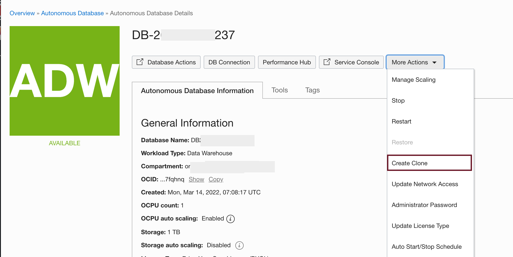
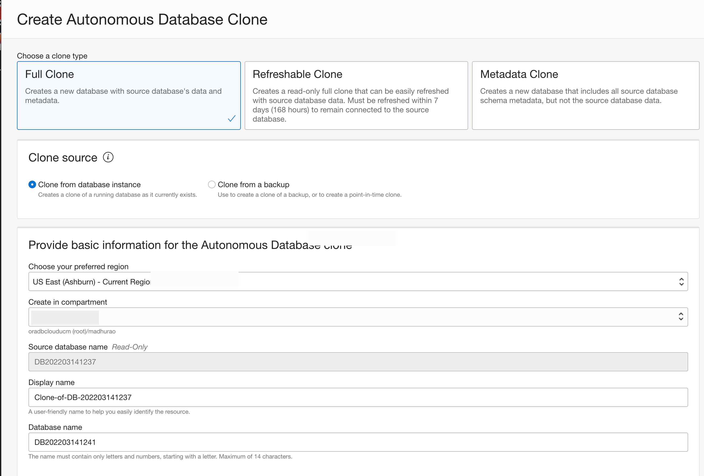
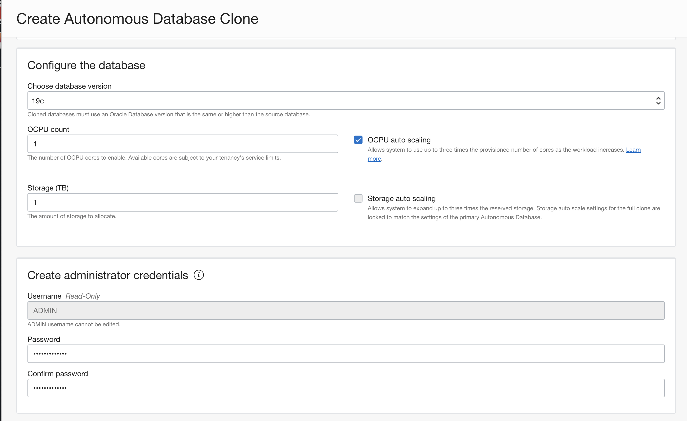
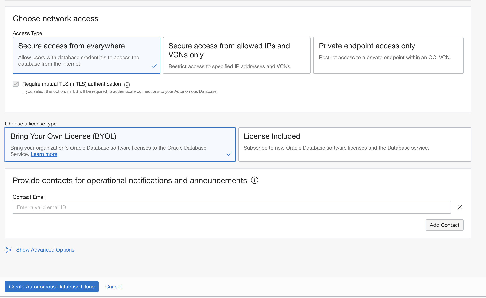

# How do I clone Autonomous Database?
Duration: 10 minutes

##  Cloning and Moving an Autonomous Database

Autonomous Database provides cloning where you can choose to create a full clone, create a metadata clone, or create a refreshable clone. You can also use cloning to upgrade your database to a newer Oracle Database version when newer Oracle Database versions are available. You can move an Autonomous Database to a different Oracle Cloud Infrastructure compartment.

When you create a clone for an Autonomous Database instance, you have the option to select the clone type:

* Full Clone: creates a new database with the source database's data and metadata. 
* Refreshable Clone: creates a read-only full clone that can be easily refreshed with the data from the source database.
* Metadata Clone: creates a new database that includes all of the source database schema metadata, but not the source database data.

## Create Clone

1. Access Autonomous Database from Cloud Console
     
      Select More Actions in the dropdown menu

      
     
      Select Clone Type and Region

      

      Select Database Version, Number of OCPU and Storage in TB

      

      Select License Type

      

      Click on Create Autonomous Database Clone Button
       
## Learn More

* [Cloning and Moving an Autonomous Database](https://docs.oracle.com/en/cloud/paas/autonomous-database/adbsa/clone-autonomous-database.html)
