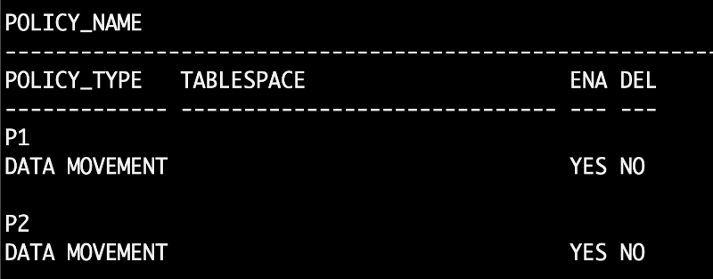

# How do I get User's ILM POLICIES? 
Duration: 10 minutes

USER\_ILMPOLICIES displays details about Automatic Data Optimization policies owned by the user. The view contains common details relevant to all types of Automatic Data Optimization policies, not just details relevant to the data movement-related Automatic Data Optimization policies. Its columns are the same as those in DBA\_ILMPOLICIES. ILM Policies are often seen in data compression use cases such as adding a row-level compression policy after considerable days of no data modifications, such as no data modification in 30 days. The other use cases are adding a storage tier policy to move old data to a different tablespace or just to view the existing policies on a table. 

## ILM POLICIES

 Login to SQLPlus and run the following statement: 
 
## Task 1: Enable automatic data optimization

1.  Create table students 

    ```
    <copy>
    CREATE TABLE students (
        student_id NUMBER , first_name VARCHAR2(128) , last_name VARCHAR2(128) 
        ); 
    </copy>
    ```  

2. A row-level ADO policy is created to automatically compress blocks in the table, after no rows in the block have been modified for at least 3 days, using Advanced Row Compression..

    ```
    <copy>
    ALTER TABLE students ILM ADD POLICY ROW STORE COMPRESS ADVANCED ROW AFTER 3 DAYS OF NO MODIFICATION;
    </copy>
    ```

3. View user\_ilmpolicies table    

    ```
    <copy>
    select * from user_ilmpolicies;
    </copy>
    ```

    

 

## Learn More
* [USER_ILMPOLICIES](https://docs.oracle.com/database/121/REFRN/GUID-50ADFAF7-C9E2-45AB-BBB8-B273986B5D4E.htm)
* [Adding ILM ADO Policies](https://docs.oracle.com/database/121/VLDBG/GUID-DE4C9EB5-FBDC-4621-AA7B-17EBD11FBF27.htm)
