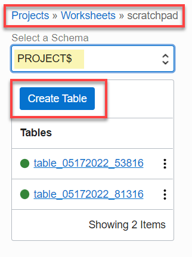
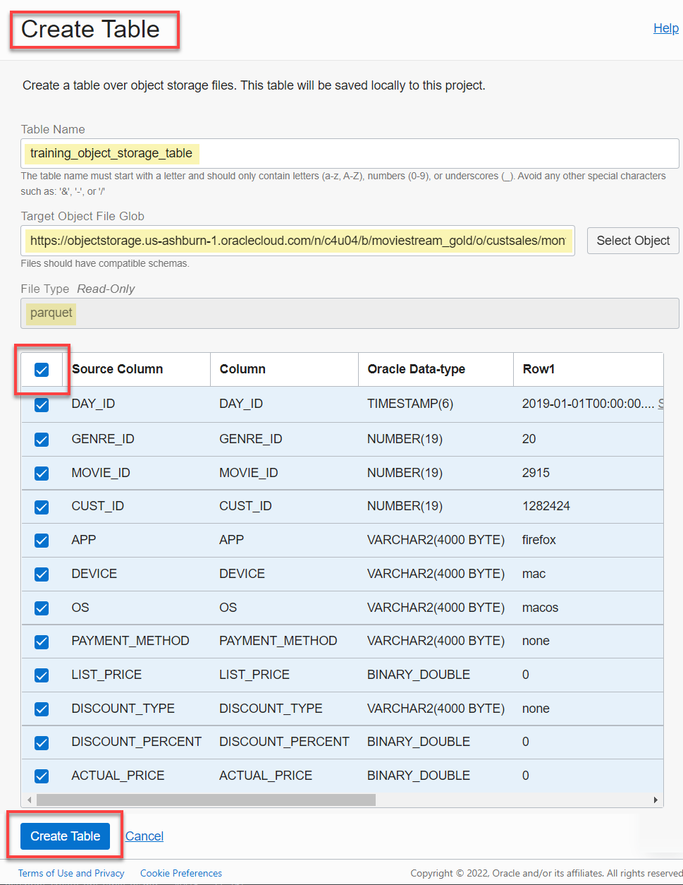
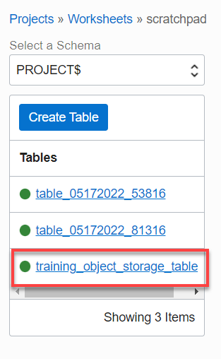
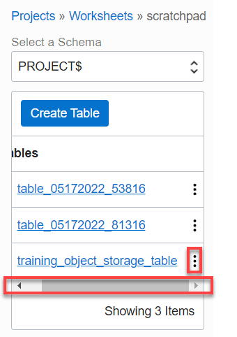
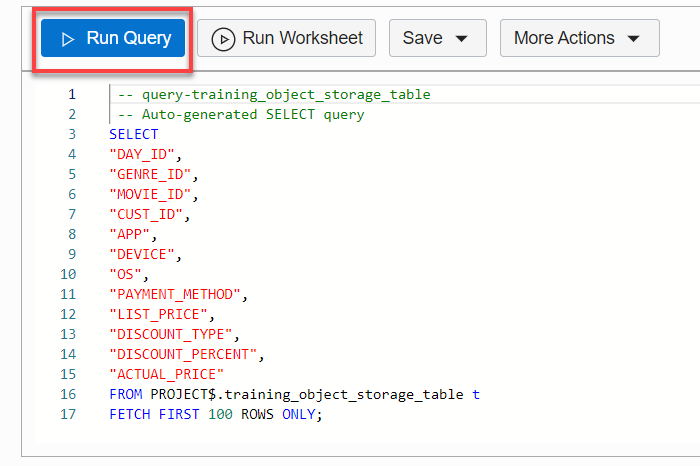
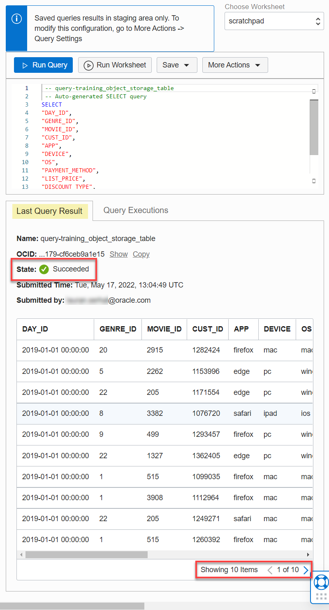
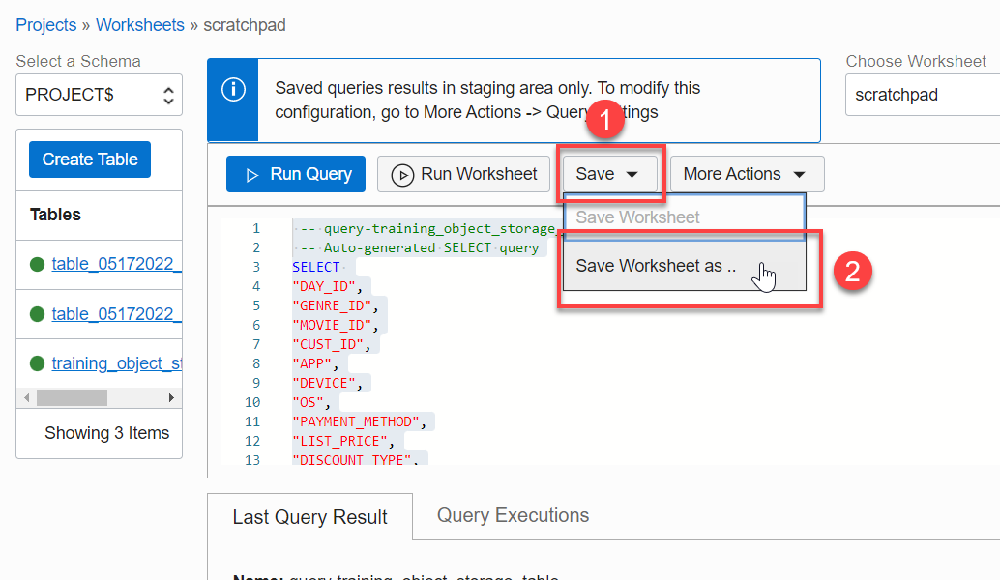
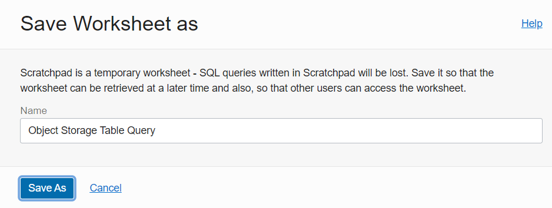

# How do I create an Oracle Object Storage Table in Query Service?
Duration: 5 minutes

You will create a table in Query Service using a Parquet file stored in a public Object Storage bucket.

### Prerequisites
* An Oracle Cloud Account.
* A Data Catalog instance.
* A Query Service project.
* The required policies to allow access to the Data Catalog instance, Oracle Object Storage, and Query Service projects.

## **Create a Table in Query Service Using a Data File in a Public Object Storage Bucket**  

The **PROJECT$** schema contains the tables that Query Service creates and manages. You can create your own tables in this schema. You will create a table over a Parquet file that is stored in a public  Object Storage bucket that is accessible using a URL.

1. Sign in to the Oracle Cloud Infrastructure Console using your tenancy, username, and password. For the **Query Service Limited Availability (LA) release**, click the following link to navigate to the [Query Service Console](https://cloud.oracle.com/sql-queryservice?region=us-ashburn-1) (https://cloud.oracle.com/sql-queryservice?region=us-ashburn-1).

2. On the **Query Service Projects** page, in the row for your Query Service project, click **Query Editor**.

    

3. On the **Scratchpad** worksheet, click the **Select a Schema** drop-down list and select the **`PROJECT$`** schema.

    

4. Click **Create Table**. The **Create Table** page is displayed. Specify the following:

    + **Table Name:** Enter **training\_object\_storage\_table**.

        >**Note:** Special characters such as **`&`**, **`-`** (hyphen), and **`/`** are not allowed in table names.

    + **Target Object File Glob:** Click **Copy** to copy the following URL, and then paste it in this field. This is the URL to access a Parquet file named **`custsales-2019-01.parquet`** which is stored in a public Oracle Object Storage bucket in a tenancy named **c4u04** in the **us-ashburn-1** region.

        ```
        <copy>https://objectstorage.us-ashburn-1.oraclecloud.com/n/c4u04/b/moviestream_gold/o/custsales/month=2019-01/custsales-2019-01.parquet</copy>
        ```

        The Source to Target columns' mapping is displayed. Click the unchecked checkbox to the left of the **Source Column** label to select all the columns.

            

5. Click **Create Table**. The table status shows as **Creating** (orange color) in the **Tables** section.

  

6. Click the table's name link to view its details such as the columns names, columns Oracle data types, and state. Click **Close**.

     

  If the table creation is successful, it is displayed in the **Tables** section.

     


7. Use the horizontal scroll bar at the bottom of the **Tables** section to scroll to the right and view the **Actions** icon that is associated with the **training\_object\_storage\_table** table.

    

  The Actions Context menu is displayed. You can use this menu to query and view the table, copy the table's OCID, edit the table name, and delete the table.

    

8. Click **Query**. The auto select query for this table is displayed in the **scratchpad** query area.

    

9. Click **Run Query**. The query output is displayed in the **Last Query Result** tab.

    

10. Save the query to a worksheet. Click **Save**, and then select **Save Worksheet as** from the drop-down list.

    

11. Enter a meaningful name for the worksheet in the **Save Worksheet as** dialog box, and then click **Save as**.

    

    The new worksheet is displayed.

      

## Learn More

* [Signing In to the Console](https://docs.cloud.oracle.com/en-us/iaas/Content/GSG/Tasks/signingin.htm).
* [Creating a Bucket and Uploading Files to a Bucket](https://docs.oracle.com/en-us/iaas/Content/GSG/Tasks/addingbuckets.htm#Putting_Data_into_Object_Storage)
* [Data Catalog Documentation](https://docs.oracle.com/en-us/iaas/data-catalog/home.htm)
* [Data Catalog Policies](https://docs.oracle.com/en-us/iaas/data-catalog/using/policies.htm)
* [Oracle Cloud Infrastructure Documentation](https://docs.oracle.com/en-us/iaas/Content/GSG/Concepts/baremetalintro.htm)
* [Access the Data Lake using Autonomous Database and Data Catalog Workshop](https://apexapps.oracle.com/pls/apex/dbpm/r/livelabs/view-workshop?wid=877)
* [DBMS_DCAT Package](https://docs-uat.us.oracle.com/en/cloud/paas/exadata-express-cloud/adbst/ref-dbms_dcat-package.html#GUID-4D927F21-E856-437B-B42F-727A2C02BE8D)
* [RUN_SYNC Procedure](https://docs.oracle.com/en/cloud/paas/autonomous-database/adbsa/ref-running-synchronizations.html#GUID-C94171B4-6C57-4707-B2D4-51BE0100F967)
* [Using Oracle Autonomous Database on Shared Exadata Infrastructure](https://docs.oracle.com/en/cloud/paas/autonomous-database/adbsa/index.html)
* [Connect with Built-in Oracle Database Actions](https://docs.oracle.com/en/cloud/paas/autonomous-database/adbsa/sql-developer-web.html#GUID-102845D9-6855-4944-8937-5C688939610F)
