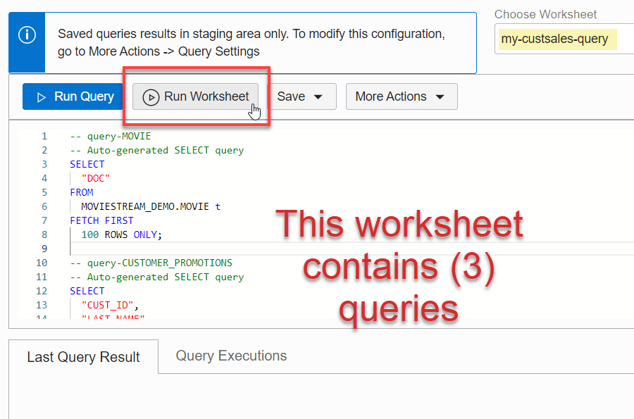
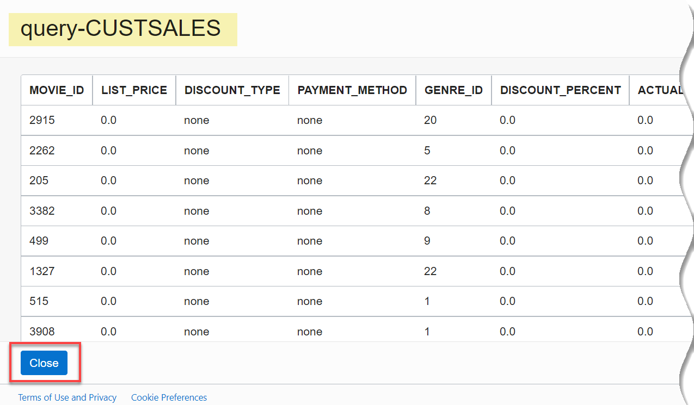
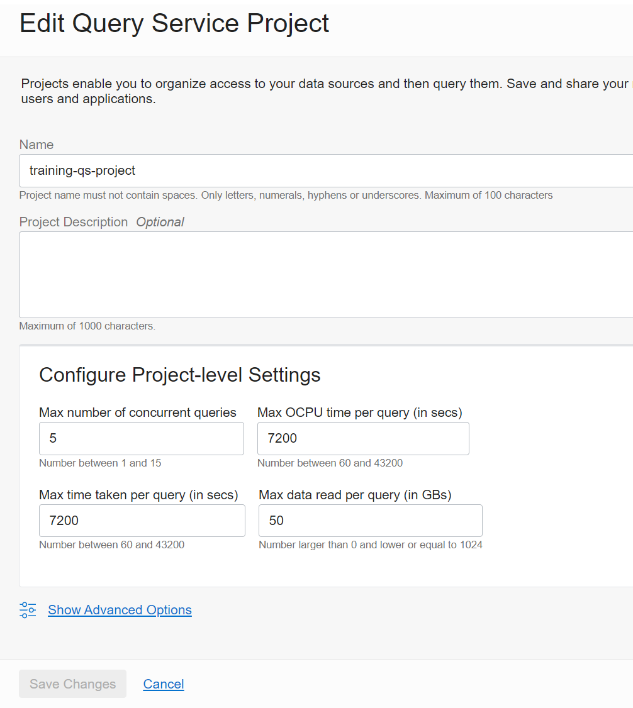
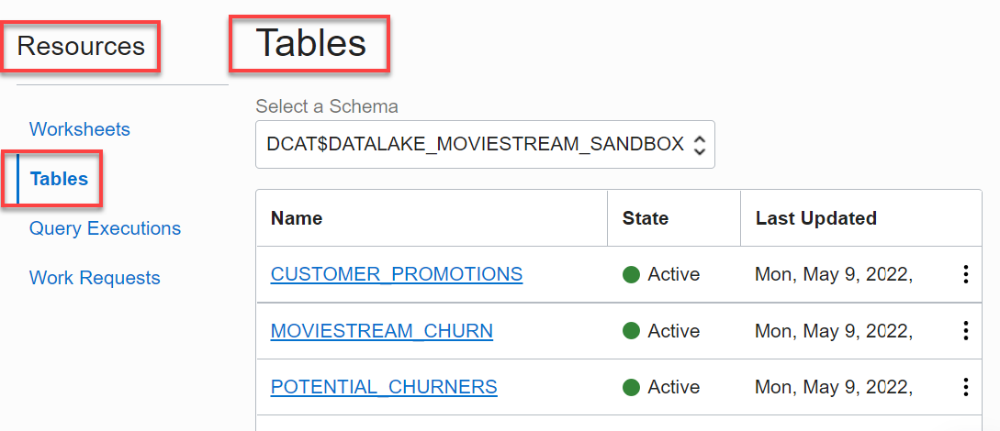
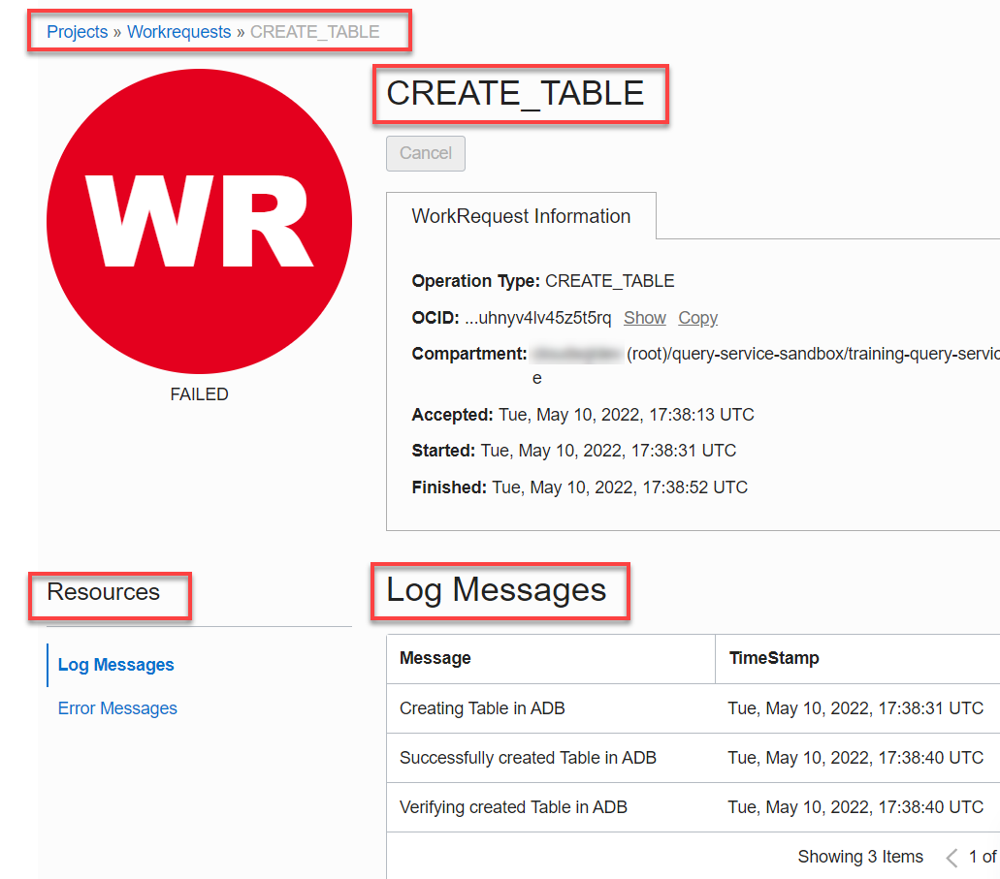
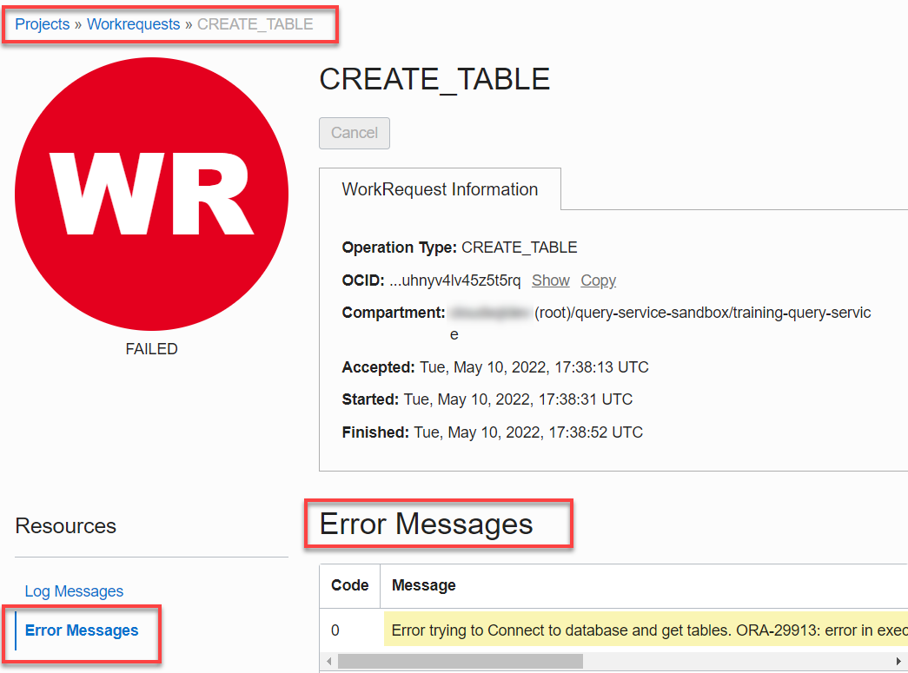

# How do I explore the project detail page in Query Service?
Duration: 10 minutes

You will get familiar with the components of the project detail page in Query Service.

### Prerequisites
* An Oracle Cloud Account.
* A Data Catalog instance.
* A Query Service project.
* The required policies to allow access to the Data Catalog instance, Oracle Object Storage, and Query Service projects.

## Exploring the Project Detail Page in Query Service

1. Sign in to the Oracle Cloud Infrastructure Console using your tenancy, username, and password. For the **Query Service Limited Availability (LA) release**, click the following link to navigate to the [Query Service Console](https://cloud.oracle.com/sql-queryservice?region=us-ashburn-1) (https://cloud.oracle.com/sql-queryservice?region=us-ashburn-1).

2. On the **Query Service Projects** page, click the desired project name link to display the project's detail page.

      

3. On the project's detail page, you can click the **Query Editor** buttons either under the project's name or in the **Worksheets** section to access the Query Editor. In addition, in the **Worksheets** section, you can click on a worksheet name link to display the queries in the worksheet in Query Editor.

      

4. The following worksheet example contains three queries. To run all three queries, click **Run Worksheet**.

    

5. Three informational messages are displayed briefly about each query about to be executed. When the queries execution is completed successfully, the status of running the worksheet in the **Last Query Result** tab changes from **In Progress** to  **Succeeded**. The **Last Query Result** tab shows the output of the last query executed.

    

6. To view the output of all three queries in the worksheet, click the **Query Executions** tab. Next, click the **View Result** link that is associated with a query to view its output. Click the **View Result** link that is associated with the **query-CUSTSALES** to view its output.

    

7. Click the **View Result** link that is associated with the **query-CUSTSALES** to view its output.

    

8. Click **Worksheets** in the breadcrumbs to return to the project's detail page. Click **Edit** to display the **Edit Query Service Project** panel. You can use this panel to edit the project's name, edit or add a description, and edit the project-level settings. When you done with your changes, click **Save Changes**.

    

9. In the **Resources** section, click **Tables**. The **Tables** section is displayed. This section was covered in detail earlier in this workshop.

    

10. In the **Resources** section, click **Query Executions**. The **Query Executions** section is displayed. This section was covered in detail earlier in this workshop.

    

    >**Note:** You can use the **View Query executions from Worksheet** drop-down list to display all query executions from all of worksheets (default), or choose a specific worksheet.

11. In the **Resources** section, click **Workshop Requests**. The **Workshop Requests** section is displayed. Click one of the **CREATE\_TABLE** links that failed. The **CREATE\_TABLE** page is displayed. By default, the **Log Messages** section is displayed. The messages provides you with important debugging information.

    

12. Since this workshop request did fail, click the **Error Messages** link in the **Resources** section to find out more details about the failed job. The error message indicates a problem trying to connect to the tables.  

    

## Learn More

* [Signing In to the Console](https://docs.cloud.oracle.com/en-us/iaas/Content/GSG/Tasks/signingin.htm).
* [Data Catalog Documentation](https://docs.oracle.com/en-us/iaas/data-catalog/home.htm)
* [Data Catalog Policies](https://docs.oracle.com/en-us/iaas/data-catalog/using/policies.htm)
* [Oracle Cloud Infrastructure Documentation](https://docs.oracle.com/en-us/iaas/Content/GSG/Concepts/baremetalintro.htm)
* [Access the Data Lake using Autonomous Database and Data Catalog Workshop](https://apexapps.oracle.com/pls/apex/dbpm/r/livelabs/view-workshop?wid=877)
* [DBMS_DCAT Package](https://docs-uat.us.oracle.com/en/cloud/paas/exadata-express-cloud/adbst/ref-dbms_dcat-package.html#GUID-4D927F21-E856-437B-B42F-727A2C02BE8D)
* [RUN_SYNC Procedure](https://docs.oracle.com/en/cloud/paas/autonomous-database/adbsa/ref-running-synchronizations.html#GUID-C94171B4-6C57-4707-B2D4-51BE0100F967)
* [Using Oracle Autonomous Database on Shared Exadata Infrastructure](https://docs.oracle.com/en/cloud/paas/autonomous-database/adbsa/index.html)
* [Connect with Built-in Oracle Database Actions](https://docs.oracle.com/en/cloud/paas/autonomous-database/adbsa/sql-developer-web.html#GUID-102845D9-6855-4944-8937-5C688939610F)
