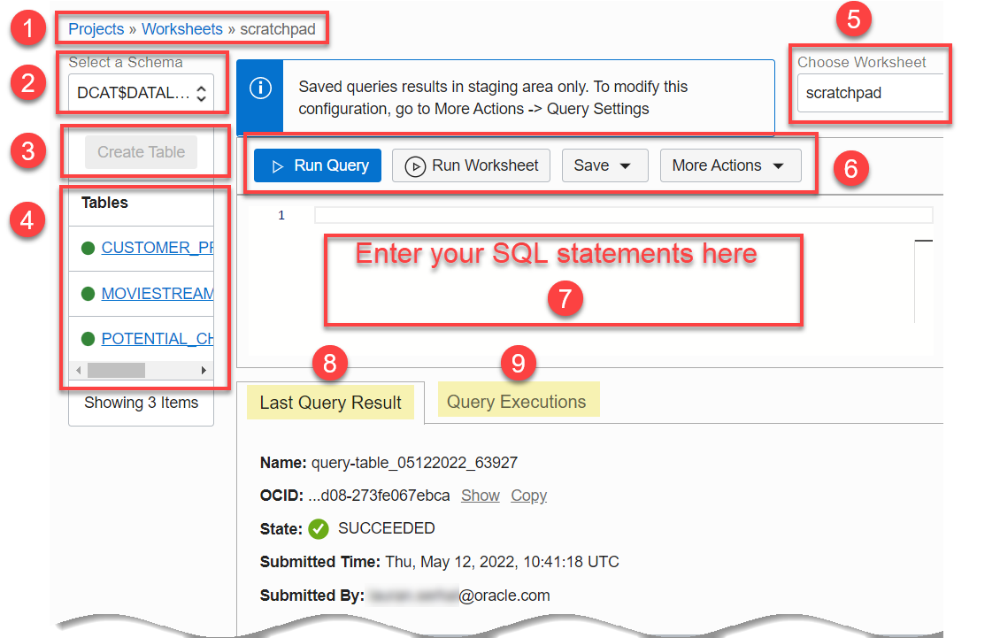
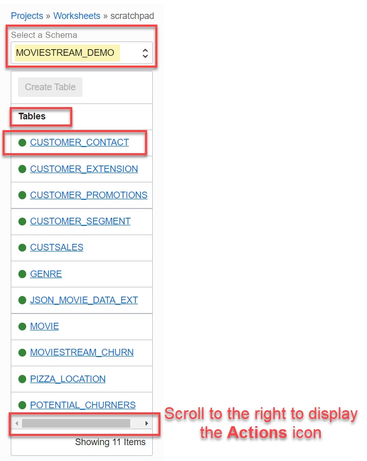
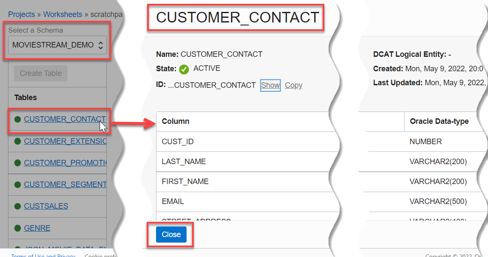

# How do I query data in Query Service?
Duration: 15 minutes

You will use Query Editor in Query Service to query data using standard Oracle SQL.

### Prerequisites
* An Oracle Cloud Account.
* A Data Catalog instance.
* A Query Service project.
* The required policies to allow access to the Data Catalog instance, Oracle Object Storage, and Query Service projects.

## Use Query Editor to Query Data in Oracle Object Storage Buckets

1. Sign in to the Oracle Cloud Infrastructure Console using your tenancy, username, and password. For the **Query Service Limited Availability (LA) release**, click the following link to navigate to the [Query Service Console](https://cloud.oracle.com/sql-queryservice?region=us-ashburn-1) (https://cloud.oracle.com/sql-queryservice?region=us-ashburn-1).

2. On the **Query Service Projects** page, in the row for your Query Service project, click **Query Editor**. Alternatively, you can click the project's name link to display the project's detail page and then click **Query Editor**.

  

  The **scratchpad** page is displayed. This is where you enter your SQL queries.

    

### **Components of the scratchpad Worksheet**

  1. **Breadcrumbs:** Click **Projects** in the breadcrumbs to return to the **Query Service Projects** page. Click **Worksheets** to view the project details page which shows your saved worksheets.

  2. **Select a Schema:** Click this drop-down list to select the schema that contains the tables that you want to query.

  3. **Create Table:** This button is enabled only when you select the **PROJECT$** schema.

  4. **Tables:** This section displays the tables in the schema that you selected in the **Select a Schema** drop-down list.

  5. **Choose Worksheet:** Initially, only **scratchpad** is available in this field. As you save your queries, you can select them from this drop-down list.

  6. **Tools buttons:** You can use the buttons in this section to run the SQL query in the scratchpad area, run all SQL queries in the currently selected worksheet, save the worksheet, set the query settings, and delete the worksheet.

  7. Enter your SQL queries in the scratchpad area.

  8. The **Last Query Result** tab shows the status and output of your query.

      

  9. The **Query Executions** tab shows the     

      

### **Query Data**

1. Click the **Select a Schema** drop-down list to view the available schemas in your project. Select the **MOVIESTREAM_DEMO** sample schema that is available with Query Service.

    

2. The **Tables** section displays the tables in this schema. You can click a table's name link to display its definition. Click **Close** to close the table's definition.

  

3. To query a table, click the **Actions** button associated with the table. From the Context menu, select **Query**. The SQL query is displayed in the Scratchpad.

4. Click **Run Query** to run the query. An information box is displayed indicating that the query is being run. In the **Last Query Result** tab, the status of running the query is displayed. When the query is completed, the results are displayed in the **Last Query Result** tab.

5. To view the status of the current and past query executions, click the **Query Executions** tab.

6. The scratchpad is a temporary storage area for your queries. You can save your queries in worksheets. A worksheet is a text document that contains a number of query blocks, as free form text. To save your query for future use, click **Save**, and then select **Save Worksheet as** from the drop-down list.

7.

7. Enter a name for the worksheet in the **Save Worksheet as** dialog box, and then click **Save as**.

### **Derived names of the automatically created schemas**  

When we created the Query Service project in this workshop, we specified a Data Catalog instance named **DataLake**. This instance contains an Oracle Object Storage data asset named **DataLake** that was harvested from the following three Oracle Object Storage buckets. Logical data entities were created as a result of the harvesting from each of the buckets.

+ **moviestream\_sandbox**
+ **moviestream\_landing**
+ **moviestream_gold**

When Query Service creates a project, it provisions an ADB instance associated with the project and synchronizes it automatically with the Data Catalog instance associated with the project. As part of the synchronization process, Query Service creates schemas that correspond to your harvested data assets and external tables in those schemas that correspond to the logical entities. It creates one schema for each Oracle Object Storage bucket.  

By default, the name of a generated schema in Query Service will start with the keyword **`DCAT$`** concatenated with the **data asset name**, an **_** (underscore) , followed by the **Object Storage bucket's name** as follows:

For example, the generated schema name for the **`moviestream_sandbox`** Oracle Object Storage bucket uses the **`DataLake`** data asset name and the bucket name as part of the schema name as follows:

    

The derived schemas' names are as follows:

+ **DCAT$DATALAKE_MOVIESTREAM\_SANDBOX:**
+ **DCAT$DATALAKE_MOVIESTREAM\_LANDING:**
+ **DCAT$DATALAKE_MOVIESTREAM\_GOLD:**

The description of the remaining schemas that are displayed in the **Select a Schema** drop-down list is as follows:

+ **PROJECT:** This schema ...
+ **PROJECT$:** This schema ...
+ **MOVIESTREAM_DEMO:** A sample schema that is available with Query Service.

4. From the **Query Service Projects** page, you can also click **Query Editor** in the **Actions** column.

      

    The Scratchpad worksheet is displayed. This will be explained in another workshop that you can select from the **Contents** menu on the left.  

      

## Learn More

* [Signing In to the Console](https://docs.cloud.oracle.com/en-us/iaas/Content/GSG/Tasks/signingin.htm).
* [Data Catalog Documentation](https://docs.oracle.com/en-us/iaas/data-catalog/home.htm)
* [Data Catalog Policies](https://docs.oracle.com/en-us/iaas/data-catalog/using/policies.htm)
* [Oracle Cloud Infrastructure Documentation](https://docs.oracle.com/en-us/iaas/Content/GSG/Concepts/baremetalintro.htm)
* [Access the Data Lake using Autonomous Database and Data Catalog Workshop](https://apexapps.oracle.com/pls/apex/dbpm/r/livelabs/view-workshop?wid=877)
* [DBMS_DCAT Package](https://docs-uat.us.oracle.com/en/cloud/paas/exadata-express-cloud/adbst/ref-dbms_dcat-package.html#GUID-4D927F21-E856-437B-B42F-727A2C02BE8D)
* [RUN_SYNC Procedure](https://docs.oracle.com/en/cloud/paas/autonomous-database/adbsa/ref-running-synchronizations.html#GUID-C94171B4-6C57-4707-B2D4-51BE0100F967)
* [Using Oracle Autonomous Database on Shared Exadata Infrastructure](https://docs.oracle.com/en/cloud/paas/autonomous-database/adbsa/index.html)
* [Connect with Built-in Oracle Database Actions](https://docs.oracle.com/en/cloud/paas/autonomous-database/adbsa/sql-developer-web.html#GUID-102845D9-6855-4944-8937-5C688939610F)
