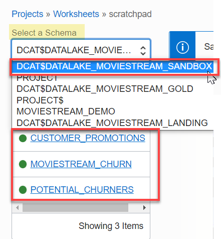
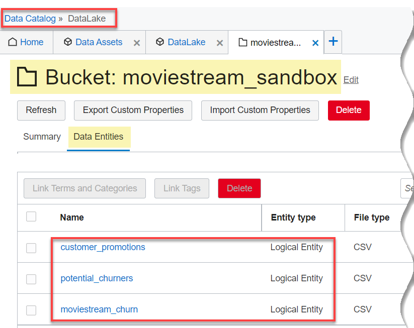

# How do I query data in Query Service?
Duration: 15 minutes

You will use Query Editor in Query Service to query data using standard Oracle SQL.

### Prerequisites
* An Oracle Cloud Account.
* A Data Catalog instance.
* A Query Service project.
* The required policies to allow access to the Data Catalog instance, Oracle Object Storage, and Query Service projects.

## Query Data in Query Service Using the Query editor

### **About the Automatically Created Schemas in Query Service**  

Query Service contains the following schemas:

+ **DCAT$:** Schemas whose name starts with **DCAT$** concatenated with the **Data Catalog data asset name**, an **_** (underscore) , followed by the **Object Storage bucket's name**. Those are created by Query Service as part of the automatic synchronization process between your Data Catalog instance and your Query Service project.
+ **PROJECT:** You can connect to this schema using any Oracle Database client tools such as Oracle SQL Developer, Oracle SQLcl, or SQL*Plus. You can also use any JDBC client by using the Oracle JDBC driver. You can then create Query service Project tables manually in this schema and run queries against those tables. It is also the Database User that the service uses to run queries submitted through the OCI Interface (UI/SDK/CLI).
+ **PROJECT$:** This schema contains the tables that you create and manage through the Query Service console or other OCI interfaces such as SDKs and REST.
+ **MOVIESTREAM_DEMO:** A sample schema that is available with Query Service.

### **The DCAT$ Schemas**

As part of the synchronization process, Query Service creates schemas that correspond to your harvested data assets and creates external tables in those schemas that correspond to the logical entities. It creates one schema for each Oracle Object Storage bucket. By default, the name of a generated schema in Query Service starts with the keyword **`DCAT$`** concatenated with the **data asset name**, an **_** (underscore) , followed by the **Object Storage bucket's name**.

In this workshop, we specified a Data Catalog instance named **DataLake** when we created a new project. This instance contains an Oracle Object Storage data asset named **DataLake** that was harvested from the following three Oracle Object Storage buckets. Logical data entities were derived from the buckets: **moviestream\_sandbox**, **moviestream\_landing**, and **moviestream_gold**.
For details, see the [Access the Data Lake using Autonomous Database and Data Catalog](https://apexapps.oracle.com/pls/apex/dbpm/r/livelabs/view-workshop?wid=877&clear=180&session=103071880685237) Livelabs workshop.
<!--
For example, the generated schema name for the **`moviestream_sandbox`** Oracle Object Storage bucket uses the **`DataLake`** data asset name and the bucket name as part of the schema name as follows:

    

-->

Therefore, the three schemas that were created by the Data Catalog synchronization process in this workshop are:
  + **DCAT$DATALAKE_MOVIESTREAM\_SANDBOX**
  + **DCAT$DATALAKE_MOVIESTREAM\_LANDING**
  + **DCAT$DATALAKE_MOVIESTREAM\_GOLD**

### **About the Automatically Generated External Tables**

As part of the synchronization process, Query Service also creates schemas that correspond to your harvested data assets. It also creates external tables in those schemas that correspond to the logical entities in each bucket that were derived from the Oracle Object Storage buckets in your Data Catalog instance. In our example, the **moviestream\_sandbox** Oracle Object Storage bucket from our Data Catalog instance contains three logical data entities; therefore, Query Service created three external tables in the **DCAT$DATALAKE_MOVIESTREAM\_SANDBOX** schema which correspond to the three derived logical data entities: **CUSTOMER\_PROMOTIONS**, **MOVIESTREAM\_CHURN**, **POTENTIAL\_CHURNERS**.

>**Note:** The names of your generated Data Catalog schemas and external tables depend on the names of your own data asset and Object Storage buckets.

<!--
    
-->

<!-- Comments -->

<!--
>**Note:** In Data Catalog, you can provide a custom property override for the schema name that will generated. In addition, you can customize the business names for each of the three Oracle Object Storage buckets that you use in this workshop. For example, instead of using the Data Asset name in the generated schema name, you can provide a shorter name such as **obj** (for Object Storage). Similarly, instead of using the buckets name as part of the generated schema name, you provide a shorter business name for the bucket. For example, instead of having long schema names in queries such as **DCAT$DATALAKE_MOVIESTREAM\_SANDBOX**, you can have a shorter name for the generated schema such as **DCAT$OBJ_SANDBOX**. For detailed information, see the [Access the Data Lake using Autonomous Database and Data Catalog](https://apexapps.oracle.com/pls/apex/dbpm/r/livelabs/view-workshop?wid=877&clear=180&session=103071880685237) Livelabs workshop.
-->

### **Use Query Editor to Query Data in Oracle Object Storage Buckets**

1. Sign in to the Oracle Cloud Infrastructure Console using your tenancy, username, and password. For the **Query Service Limited Availability (LA) release**, click the following link to navigate to the [Query Service Console](https://cloud.oracle.com/sql-queryservice?region=us-ashburn-1) (https://cloud.oracle.com/sql-queryservice?region=us-ashburn-1).

2. On the **Query Service Projects** page, in the row for your Query Service project, click **Query Editor**. This is the quickest way to access the Query Editor and start querying tables in the available schemas. Alternatively, you can click the project's name link to display the project's detail page and then click **Query Editor**.

    

  The **Query Editor** page is displayed with an empty **Scratchpad**. This is where you enter your SQL queries.

    

### **Components of the Query Editor**

1. **Breadcrumbs:** Click **Projects** in the breadcrumbs to return to the **Query Service Projects** page. Click **Worksheets** to view the project details page which shows your saved worksheets.

2. **Select a Schema:** Click this drop-down list to select the schema that contains the tables that you want to query.

3. **Create Table:** This button is enabled only when you select the **PROJECT$** schema.

4. **Tables:** This section displays the tables in the schema that you selected in the **Select a Schema** drop-down list.

5. **Choose Worksheet:** Initially, only the **Scratchpad** is available in this drop-down list. When you save your queries as new worksheets, you will be able to select those worksheets from this drop-down list.

    >**Note:** The **Scratchpad** is only stored for the duration of your web browser's session; therefore, to share or persist the queries across web browsers or web browser sessions, you must save the queries as a worksheet.

6. **Tools buttons:** You can use the buttons in this section to run the current SQL query (at the current cursor location), run all SQL queries in the text editor, save the worksheet, set the query settings, and delete the worksheet.

7. Enter your SQL queries in the text editor area.

8. The **Last Query Result** tab shows the status and output of your query.

9. The **Query Executions** tab displays the queries executed in the currently selected worksheet in the **Choose Worksheet** drop-down list.

Let's query the **CUSTOMER\_CONTACT** external table from the **MOVIESTREAM_DEMO** sample schema that is available with Query Service.

3. Click the **Select a Schema** drop-down list to view the available schemas in your project. Select the **MOVIESTREAM_DEMO** sample schema that is available with Query Service.

    

4. Use the horizontal scroll bar at the bottom of the **Tables** section to scroll to the right and view the **Actions** icon that is associated with each table.

    

5. The **Tables** section displays the tables in this sample schema. You can click a table's name link to display its definition. For example, click **CUSTOMER_CONTACT** to display the table's definition. When done, click **Close** to close the table's definition.

  

6. To query a table, click the **Actions** button next to a table such as **CUSTSALES**, and then select **Query** from the Context menu. The SQL query is displayed in the text editor area. Click **Run Query** to run the query. An information box is displayed briefly. In the **Last Query Result** tab, the status of running the query is displayed, initially **In Progress**. When the query is completed successfully, the results are displayed in the **Last Query Result** tab and the status changes to **Succeeded**.  

  

7. To view the status of the current and past query executions, click the **Query Executions** tab.

    

8. To view the details of a past query execution from the **Query Executions** tab, click the query's link in the **Name** column.
   The query detail page is displayed. You can use this page to edit the name of the saved query, click the **View Result** link in the **Query Information** tab to view the results of the query. You can also click the **Open Query in Worksheet** to open the query in **Query Editor**. Finally, you can click the **Log Messages** and **Error Messages** links in the **Resources** section on the left to display the log messages and error messages, if any.  

    

9. Click the **Query Executions** link in the breadcrumbs to return to the scratchpad worksheet. Scratchpad is a temporary worksheet; therefore, SQL queries written in Scratchpad will be lost. You can save your Scratchpad query to a worksheet that you can retrieve at a later time. You can also share the saved worksheet with others. Click **Save**, and then select **Save Worksheet as** from the drop-down list.

  

10. In the **Save Worksheet as** dialog box, enter a meaningful name for the worksheet and then click **Save as**. The saved worksheet is displayed.

    

## Learn More

* [Signing In to the Console](https://docs.cloud.oracle.com/en-us/iaas/Content/GSG/Tasks/signingin.htm).
* [Data Catalog Documentation](https://docs.oracle.com/en-us/iaas/data-catalog/home.htm)
* [Data Catalog Policies](https://docs.oracle.com/en-us/iaas/data-catalog/using/policies.htm)
* [Oracle Cloud Infrastructure Documentation](https://docs.oracle.com/en-us/iaas/Content/GSG/Concepts/baremetalintro.htm)
* [Access the Data Lake using Autonomous Database and Data Catalog Workshop](https://apexapps.oracle.com/pls/apex/dbpm/r/livelabs/view-workshop?wid=877)
* [DBMS_DCAT Package](https://docs-uat.us.oracle.com/en/cloud/paas/exadata-express-cloud/adbst/ref-dbms_dcat-package.html#GUID-4D927F21-E856-437B-B42F-727A2C02BE8D)
* [RUN_SYNC Procedure](https://docs.oracle.com/en/cloud/paas/autonomous-database/adbsa/ref-running-synchronizations.html#GUID-C94171B4-6C57-4707-B2D4-51BE0100F967)
* [Using Oracle Autonomous Database on Shared Exadata Infrastructure](https://docs.oracle.com/en/cloud/paas/autonomous-database/adbsa/index.html)
* [Connect with Built-in Oracle Database Actions](https://docs.oracle.com/en/cloud/paas/autonomous-database/adbsa/sql-developer-web.html#GUID-102845D9-6855-4944-8937-5C688939610F)
